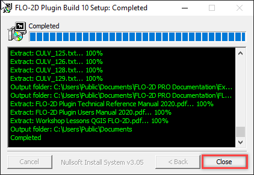

QGIS and FLO-2D Plugin Install Instructions
============================================

QGIS is an open-source geographic information system software designed for spatial data analysis and visualization.
The FLO-2D Plugin uses QGIS tools to effectively prepare FLO-2D data,
providing an enhanced modeling experience within a user-friendly environment.

Step 1: Get QGIS and FLO-2D Plugin
-----------------------------------

Use this Download Link to access the **installers**, and training data.

|Setup_Download|

.. |Setup_Download| raw:: html

   <a href="https://flo-2d.sharefile.com/d-s872384bd61524bf3b695612d1f158a78" target="_blank">Click Here to Download</a>

1. Select all.

2. Download.

3. The files are zipped into "file.zip"  Extract them into a safe location.

.. image:: img/Instructions/image2.png

Step 2: Documentation Installer
--------------------------------
Use these instructions to install the FLO-2D Plugin documentation.  Admin Rights Not Required.

1. Run the installer.  FLO-2D Plugin Documentation Installer.exe

2. Default settings are fine, click Close to finish.

Step 3: QGIS Installer
----------------------
Follow these instructions to set up QGIS.

1. Double click the QGIS-OSGeo4W-3.28.11-1.msi file.

2. Finish installing with the default settings.

.. image:: img/Instructions/image8.png

3. Open QGIS.

.. image:: img/Instructions/Worksh002.png

4. Click Settings/Options

.. image:: img/Instructions/image13.png

5. Click the CRS tab and set the options as shown below.  Use CRS from first layer added.  Use Project CRS.  Click OK to
   close the window.

.. image:: img/Instructions/image14.png

Step 4: FLO-2D Plugin
----------------------
With QGIS installed it is time to add the FLO-2D plugin and a few other handy plugins.

1. Navigate to the plugin manager.

.. image:: img/Instructions/image10.png

2. Install the FLO-2D Plugin from a zip file.

.. image:: img/Instructions/image12.gif

3. Install Quick Map Services and Profile Tool, and Curve Number Generator.
   Close the Plugin Manager once everything is finished installing.

.. image:: img/Instructions/image11.png

4. Add more services to Quick Map Services and eliminate unwanted maps.  Click Quick Map Services icon and click Settings.
   On the settings window, go to More Services and click Get Contributed pack.  On the Visibility window, uncheck the
   unwanted maps.

This concludes the installation and setup.  The tutorial data is here:
C:\\Users\\Public\\Documents\\FLO-2D PRO Documentation\\Example Projects\\QGIS Tutorials

.. image:: img/Instructions/image9.png

