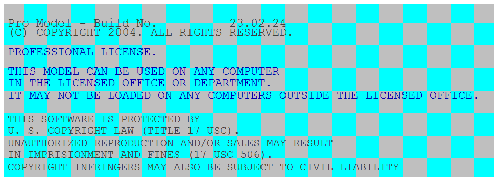
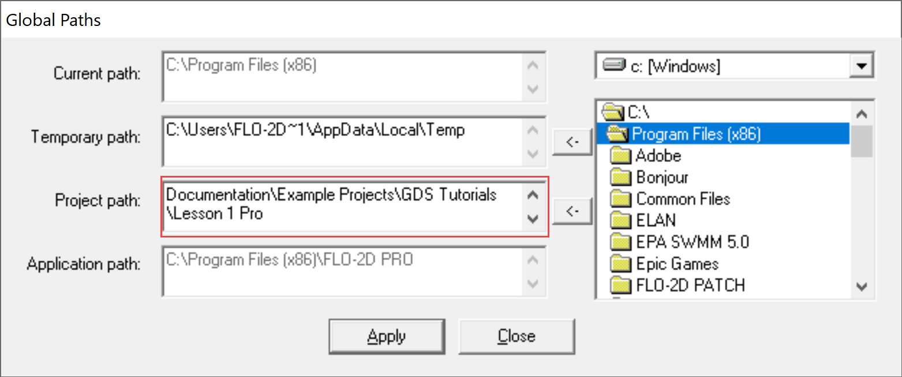
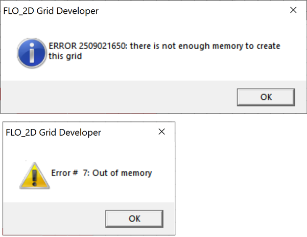

Troubleshooting
================

Installation Test
-------------------

1. Test FLO-2D engine by running a model from a project folder.  Copy the Run for Project files from

   C:\\Program Files (x86)\\FLO-2D PRO\\Run for Project Folder

.. image:: img/Instructions/installtest01.png

2. Paste the files into any project folder with \*.DAT files like Barn.

   C:\\Users\\Public\\Documents\\FLO-2D PRO Documentation\\Example Projects\\Example Projects\\Barn Mudflow

.. image:: img/Instructions/installtest02.png

3. Double click FLOPRO.EXE to start a test run.

4. If the computer is activated with the professional version, this message will appear.

5. If the computer isn't activated, this message will appear.

.. image:: img/Instructions/installtest04.png

6. Any other message might need some troubleshooting.  Find the related issue below.

FLO-2D Pro Troubleshooting
-----------------------------

If something isn't working, do not uninstall FLO-2D.  That is rarely a correct way to fix the installation.
Find some help below or email FLO-2D via the |Contact-Form| for support.

.. |Contact-Form| raw:: html

   <a href="https://flo-2d.com/contact/" target="_blank">Contact Form</a>

Starting in 2022, the FLO-2D engine uses 4 distribution packages.  These installers are embedded into the FLO-2D Pro
Setup.exe.  If one of the embedded installers fails or is skipped, it may be necessary troubleshoot the issue.
This guide can help fix common issues.

GDS and Mapper Troubleshooting
-------------------------------

GDS and Mapper are written in Visual Basic code.  Visual basic has been obsolete code for more than a decade.
Because of SysWOW (System Windows on Windows), old programs can be used but are challenging to install.
Some computers won't have any issues and others simply will not run GDS and Mapper because things like
Microsoft Data Access (MDAC) and Data Access Objects (DAO) will not load or be recognized by the computer.

FLO-2D solved this issue by upgrading to QGIS and the FLO-2D Plugin.  If you still want to
use GDS or Mapper and you get missing dll failures or struggle to use GDS processors, this section may help.

1. GDS might not be connected to it's MapObjects dlls.  These are the objects that do things like load images, load
   tables, intersect shapefiles, and create the grid.  The fault will look like this:

.. image:: img/Instructions/gdsfault01.png

2. If this fault shows up, delete the contents of this folder and run the FLO-2D Pro Setup Installer - MapObjects section again.

   C:\\Program Files(x86)\\Common Files\\ESRI

   Don't worry, these old files are not used by ArcGIS Desktop or ArcGIS Pro.

3. GDS might give an error message when the user tries to set up a new project using Define Working Region....
   A path correction will fix this fault.  When a new project doesn't have a project path, it tries to write data
   to the C:\\Program Filex(x86)\\FLO-2D Pro path.  This path is protected by Admin Rights.

.. image:: img/Instructions/gdsfault03.png

4. The error message that appears states something about admin rights or permissions.  Correct it by applying a project
   path in GDS\\Tools\\Options\\Directory Paths

5. GDS and Mapper may have overflow or out of memory error messages.  This is not a correctable fault.
   They are both 32-bit programs and have limitations related to the memory they can use.  This varies by computer
   and by screen size so if you get this fault on one computer, it may not show up on an older computer.

5. GDS and Mapper default settings are for computers in the USA.  It may be necessary to adjust the number separator.
   If an error message appears about the number separator, use the Control Panel\\Clock and Region\\Additional Settings
   to set the decimal separator to a ".".  International users might want to use QGIS so this is not necessary.

.. image:: img/Instructions/gdsfault06.png

6. Sometimes the Microsoft Data Access program doesn't install correctly and GDS cannot find the MDAC dlls.
   It may be possible to reinstall the MDAC setup program.
   |GDSPatch|

.. |GDSPatch| raw:: html

   <a href="https://flo-2d.sharefile.com/d-sca2c917fcb9d424091e9faa8272b29b8" target="_blank">Download GDS Patch.</a>

7. GDS Tutorials are no longer part of the FLO-2D Pro Setup.  To get the GDS and Mapper Tutorials, Run this installer:
   |GDStutorials|

.. |GDStutorials| raw:: html

   <a href="https://flo-2d.sharefile.com/d-s6907dafe3ebc4abab8aa6ad4df386a2c" target="_blank">Download GDS Tutorials.</a>

