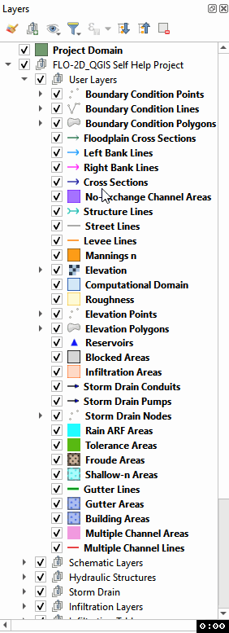
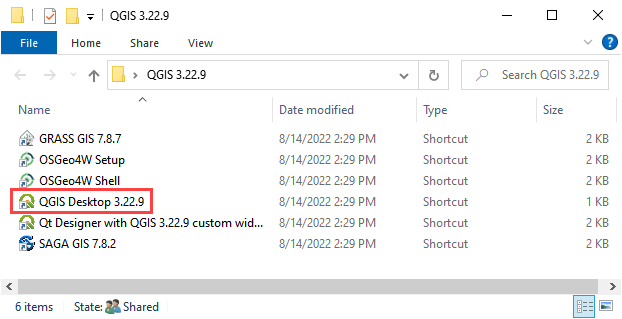

Lesson 1 - Part 2 – Project Recovery Methods
=============================================

Overview
________

Think of this as making a backup of a document.  It is a simple method to protect the data in case something goes wrong
in the next lessons.  Once a user gains more experience, this method won't be as important.

Required Data
_____________

The lesson has a QGIS project file, Geopackage file, FLO-2D Data Export files and FLO-2D Project Run files.

.. list-table::
   :widths: 33 33 33
   :header-rows: 0

   * - **File**
     - **Content**
     - **Location**

   * - Lesson 1.qgz
     - QGIS file
     - QGIS Lesson 1

   * - Lesson 1.gpkg
     - FLO-2D GeoPackage
     -

   * - \*.DAT files
     - FLO-2D data files
     -

Project Location C:\\Users\\Public\\Documents\\FLO-2D PRO Documentation\\Example Projects\\QGIS Tutorials\\

Check these folders to ensure the data is available before starting the lesson.
Lesson 1, Part 1 should be completed first.

Step-by-Step Procedure
______________________

To create recovery backup system, follow these steps:

1. Organize the map layers;
2. Create a recovery file;
3. Recover a project;
4. Open project.

Step 1: Organize the map layers
________________________________

1. Manage the map layers by grouping the data from Lesson 1 Part 1 to a group called Project Data.

2. Right click Project Domain and click Move to Bottom.

3. Select Elevation and Manning_n layers and right click them.  Click Move Out of Group.

4. Select Elevation and Manning_n layers and right click them.  Click Move to bottom.

5. Select Project Domain, Elevation, and Manning_n and right click them.  Click Group Selected.

6. Name the group Project Data.

7. This GIF image will show an animation of the process.

Step 2: Create a recovery file
______________________________

1. If the QGIS is still open, save and close it.

2. Open QGIS Lesson 1 in a File Browser.
   Select the Lesson 1.gpkg and Lesson 1.qgz files and zip them.
   This will create a recovery file.

3. Name the zipped file.
   It is good to choose a name that identifies project progress.
   For Example: Lesson 1 n-value OK.zip.

4. Repeat this step after any time a Backup or Recovery Point is desired.

.. image:: ../img/Workshop/Worksh024.png

Step 3: Recover a project
_________________________

.. note::  Don't complete this step unless a project is corrupted.

1. In the Lesson 1 Folder, select Lesson 1.gpkg and Lesson 1.qgz and delete them both.

.. image:: ../img/Workshop/Worksh025.png

2. Extract the recovery files.
   The example below uses Lesson 1 Recovery Files.zip.

.. image:: ../img/Workshop/Worksh026.png

3. Change the name of the path so the file can be extracted directly to the Lesson 1 folder.

.. image:: ../img/Workshop/Worksh027.png

Step 4: Open the project
________________________

1. Open QGIS and drag Lesson 1.qgz onto the canvas the file in QGIS and Load the Project into the FLO-2D Plugin.

.. image:: ../img/Workshop/Worksh028.png

2. Click Yes to load the plugin.

.. image:: ../img/Workshop/Worksh029.png

.. note:: If the project path changes, the plugin will recognize the path change and try to load the model from the new
          path.

.. note:: If the project path changes but an old geopackage remains in the previous path, it will be loaded and can
          corrupt the project.

.. image:: ../img/Workshop/Worksh030.png
