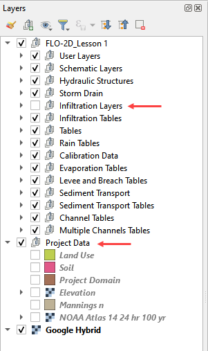

Lesson 2 – Channels
===================

Overview
________

Complete QGIS Lesson 1 before starting this lesson.
Use Lesson 2 to build an urban drainage channel and add culverts to the channel.

.. note:: This lesson uses an HEC-RAS import.  Alternate channel development methods are included in the advanced
          tutorials and coastal tutorials.  It is not necessary to have a RAS channel.

This video shows the full process of this tutorial.

.. youtube:: 74a07-wH3Gw

Required Data
_____________

The lesson makes use of the original data from Lesson 1, left bank, right bank, and cross section data, and culvert rating tables.
Start from the end of Lesson 1.  All data is provided in the Lesson folders.  This lesson uses the same project and data from the
classic QGIS Lesson 2 but it does not use HEC-RAS data.  Instead, it uses the FLO-2D Plugin channel tools.

.. list-table::
   :widths: 33 33 33
   :header-rows: 0

   * - **File**
     - **Content**
     - **Location**

   * - QGIS Lesson 1.gpkg
     - FLO-2D GeoPackage
     - \\QGIS Lesson 1

   * - QGIS Lesson 1.qgz
     - QGIS file
     - \\QGIS Lesson 1

   * - Grnway Inflow 24 hr100yr.txt
     - Inflow hydrograph
     - \\QGIS Lesson 2

   * - \*.txt
     - Culvert rating tables
     - \\QGIS Lesson 2\\Hydraulic Structures

   * - Greenway.g01
     - Channel GeoRAS file
     - \\QGIS Lesson 2\\HEC-RAS Channel

Project Location C:\\Users\\Public\\Documents\\FLO-2D PRO Documentation\\Example Projects\\QGIS Tutorials

Check these folders to ensure the data is available before starting the lesson.

Step-by-Step Procedure
______________________

To setup a FLO-2D flood simulation use these steps.

1. Open Lesson 1 and prep the map layers;

2. Import GeoRAS channel;

3. Schematize channel;

4. Channel boundary conditions;

5. Create culverts;

6. Interpolate the channel;

7. Export the project;

8. Test Run and fix the channel bank.

9. Final run and recovery point.

Step 1: Open QGIS and load the project
______________________________________

.. image:: ../img/Workshop/Worksh002.png

1. Open QGIS and drag Lesson 1.qgz onto the map space the file in QGIS and Load the Project into the FLO-2D Plugin.

.. image:: ../img/Workshop/Worksh028.png

2. Click Yes to load the plugin.

.. image:: ../img/Workshop/Worksh029.png

C:\\Users\\Public\\Documents\\FLO-2D PRO Documentation\\Example Projects\\QGIS Tutorials\\QGIS Lesson 1\\QGIS Lesson 1.qgz

3. If necessary add an aerial image to the map.  See Lesson 1 - Part 2 - Step 3 for instructions.

.. image:: ../img/Workshop/Worksh056.png

4. Organize the map layers to facilitate the next steps.  Uncheck Infiltration Layers and any unused Project Data Layers.

Step 2: Import GeoRAS Channel
_____________________________

1. Click the Import RAS icon.
   Open the Greenway.g01 file.

.. image:: ../img/Workshop/Worksh057.png

C:\\Users\\Public\\Documents\\FLO-2D PRO Documentation\\Example Projects\\QGIS Tutorials\\QGIS Lesson 2\\Greenway.g01

2. Check the Bank Stations radio button and click OK.

.. image:: ../img/Workshop/Worksh058.png

3. The channel left bank, right bank, and cross sections are imported into the User Layers.
   The cross-section data is imported into the cross section data tables.

.. image:: ../img/Workshop/Worksh059.png

Step 3: Schematize channel
__________________________

1. Click the Schematize channels button.

.. image:: ../img/Workshop/Worksh060.png

2. If the channel schematization process was successful, the following message will appear.
   Click Close.

.. image:: ../img/Workshop/Worksh061.png

Step 4: Channel boundary condition
___________________________________

Inlet
-----

1. Zoom to the first channel element on the southeast corner of the map.

.. image:: ../img/Advanced-Workshop/Lesson050.png

2. Uncheck the visibility of the User Layers Left Bank Lines, Right Bank Lines, Cross Sections.

.. image:: ../img/Advanced-Workshop/image50.png

3. Collapse the Cross Section Editor

4. Expand the Boundary Condition Editor.

5. Click the Add point BC button.

.. image:: ../img/Advanced-Workshop/Lesson052.png

6. Digitize a point to the first left bank channel cell and click OK.

.. image:: ../img/Advanced-Workshop/Lesson053.png

7. Click Save on the Widget

.. image:: ../img/Advanced-Workshop/Lesson054.png

8.  Change the BC name of the inflow to GrnwayIN

9.  Set Defined for to Channel

10. Click Add new Time Series

11. Name the new Time Series to Grnway 24hr 100yr.

12. The widget should look like this.

.. image:: ../img/Advanced-Workshop/Mod10_010.gif

13. Open the hydrograph file in Notepad and copy the data.

.. image:: ../img/Advanced-Workshop/Lesson056.png

C:\\Users\\Public\\Documents\\FLO-2D PRO Documentation\\Example Projects\\QGIS Tutorials\\QGIS Lesson 2\\Greenway Inflow 100yr 24hr.txt

14. Place the cursor in the first cell of the Table and click Paste.

.. image:: ../img/Workshop/Worksh040.gif

Outlet
------

1. Zoom to the end of the channel.

2. Add a BC Point to the last element of the channel.

.. image:: ../img/Advanced-Workshop/Lesson058.png

.. image:: ../img/Advanced-Workshop/Lesson059.png

3. Save the form and set the BC type to Outflow

.. image:: ../img/Advanced-Workshop/Lesson054.png

4. Name the BC to GrnwayOut

5. Set the Outflow type to 3.

.. image:: ../img/Advanced-Workshop/Lesson060.png

6. Click the Schematize button the outflow conditions and click OK to close the message.

.. image:: ../img/Advanced-Workshop/Lesson061.png

.. image:: ../img/Advanced-Workshop/Lesson062.png

Step 5: Culverts
________________

This structure will calculate discharge through a box culvert.
This example has a box culvert that is longer than the grid element.
The channel segments are split up to allow for the width of the roadway.

.. note::  This image shows how the culverts should look once they have been digitized

.. image:: ../img/Workshop/Worksh074.png

1. Zoom to the first culvert.

.. image:: ../img/Workshop/Worksh175.png

2. Collapse all FLO-2D Widgets.  Open the Structures Editor.
   Click the Add Structure icon.

.. image:: ../img/Workshop/Worksh186.png

3. Digitize the first culvert

    - Left click the upstream left bank.
    - Left click the downstream left bank.
    - Right click to complete the line.
    - Click OK to complete the structure

.. image:: ../img/Workshop/addstructure.gif

4. Repeat the process on the second culvert downstream.

.. image:: ../img/Workshop/addstructure2.gif

5. Click the Save Button on the Structure Editor.

.. image:: ../img/Workshop/Worksh077.png

6. Fill out the data for each structure.

-  Name the culverts Grnway1, Grnway2

-  Type \= Channel

-  Rating \= Rating table

-  Tailwater condition is none.

.. image:: ../img/Workshop/Worksh076.png

7.  Click the Import Rating Tables button

.. image:: ../img/Workshop/Worksh078.png

8.  Navigate to the Rating Tables files, select both tables and click Open.

C:\\Users\\Public\\Documents\\FLO-2D PRO Documentation\\Example Projects\\QGIS Tutorials\\QGIS Lesson 2\\Hydraulilc Structures

.. image:: ../img/Workshop/Worksh079.png

9. Note that the data was loaded into the FLO-2D Table Editor for the active structure.

.. image:: ../img/Workshop/Worksh179.png

10. Click Schematize to write the data to the schematic layers.

.. image:: ../img/Workshop/Worksh080.png

11. The hydraulic structures are now ready.

12. If the table and plot did not update, refresh the tables by selecting the structure again in the widget.

.. image:: ../img/Workshop/Worksh081.png

Step 6: Interpolate the channel
_______________________________

1. To interpolate the channel segments, export the channel data and run the interpolator.
   In the Cross Sections Editor widget, click the Create CHAN.DAT, XSEC.DAT, and CHANBANK.DAT icon.

.. image:: ../img/Workshop/Worksh084.png

2. Select the folder where the \*.DAT files will be saved.

C:\\Users\\Public\\Documents\\FLO-2D PRO Documentation\\Example Projects\\QGIS Tutorials\\QGIS Lesson 2\\Lesson 2 Export

.. image:: ../img/Workshop/Worksh085.png

.. image:: ../img/Workshop/Worksh086.png

.. note:: If this process results in an Interpolate.exe error, it is possible to move that Interpolate.exe to another
          location.  Sometimes this file is locked by admin rights because it is in the Program Files (x86) directory.

.. image:: ../img/Workshop/Worksh087.png

3. If the interpolation is performed correctly the following message will appear.  Click Import CHAN.DAT and XSEC.DAT to
   update the channel data in QGIS.

.. image:: ../img/Workshop/Worksh088.png

4. Click the OK icon when the process is finished.

.. image:: ../img/Workshop/Worksh089.png

7. Export the project
_____________________

1. Click the Setup Control Parameters icon.

.. image:: ../img/Workshop/Worksh017.png

3. Check the boxes for Main Channel and Hydraulic structures if needed.

4. Click Save.

.. image:: ../img/Workshop/Worksh082.png

5. Click the Export Data button.

.. image:: ../img/Workshop/Worksh021.png

6. Navigate to the project and click Select Folder.

C:\\Users\\Public\\Documents\\FLO-2D PRO Documentation\\Example Projects\\QGIS Tutorials\\QGIS Lesson 2\\QGIS Lesson 2 Export

.. image:: ../img/Workshop/Worksh187.png

7. If all files were written correctly, the following message will appear.  Click OK to close it.

.. image:: ../img/Workshop/Worksh188.png

Step 8: Test run and fix the channel bank
__________________________________________

1. Click the Run FLO-2D Icon.

.. image:: ../img/Workshop/Worksh0052.png

2. Set the FLO-2D Folder.
   C:\\program files (x86)\\flo-2d pro

3. Set the Project Folder.

C:\\users\\public\\public documents\\flo-2d pro documentation\\Example Projects\\QGIS Tutorials\\QGIS Lesson 2\\Lesson 2 Export

4. Click OK.

.. image:: ../img/Workshop/Worksh090.png

5. If an error message appears, open the error.chk file from the project directory.

.. image:: ../img/Workshop/Worksh091.png

6. If you are in a live class, Open and read the Error.CHK file in Notepad or Notepad++ and wait for the instructor.
   We will fix this as a group.

7. If you are on your own, check out this video.  It will show you how to fix the error.

.. youtube:: rhdmcXE-gyw

Step 9: Final run and recovery point
____________________________________

1. Click the Run FLO-2D Icon.

.. image:: ../img/Workshop/Worksh0052.png

2. Set the FLO-2D Folder.
   C:\\program files (x86)\\flo-2d pro

3. Set the Project Folder.

C:\\users\\public\\public documents\\flo-2d pro documentation\\Example Projects\\QGIS Tutorials\\QGIS Lesson 2\\Lesson 2 Export

4. Click OK.

.. image:: ../img/Workshop/Worksh090.png.

5. If the run still has errors, repeat Step 8.  If the run starts, let it run.

6. Save and close QGIS.

7. Find QGIS Lesson 1 in a File Browser.
   Select the Lesson 1.gpkg and Lesson 1.qgz files and zip them.
   This will create a recovery file.

8. Name the zipped file.
   It is good to choose a name that identifies project progress.
   For Example: Lesson 2 Complete.zip.

9. Repeat this step after any time a Backup or Recovery Point is desired.

.. image:: ../img/Workshop/Worksh024.png

Summary
_______

This lesson was a simple channel import.  It used a Georeferenced HEC-RAS geometry file.
These files can be made with HEC-RAS version 5.xx, or HECGEORAS plugin for ArcGIS.

There are many ways to build channels with QGIS for FLO-2D and the other possibilities are outlined in the Advanced
Tutorials.  You can see these on the left hand table of contents.
