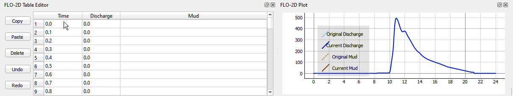
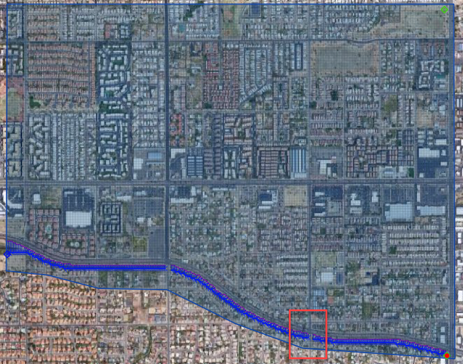
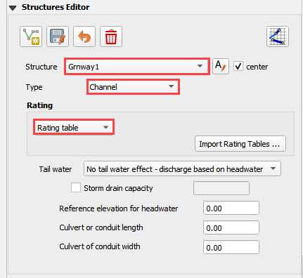
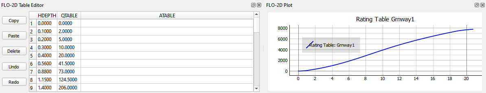
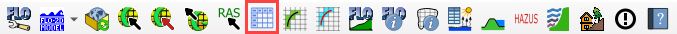

Lesson 2 – Channels
===================

.. _overview-3:

Overview
________

Complete QGIS Lesson 1 before starting this lesson.
Use Lesson 2 to build an urban drainage channel and add culverts to the channel.

This video shows the full process of this tutorial.

.. youtube:: d2GfNh6OTWU

Required Data
_____________

The lesson makes use of the original data from Lesson 1, left bank, right bank, and cross section data, and culvert rating tables.
Start from the end of Lesson 1.
All data is provided in the Lesson folders.

.. list-table::
   :widths: 33 33 33
   :header-rows: 0

   * - **File**
     - **Content**
     - **Location**

   * - QGIS Lesson 1.gpkg
     - FLO-2D GeoPackage
     - \\QGIS Lesson 1

   * - QGIS Lesson 1.qgz
     - QGIS file
     - \\QGIS Lesson 1

   * - Grnway Inflow 24 hr100yr.txt
     - Inflow hydrograph
     - \\QGIS Lesson 2

   * - Culvert rating tables
     - Culvert rating tables
     - \\QGIS Lesson 2\\Hydraulic Structures

   * - Greenway.g01
     - Channel GeoRAS file
     - \\QGIS Lesson 2

Project Location C:\\Users\\Public\\Documents\\FLO-2D PRO Documentation\\Example Projects\\QGIS Tutorials

Check these folders to ensure the data is available before starting the lesson.

.. _step-by-step-procedure-3:

Step-by-Step Procedure
----------------------

To setup a FLO-2D flood simulation use these steps.

1. Open Lesson 1;

2. Import GeoRAS channel;

3. Schematize channel;

4. Channel boundary condition;

5. Create culverts;

6. Set up control parameters and export project;

7. Interpolate the channel;

8. Import the new data;

9. Run the FLO-2D model.

Step 1: Open Lesson 1 in QGIS
______________________________

.. image:: ../img/Workshop/Worksh002.png

1. Search the start menu and run the QGIS Desktop program.  The version should be QGIS 3.18.2

2. Click Open Project and navigate to QGIS Lesson 1.
   Select QGIS Lesson 1.qgz and click Open.

.. image:: ../img/Workshop/Worksh055.png

C:\\Users\\Public\\Documents\\FLO-2D PRO Documentation\\Example Projects\\QGIS Tutorials\\QGIS Lesson 1\\QGIS Lesson 1.qgz

3. Use Quick Map Services to load an aerial image onto the map.
   See Lesson 1 - Part 2 - Step 3 for instructions.

.. image:: ../img/Workshop/Worksh056.png

Step 2: Import GeoRAS Channel
_____________________________

1. Click the Import RAS icon.
   Open the Greenway.g01 file.

.. image:: ../img/Workshop/Worksh057.png

C:\\Users\\Public\\Documents\\FLO-2D PRO Documentation\\Example Projects\\QGIS Tutorials\\QGIS Lesson 2\\Greenway.g01

2. Check the Bank Stations radio button and click OK.

3. The channel left bank, right bank, and cross sections are imported into the User Layers.
   The cross-section data is imported into the cross section data tables.

.. image:: ../img/Workshop/Worksh059.png

Step 3: Schematize channel
__________________________

1. Click the Schematize channels button.

.. image:: ../img/Workshop/Worksh060.png

2. If the channel schematization process was successful, the following message will appear.
   Click Close.

.. image:: ../img/Workshop/Worksh061.png

Step 4: Channel in/out condition
________________________________

Inlet
_____

1. Zoom to the first channel element on the southeast corner of the map.

.. image:: ../img/Workshop/Worksh062.png

2. Use the Boundary Condition Editor to create the Inflow point.

.. image:: ../img/Workshop/Worksh063.png

3. Add a point to the first channel cell.

4. Click Save on the Widget.

5. Change the name of the inflow to GrnwayIN.

6. Set it to Defined for Channel.

7. Click the add a new time series button.

8. Name the new time series Grnway24hr100yr.

.. image:: ../img/Workshop/Worksh065.png

9. Open the hydrograph file from Lesson 2.  Copy the data from this file.

.. image:: ../img/Workshop/Worksh174.png

C:\\Users\\Public\\Documents\\FLO-2D PRO Documentation\\Example Projects\\QGIS Tutorials\\QGIS Lesson 2\\Greenway Inflow 100yr 24hr.txt

10. Place the cursor in the first cell of the FLO-2D Table Editor and click Paste.

Outlet
______

1. Zoom to the end of the channel.
   Add a BC Point to the last element of the channel.

.. image:: ../img/Workshop/Worksh063.png

.. image:: ../img/Workshop/Worksh068.png

.. image:: ../img/Workshop/Worksh069.png

2. Save the form and set the BC type to Outflow

3. Name the BC to GrnwyOut

4. Set the type to 3.

.. image:: ../img/Workshop/Worksh071.png

5. Shematize the outflow conditions.

.. image:: ../img/Workshop/Worksh073.png

Step 5: Culverts
________________

This structure will calculate discharge through a box culvert.
This example has a box culvert that is longer than the grid element.
The channel segments are split up to allow for the width of the roadway.

**Note:  This image shows how the culverts should look once they have been digitized**

.. image:: ../img/Workshop/Worksh074.png

1. Zoom to the first culvert.

2. Open the Structures Editor.
   Click the Add Structure icon.

.. image:: ../img/Workshop/Worksh075.png

3. Digitize the first culvert by clicking on the upstream left bank element and downstream left bank element of the channel.
   Right click to complete the line and click OK to close the Structure Line attribute box.

.. image:: ../img/Workshop/Worksh176.png

4. Repeat the process on the second culvert downstream.

.. image:: ../img/Workshop/Worksh177.png

5. Click the Save Button on the Structure Editor.

.. image:: ../img/Workshop/Worksh077.png

6. Fill out the data for each structure.

-  Name the culverts Grnway1, Grnway2

-  Type \= Channel

-  Rating \= Rating table

-  Tailwater condition is none.

7.  Click the Import Rating Tables button

.. image:: ../img/Workshop/Worksh078.png

8.  Navigate to the Rating Tables files, select both tables and click Open.

C:\\Users\\Public\\Documents\\FLO-2D PRO Documentation\\Example Projects\\QGIS Tutorials\\QGIS Lesson 2\\Hydraulilc Structures

.. image:: ../img/Workshop/Worksh079.png

9. Note that the data was loaded into the FLO-2D Table Editor for the active structure.

10. Click Schematize to write the data to the schematic layers.

.. image:: ../img/Workshop/Worksh080.png

11. The hydraulic structures are now ready.

7. If you do not see the data, refresh the tables by selecting the structure again in the widget.

.. image:: ../img/Workshop/Worksh081.png

Step 6: Export the project
__________________________

1. Click the Setup Control Parameters icon.

3. Check the boxes for Main Channel and Hydraulic structures if needed.

4. Click Save.

.. image:: ../img/Workshop/Worksh082.png

5. This is a good point to save project.

.. image:: ../img/Workshop/Worksh011.png

Step 7: Interpolate the channel
_______________________________

1. To interpolate the channel segments, export the channel data and run the interpolator.
   In the Cross Sections Editor widget, click the Create CHAN.DAT, XSEC.DAT, and CHANBANK.DAT icon.

.. image:: ../img/Workshop/Worksh084.png

2. Select the folder where the \*.DAT files will be saved.

C:\\Users\\Public\\Documents\\FLO-2D PRO Documentation\\Example Projects\\QGIS Tutorials\\QGIS Lesson 2\\Lesson 2 Export

.. image:: ../img/Workshop/Worksh085.png

The first action saves the channel data.

.. image:: ../img/Workshop/Worksh086.png

The second action calls the Interpolate.exe program from the FLO-2D Pro folder.
If this process results in an Interpolate.exe error, it is possible to move that file to another location and make sure it is named correctly.

.. image:: ../img/Workshop/Worksh087.png

If the interpolation is performed correctly the following message will appear.

3. Click Import CHAN.DAT and XSEC.DAT to update the channel data in QGIS.

.. image:: ../img/Workshop/Worksh088.png

4. Click the OK icon when the process is finished.

.. image:: ../img/Workshop/Worksh089.png

Step 8: Run the simulation
__________________________

1. Click the Run FLO-2D Icon.

.. image:: ../img/Workshop/Worksh005.png

2. Set the FLO-2D Folder.
   C:\\program files (x86)\\flo-2d pro

3. Set the Project Folder.

C:\\users\\public\\public documents\\flo-2d pro documentation\\Example Projects\\QGIS Tutorials\\QGIS Lesson 2\\Lesson 2 Export

4. Click OK.

.. image:: ../img/Workshop/Worksh090.png

5. If an error message appears, open the error.chk file from the project directory.

.. image:: ../img/Workshop/Worksh091.png

6. If you are in a live class, Open and read the Error.CHK file in Notepad or Notepad++ and wait for the instructor.
   We will fix this as a group.

7. If you are on your own, check out this video.
   Go in about halfway and find the part where we fix the left and right banks.

https://www.youtube.com/watch?v-Ov1oa2HEsXs

Summary
-------

This lesson was a simple channel import.  It used a Georeferenced HEC-RAS geometry file.
These files can be made with HEC-RAS version 5.0 or HEC GEORAS plugin for ArcGIS or the standard RasMapper program.

There are many ways to build channels with QGIS for FLO-2D and the other possibilities are outlined in the User’s Manual.

To add more detail and components to the project such as channels, hydraulic structures, buildings, levees and storm drains, complete the following
lessons.
