Lesson 3 – Create a Storm Drain System Using Shapefiles
=======================================================

**Overview**

This lesson will outline the process to create a storm drain network for FLO-2D.  This is the quick version.  It is
better for learning QGIS and FLO-2D Plugin operations.  For advanced storm drain modeling, see the Advanced Lessons.

.. youtube:: SArfBrC0U9A

Required Data

Start this lesson from the end of Lesson 2.
It requires the channels and culverts.
All data is provided in the Lesson folders.

.. list-table::
   :widths: 33 33 33
   :header-rows: 0

   * - **File**
     - **Content**
     - **Location**

   * - Shapefiles without pump
     - Inlets-Junctions, Outfalls, and Conduits
     - QGIS Lesson 3\\Storm Drain Shapefiles\\Without pump

   * - Shapefiles with pump
     - Inlets-Junctions, Outfalls, Conduits, and Pumps
     - QGIS Lesson 3\\Storm Drain Shapefiles\\With pump

   * - I4-37-32-26-1.txt
     - Rating Table
     - QGIS Lesson 3\\Storm Drain Shapefiles

Project Location C:\\Users\\Public\\Documents\\FLO-2D Pro Documentation\\Example Projects\\QGIS Tutorials

Check these folders to ensure the data is available before starting the lesson.

Step 1: Open QGIS and load the project
______________________________________

.. image:: ../img/Workshop/Worksh002.png

1. Open QGIS and drag Lesson 1.qgz onto the map space the file in QGIS and Load the Project into the FLO-2D Plugin.

.. image:: ../img/Workshop/Worksh157.png

2. Click Yes to load the plugin.

.. image:: ../img/Workshop/Worksh158.png

C:\\Users\\Public\\Documents\\FLO-2D PRO Documentation\\Example Projects\\QGIS Tutorials\\QGIS Lesson 1\\QGIS Lesson 1.qgz

3. If necessary add an aerial image to the map.  See Lesson 1 - Part 2 - Step 3 for instructions.

.. image:: ../img/Workshop/Worksh056.png

4. Organize the map layers to facilitate the next steps.  Uncheck Channel User Layers and any unused Project Data Layers.

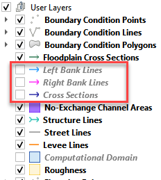

.. warning:: The next step may require extra data and a plugin update.  If you would like to try the lesson with pumps,
             download the new data and update the plugin with this link:
             https://flo-2d.sharefile.com/d-scaa3099c74544a6d9e70b1012e906d84

             If you would like to try the lesson without pumps, simply ignore instructions related to pumps.

Step 2: Import the storm drain shapefiles
__________________________________________

1. Click the Boundary Condition Points layer in the User Layers Group.

2. Drag the \*.shp files from QGIS Lesson 3 folder and drop the files in the map space.
   The shapefiles should be located in the User Layers group.

C:\\Users\\Public\\Documents\\FLO-2D PRO Documentation\\Example Projects\\QGIS Tutorials\\QGIS Lesson 3\\Storm Drain Shapefiles\\With pump

.. note:: If your data doesn't have pumps, simply use the shapefiles in Lesson 3\\Storm Drain Shapefiles

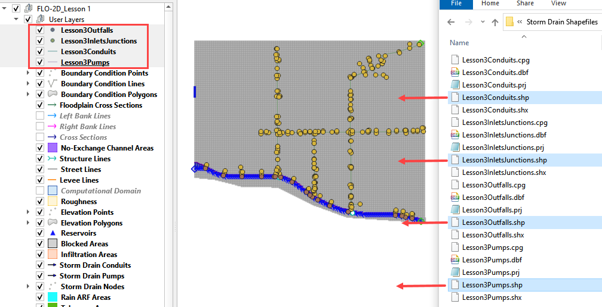

The shapefiles info:

-  **Lesson3InletsJunctions.shp** is a point shapefile that contains the Inlets and Junctions.
   Inlets collect flow from the surface and their name should start with “I”, this is a requirement for all inlets from
   type 1 to 5, including manholes.

-  **Lesson3Outfalls.shp** is a point shapefile that contains the outfalls.

-  **Lesson3Conduits.shp** is a polyline shapefile that contains the pipes.

-  **Lesson3Pumps.shp** is a polyline shapefile that contains the pumps.

3. Check the Attribute Tables for the new layers.
   To do this right click any storm drain layer and then click Attributes Table.

.. image:: ../img/Workshop/Worksh094.png

The following data must be available in the shapefile to create the **SWMM.INP** files and the associated storm drain
data files: **SWMMFLO.DAT**, **SWMMOUTF.DAT** and **SWMMFLORT.DAT**.

\* The asterisk means the data in the fields will be overwritten by the link node calculator.

.. image:: ../img/Advanced-Workshop/conduits.png

.. image:: ../img/Advanced-Workshop/inlets.png

.. image:: ../img/Advanced-Workshop/outfalls.png

.. image:: ../img/Advanced-Workshop/pumps.png

Step 3: Select storm drain fields from the shapefiles
_____________________________________________________

1. Expand the Storm Drain Editor widget and click the Select components from shapefile layer button.

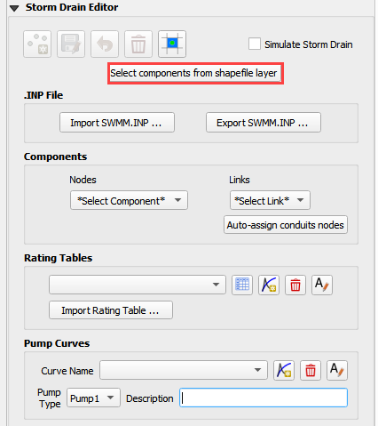

2. Use the Editor to assign the Inlets/Junctions parameters from the shapefile to the attribute table.

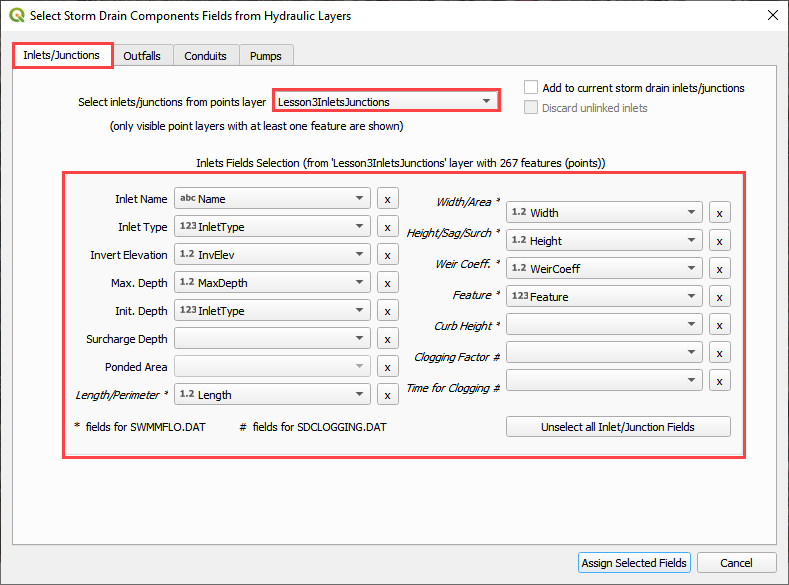

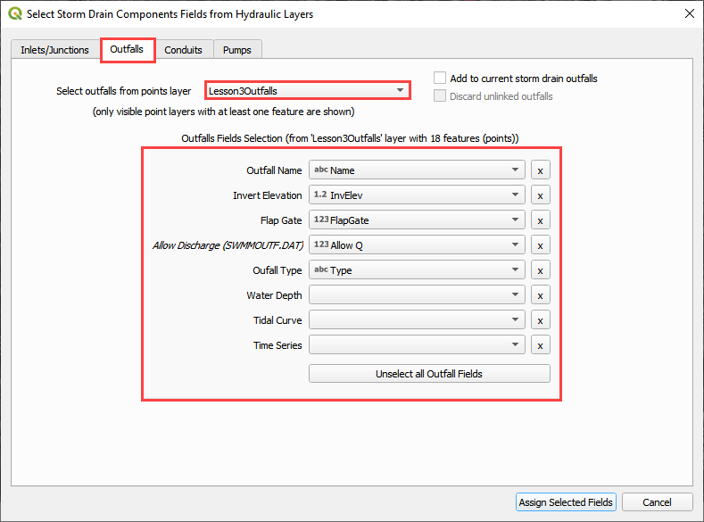

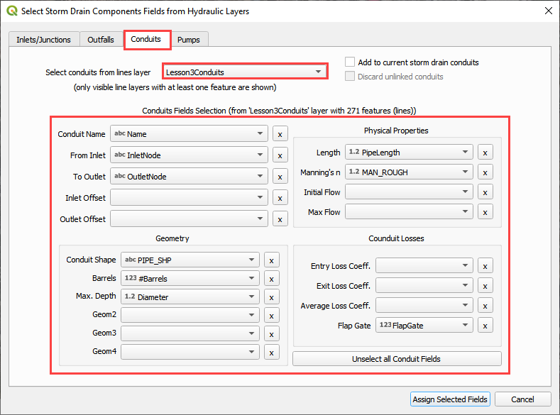

.. note:: If the project does not have pumps, click *Unselect all Pump Fields* and then click *Assign Selected Fields*.

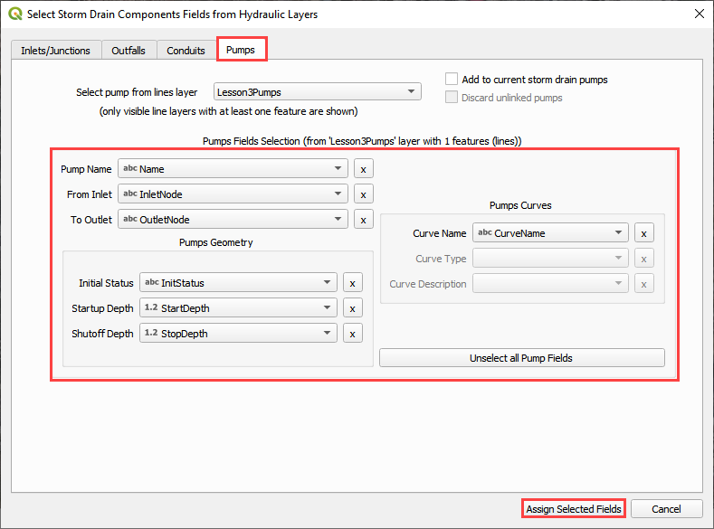

3. Once all features are selected in the drop-down menus, click *Assign Selected Inlets/Junctions, Outfalls and
   Conduits* to create the data structures of the Storm Drain Components.

4. The following message will be displayed.
   Click *OK*.

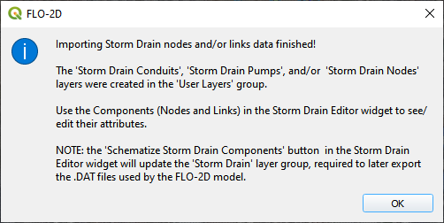

Step 4: Assign the link node connections
_________________________________________

1. Click the Simulate storm drain checkbox.

2. Click the Auto-assign link nodes button and select Conduits.

3. Repeat the process for Pumps.

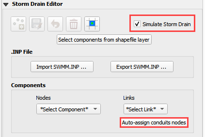

.. image:: ../img/Workshop/Worksh100a.png

Step 5: Import rating tables
____________________________

1. Click the Import Rating Table Button

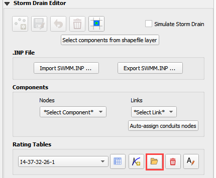

2. Navigate to the I4 table with this path.
   Select the file and click Open.

C:\\Users\\Public\\Documents\\FLO-2D PRO Documentation\\Example Projects\\QGIS Tutorials\\QGIS Lesson 3\\Storm Drain Shapefiles\\I4-37-32-26-1.txt

3. The table was imported and assigned to the correct inlet node.

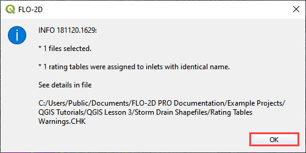

4. No error was reported.  If an error was detected because one Type 4 inlet didn't match a selected text file, it
   would be reported to this file:

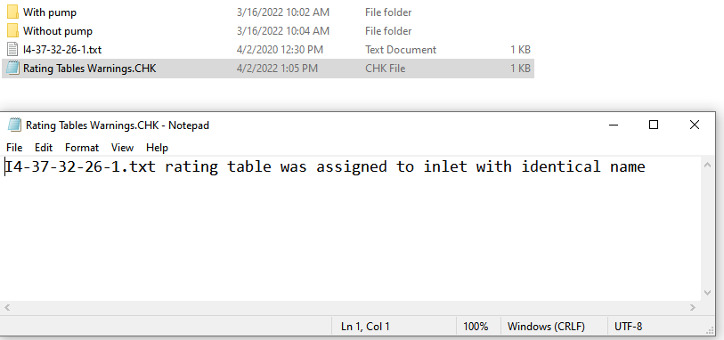

Step 6: Set up the pump data
____________________________

.. note:: Not using pumps? Skip this step.

1. Click the Add pump curve button.

2. Name the Pump "P1".

3. Set the Pump Type to Pump4.

4. Add a description. (not required)

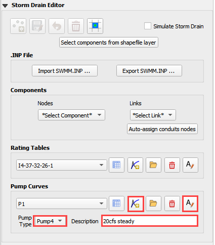

5. Apply a rating table.

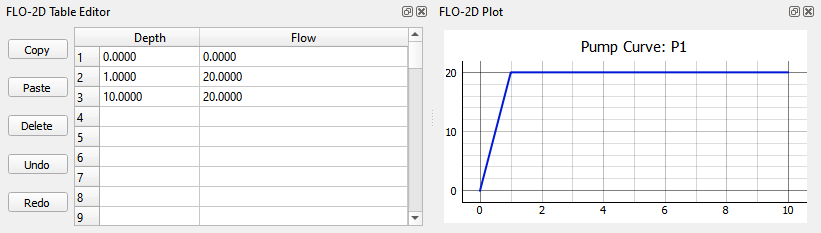

6. Pump instructions can be found in the EPA SWMM 5.0 Help Document

.. image:: ../img/Workshop/Worksh101c.png

C:\\ProgramData\\Microsoft\\Windows\\Start Menu\\Programs\\EPA SWMM 5.0\\EPA SWMM 5.0 Help

Step 7: Schematize storm drain components
_________________________________________

1. Click on Schematize Storm Drain Components in the Storm Drain Editor widget.

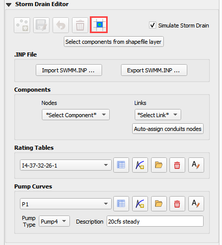

2. Once the storm drain components are schematized, the following dialog will appear.
   Click *OK* to close.

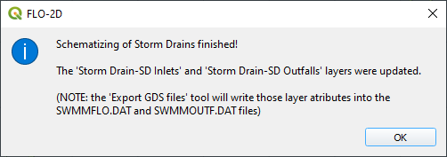

3. The storm drain schematized data layers have been completed.  The storm drain components are now part of the
   schematized layers in the project.

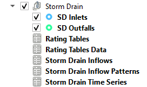

Step 8: Export the project
__________________________

1. Click the Set Control Variable icon.

.. image:: ../img/Workshop/Worksh017.png

2. Verify the data and Click Save.

.. image:: ../img/Workshop/Worksh111.png

3. This is a good point to save project.

.. image:: ../img/Workshop/Worksh083.png

4. Export the data files to the Project Folder in QGIS Lesson 3

.. image:: ../img/Workshop/Worksh021.png

C:\\Users\\Public\\Documents\\FLO-2D PRO Documentation\\Example Projects\\QGIS Tutorials\\QGIS Lesson 3\\Lesson 3 Export

5. Click OK to export the main project data files.

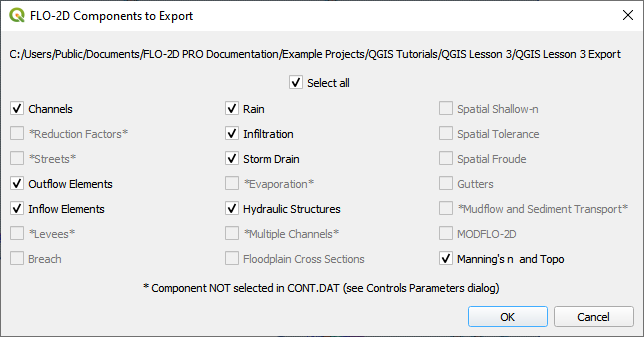

6. Save the swmm.inp file with the next dialog.  Make sure the path is still Lesson 3 Export.

.. image:: ../img/Workshop/Worksh021c.png

7. Check the .INP control variables and click OK.

.. image:: ../img/Workshop/Worksh021d.png

8. These are the storm drain components that were written to the swmm.inp file.

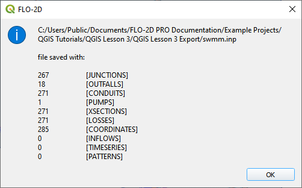

9. The final dialog will be displayed.  The associated storm drain data files are created when the storm drain switch
   has been turned ON.

.. image:: ../img/Workshop/Worksh021f.png

Step 9: Run the simulation
____________________________

1. Click the Run FLO-2D Icon.

.. image:: ../img/Workshop/Worksh0052.png

2. Set the Project path and the FLO-2D Engine Path and click OK to start the simulation.

3. Set the *FLO-2D Folder*.

C:\\program files (x86)\\flo-2d pro

4. Set the *Project Folder*.

C:\\users\\public\\public documents\\flo-2d pro documentation\\Example Projects\\QGIS Tutorials\\QGIS Lesson 3\\Lesson 3 Export

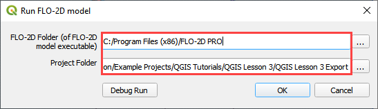

5. After the storm drain model is complete, review FLO-2D Storm Drain Manual Chapter 6 for more details about reviewing
   results.

Summary
_______

This is the completion of a full storm drain model using the FLO-2D model along with digital terrain elevation data and
an inflow hydrograph, rain, and boundary conditions from Lesson 1 and 2.  This lesson has demonstrated how to create the
storm drain system by using shapefiles for conduits, pumps, inlets/junctions and outfalls.