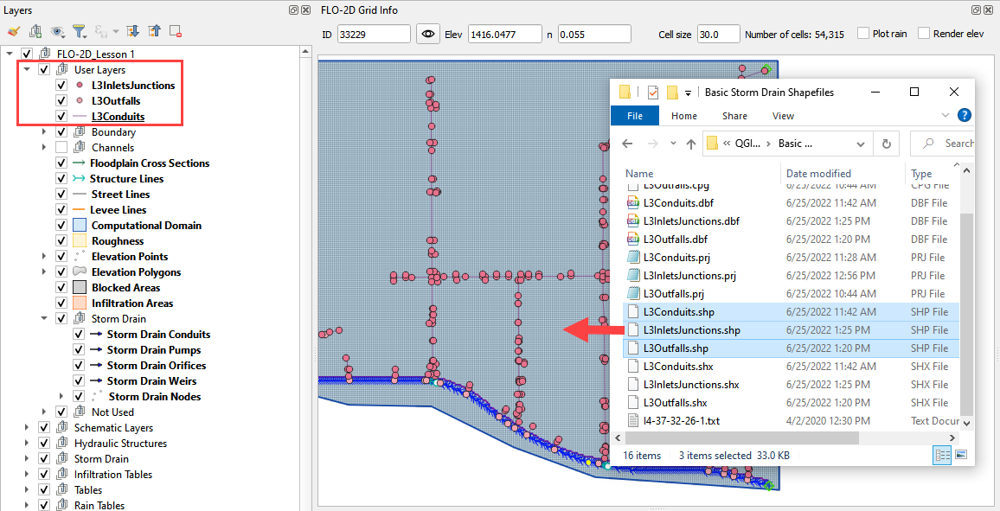
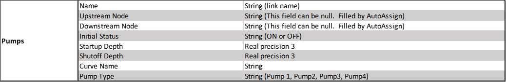
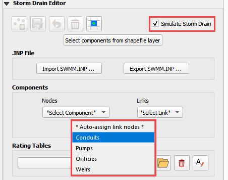
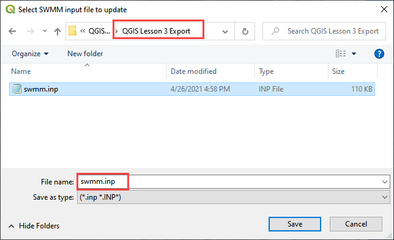
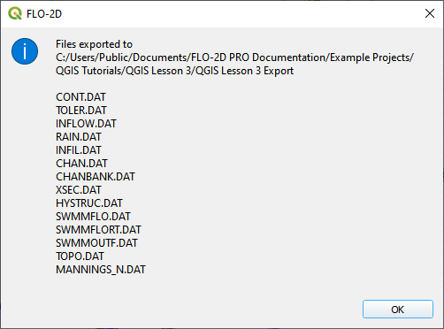

Lesson 3 – Create a Storm Drain System Using Shapefiles
=======================================================

Overview
________

This lesson will outline the process to create a storm drain network for FLO-2D.  This is the quick version.  It is
better for learning QGIS and FLO-2D Plugin operations.  For advanced storm drain modeling, see the Advanced Lessons.

.. youtube:: x-SlOV4-bHI

Required Data
_____________

Start this lesson from the end of Lesson 2.
It requires the channels and culverts.
All data is provided in the Lesson folders.

.. list-table::
   :widths: 33 33 33
   :header-rows: 0

   * - **File**
     - **Content**
     - **Location**

   * - Shapefiles without pump
     - Inlets-Junctions, Outfalls, and Conduits
     - QGIS Lesson 3\\Storm Drain Shapefiles\\Without pump

   * - Shapefiles with pump
     - Inlets-Junctions, Outfalls, Conduits, and Pumps
     - QGIS Lesson 3\\Storm Drain Shapefiles\\With pump

   * - I4-37-32-26-1.txt
     - Rating Table
     - QGIS Lesson 3\\Storm Drain Shapefiles

Project Location C:\\Users\\Public\\Documents\\FLO-2D Pro Documentation\\Example Projects\\QGIS Tutorials

Check these folders to ensure the data is available before starting the lesson.

Step-by-Step Procedure
______________________

To setup a FLO-2D flood simulation use these steps.

1. Open QGIS and load the project;

2. Import shapefiles for storm drain;

3. Select components from storm drain shapefiles;

4. Assign the conduit node connections;

5. Import rating tables;

6. Set up the pump;

7. Schematize storm drain data;

8. Export swmm.inp file;

9. Export project data;

10. Run the simulation.

Step 1: Open QGIS and load the project
______________________________________

.. image:: ../img/Workshop/Worksh002.png

1. Open QGIS and drag Lesson 1.qgz onto the map space the file in QGIS and Load the Project into the FLO-2D Plugin.

.. image:: ../img/Workshop/Worksh028.png

2. Click Yes to load the plugin.

.. image:: ../img/Workshop/Worksh029.png

C:\\Users\\Public\\Documents\\FLO-2D PRO Documentation\\Example Projects\\QGIS Tutorials\\QGIS Lesson 1\\QGIS Lesson 1.qgz

3. If necessary add an aerial image to the map.  See Lesson 1 - Part 2 - Step 3 for instructions.

.. image:: ../img/Workshop/Worksh056.png

4. Organize the map layers to facilitate the next steps.  Uncheck Channel User Layers and any unused Project Data Layers.

.. image:: ../img/Workshop/Worksh189.png

.. warning:: The next step may require extra data and an update.  If you would like to try the lesson with pumps,
             download the new data and update the plugin with this link:
             https://flo-2d.sharefile.com/d-sd19055844ea84fccbbb782e33872c53a

             If you would like to try the lesson without pumps, simply ignore instructions related to pumps.

Step 2: Import shapefiles for storm drain features
__________________________________________________

1. Grab the \*.shp files from QGIS Lesson 3\\Storm Drain Shapefiles and drop the files in the map space.
   The shapefiles should be located inside the project layer in the layer panel.

.. note:: If your data doesn't have pumps, simply use the shapefiles in Lesson 3\\Storm Drain Shapefiles

The shapefiles info:

-  **Lesson3InletsJunctions.shp** is a point shapefile that contains the Inlets and Junctions.
   Inlets collect flow from the surface and their name should start with “I”, this is a requirement for all inlets from
   type 1 to 5, including manholes.

-  **Lesson3Outfalls.shp** is a point shapefile that contains the outfalls.

-  **Lesson3Conduits.shp** is a polyline shapefile that contains the pipes.

-  **Lesson3Pumps.shp** is a polyline shapefile that contains the pumps.

3. Check the Attribute Tables for the new layers.
   To do this right click each layer and then Click Attributes Table.

.. image:: ../img/Workshop/Worksh094.png

The following data must be available in the shapefile to create the **SWMM.INP** files and the associated storm drain
data files: **SWMMFLO.DAT**, **SWMMOUTF.DAT** and **SWMMFLORT.DAT**.

.. image:: ../img/Advanced-Workshop/conduits.png

.. image:: ../img/Advanced-Workshop/inlets.png

.. image:: ../img/Advanced-Workshop/outfalls.png

Step 3: Select components from shapefile layer
______________________________________________

1. Display the Storm Drain Editor widget and click the Select components from shapefile layer button.

.. image:: ../img/Workshop/Worksh095.png

2. Use the Editor to assign the Inlets/Junctions parameters from the shapefile to the attribute table.

.. image:: ../img/Workshop/Worksh096.png

.. image:: ../img/Workshop/Worksh097.png

.. image:: ../img/Workshop/Worksh098.png

.. note:: If the project does not have pumps, click *Unselect all Pump Fields* and then click *Assign Selected Fields*.

.. image:: ../img/Workshop/Worksh098a.png

3. Once all features are assigned in the drop-down menu, then click on *Assign Selected Inlets/Junctions, Outfalls and
   Conduits* to create the data structures of the Storm Drain Components.  The following message will be displayed.
   Click *OK*.

.. image:: ../img/Workshop/Worksh099.png

Step 4: Assign the conduit node connections
____________________________________________

1. Display the Storm Drain Editor widget and click on *Inlets/Junctions.*

2. Click the Simulate storm drain checkbox.

3. Click the Auto-assign conduits nodes button.

Step 5: Import rating tables
____________________________

1. Click the Import Rating Table Button

.. image:: ../img/Workshop/Worksh101.png

2. Navigate to the I4 table with this path.
   Select the file and click Open.

C:\\Users\\Public\\Documents\\FLO-2D PRO Documentation\\Example Projects\\QGIS Tutorials\\QGIS Lesson 3\\Storm Drain Shapefiles\\I4-37-32-26-1.txt

3. The table was imported and assigned to the correct inlet node.

Step 6: Set up the pump data
____________________________

.. note:: Not using pumps? Skip this step.

1. Click the Add pump curve button.

2. Name the Pump "P1".

3. Set the Pump Type to Pump4.

4. Add a description. (not required)

.. image:: ../img/Workshop/Worksh101a.png

5. Apply a uniform rating table.

Step 7: Schematize storm drain components
_________________________________________

1. Click on Schematize Storm Drain Components in the Storm Drain Editor widget.

.. image:: ../img/Workshop/Worksh104.png

2. Once the storm drain components are schematized, the following dialog will appear.
   Click *OK* to close.

.. image:: ../img/Workshop/Worksh105.png

The storm drain schematized data layers have been completed.  The storm drain components are now part of the schematized
layers in the project.

.. image:: ../img/Workshop/Worksh106.png

Step 8: Export SWMM.INP file
____________________________

1. Make sure the switch *Simulate Storm Drain* is selected.
   Click the *Export SWMM.INP* button in the **Storm Drain Editor** widget.

.. image:: ../img/Workshop/Worksh107.png

2. Browse to the Project Folder and Save the **SWMM.INP** file.
   The \*.INP file should be named as ‘SWMM.INP’, no other names will be read by FLO-2D model.
   Click *Save*.

3. The *Storm Drain Control Dialog* is displayed.
   The control parameters must be entered.
   All gray out data in the control dialog is hardwired.

4. The data is default for FLO-2D. The report_step can be set to any desired value.

.. image:: ../img/Workshop/Worksh109.png

5. A dialog displays presenting the features that were written to the SWMM.INP file.
   Click *OK*.

.. image:: ../img/Workshop/Worksh110.png

Step 9: Export the project
__________________________

The files that connect inlets and outfalls with the FLO-2D surface layer are created when the GDS Data Files are
exported.

1. Click the *Set* *Control Variable* icon and enter the data in the FLO-2D Toolbar.
   The following dialog will be displayed, make sure the *Storm Drain* component switch is selected.

.. image:: ../img/Workshop/Worksh017.png

2. Click *Save*.

.. image:: ../img/Workshop/Worksh111.png

3. This is a good point to save project.
   Refer to Steps 9 in Lesson 1.

.. image:: ../img/Workshop/Worksh083.png

4. Export the data files to the Project Folder in QGIS Lesson 3

.. image:: ../img/Workshop/Worksh021.png

C:\\Users\\Public\\Documents\\FLO-2D PRO Documentation\\Example Projects\\QGIS Tutorials\\QGIS Lesson 3\\Lesson 3 Export

5. All GDS Data files will be created in the selected project folder, including **SWMMFLO.DAT** and **SWMMOUTF.DAT** files.

6. The following dialog will be displayed, associated storm drain data files are created when the storm drain switch
   has been turned ON.

Step 10: Run the simulation
____________________________

1. Click the Run FLO-2D Icon.

.. image:: ../img/Workshop/Worksh0052.png

2. Set the Project path and the FLO-2D Engine Path and click OK to start the simulation.

3. Set the *FLO-2D Folder*.

C:\\program files (x86)\\flo-2d pro

4. Set the *Project Folder*.

C:\\users\\public\\public documents\\flo-2d pro documentation\\Example Projects\\QGIS Tutorials\\QGIS Lesson 3\\Lesson 3 Export

.. image:: ../img/Workshop/Worksh113.png

5. After the storm drain model is complete, review FLO-2D Storm Drain Manual Chapter 6 for more details about reviewing
   results.

Summary
_______

This is the completion of a full storm drain model using the FLO-2D model along with digital terrain elevation data and
an inflow hydrograph, rain, and boundary conditions from Lesson 1 and 2.  This lesson has demonstrated how to create the
storm drain system by using shapefiles for conduits, pumps, inlets/junctions and outfalls.