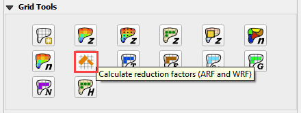
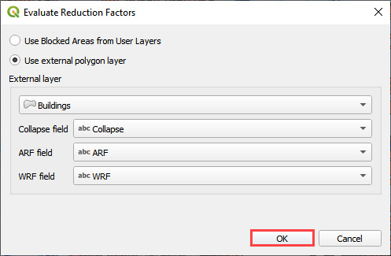
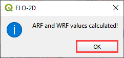
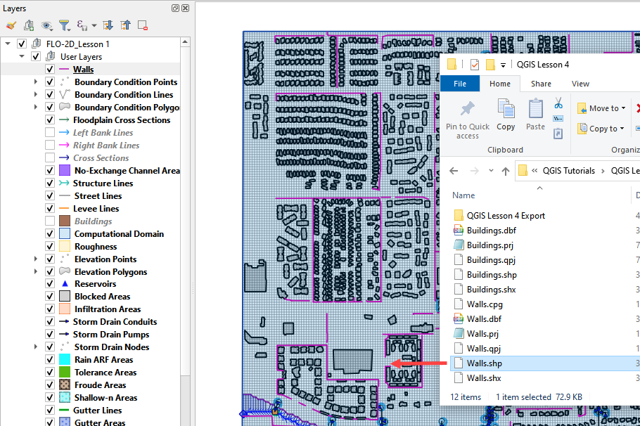
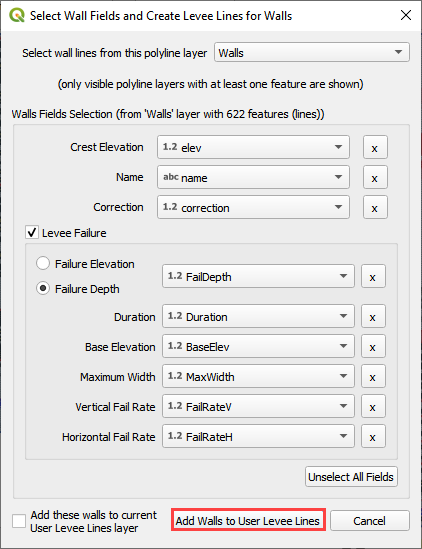
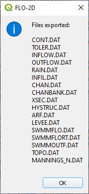

Lesson 4 – QGIS FLO-2D Plugin Buildings, Walls and Wall Failure
================================================================

.. _overview-5:

Overview
________

Lesson 4 will outline the process of setting up buildings and walls and defining wall failure parameters in a FLO-2D project using the Plugin for QGIS.
This lesson can be completed after Lesson 1 is finished.
Apply these instructions after Lesson 1, 2 or 3 are completed.

This video shows the full process of this tutorial.

.. youtube:: guHbOgtpAnM

Required Data
_____________

The lesson makes use of buildings and walls shapefiles.

.. list-table::
   :widths: 33 33 33
   :header-rows: 0

   * - **File**
     - **Content**
     - **Location**

   * - Buildings.shp
     - Building shapefile
     - \\Example Projects\QGIS Tutorials\QGIS Lesson 4 PRO

   * - Walls.shp
     - Walls shapefile
     -

\*\ *Project Location C:\Users\Public\Documents\FLO-2D Pro Documentation*

Check these folders to ensure the data is available before starting the lesson.

.. _step-by-step-procedure-5:

Step-by-Step Procedure
______________________

To setup a FLO-2D flood simulation use these steps.

1. Open Lesson 1, 2 or 3 completed project;

2. Assign buildings;

3. Assign walls;

4. Save and export;

5. Run the simulation.

Step 1: Open project QGIS and load the FLO-2D Plugin data
_________________________________________________________

.. image:: ../img/Workshop/Worksh002.png

Search the start menu and run the “QGIS Desktop” program.

QGIS Lesson 1, 2 or 3 can be used to for this project.
Click Open Project and navigate to Example Projects.
If QGIS Lesson 1, 2 or 3 are complete, choose any of these files to continue with Lesson 4.
This tutorial will continue from Lesson 3.

.. image:: ../img/Workshop/Worksh055.png

**C:\Users\Public\Documents\FLO-2D PRO Documentation\Example Projects\QGIS Tutorials\QGIS Lesson 1\QGIS Lesson 1.gpkg**

1. *Click Yes* in the FLO-2D window to Load the model.

.. image:: ../img/Workshop/Worksh114.png

The model will look as follows:

Step 2: Assign buildings
________________________

1. Drag the **Buildings.shp** shapefile onto the map space.

.. image:: ../img/Workshop/Worksh116.png

The **Buildings.shp** shapefile needs 3 Attributes.

-  Collapse Field

-  ARF Field

-  WRF Field

-  These fields represent switches to set the calculation control for each building.

-  Collapse - 0 will ignore building collapse settings.

-  Collapse - 1 will apply the control for building collapse.
   If building collapse is needed, look in the Data Input manual for an extra data file.

-  ARF - 0 will ignore the ARF calculation

-  ARF - 1 will calculate the ARF calculation

-  WRF - 0 will ignore the spatially variable WRF but apply a T line to any totally blocked cell.

-  WRF - 1 will calculate the spatially variable WRF and apply a T line to any totally blocked cell.

2. Click the Evaluate Reduction Factors (ARF and WRF) icon.

3. Set up the parameters and click OK

4. Close *OK* the window.

Step 3: Assign walls
____________________

1. *Drag* the file **Walls.shp** into the map space.

2. Click the *Levee Elevation Tool* from the *FLO-2D Toolbar* and click the Add Walls to User Levee Lines button.

.. image:: ../img/Workshop/Worksh121.png

.. image:: ../img/Workshop/Worksh122.png

3. Set the wall elevation and failure fields and click Add Walls to User Levee Lines.

4. Uncheck Levee Failure

5. The levees were added to the user layer.
   Click OK.

.. image:: ../img/Workshop/Worksh124.png

*Note: If an error message was displayed, Move the Walls Layer to the User Layer Group.*

6. Click the *Levee Elevation Tool* from the *FLO-2D Toolbar* and click the Create Schematic Layers from User Levees button.

.. image:: ../img/Workshop/Worksh125.png

7. In this case, only levee lines are used.
   Uncheck elevation polygons if it is checked.

8. Duplicate levees were identified.
   Remove them by clicking Yes.

.. image:: ../img/Workshop/Worksh127.png

9. Once the process is complete, the following image will appear.
   Click OK to close it.

.. image:: ../img/Workshop/Worksh128.png

Step 4: Export the project
__________________________

The files that connect inlets and outfalls with the FLO-2D surface layer are created when the GDS Data Files are exported.

1. Click the *Set Control Parameters* icon and enter the data in the FLO-2D Toolbar.
   The following dialog will be displayed, make sure the **Area Reduction Factors** and **Levees** component switches are selected.

.. image:: ../img/Workshop/Worksh017.png

2. Click *Save*.

.. image:: ../img/Workshop/Worksh129.png

3. This is a good point to save the project.
   Refer to Steps 9 in Lesson
   1.

.. image:: ../img/Workshop/Worksh083.png

4. Export the data files to the project folder in QGIS Lesson 4.

.. image:: ../img/Workshop/Worksh021.png

**C:\Users\Public\Documents\FLO-2D PRO Documentation\Example Projects\QGIS Tutorials\QGIS Lesson 4\QGIS Lesson 4 Export**

All GDS Data files will be created in the selected project
folder, including **ARF.DAT** and **LEVEE.DAT** files.

The swmm.inp file was not exported.
Copy it from Lesson 3 Export folder or export it again using the Storm Drain Editor.

.. image:: ../img/Workshop/Worksh130.png

Step 5: Run the simulation
__________________________

1. Click the *Run FLO-2D* Icon.

2. Set the Project path and the FLO-2D Engine Path and click *OK* to start the simulation.

.. _summary-2:

Summary
-------

This is the completion of a tutorial for adding buildings and walls to a model that is ready to run.
This tutorial can be applied to any project once the grid and elevation is assigned.