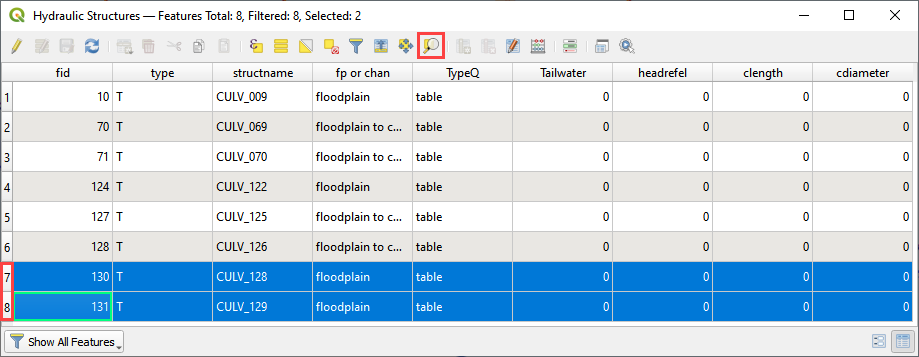
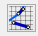
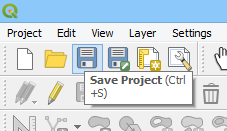
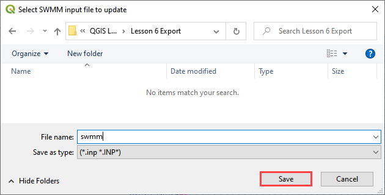

Lesson 6 – Hydraulic Structures
===============================

.. _overview-7:

Overview
________

Lesson 6 outlines the process of creating hydraulic structures with rating tables and generalized culvert equations.
This lesson needs a channel so please use the data from Lesson 2, 3, or 4 to run through this tutorial.
Finish Lesson 2 through before performing the following steps.

.. _required-data-7:

Required Data
_____________

The lesson makes use of QGIS Lesson 2, 3 or 4 and hydraulic structure shapefile and structure data files in QGIS Lesson 6.

.. list-table::
   :widths: 33 33 33
   :header-rows: 0

   * - **File**
     - **Content**
     - **Location**

   * - \*.shp
     - Hydraulic Structures
     - \\Example Projects\QGIS Tutorials\QGIS Lesson 6 PRO

   * - \*.txt
     - Culvert Tables
     -

\*\ *Project Location C:\Users\Public\Documents\FLO-2D Pro Documentation*

Check these folders to ensure the data is available before starting the lesson.

.. _step-by-step-procedure-7:

Step-by-Step Procedure
______________________

To build **HYSTRUC.DAT** following these steps.

1. Open Lesson 2, 3, or 4 qgz file;

2. Import the Hydraulic Structures shapefile;

3. Build the structures into the User Layers;

4. Assign the structure attributes;

5. Assign the rating tables;

6. Schematize the data;

7. Export and

8. Run the simulation.

.. _step-1-setup-the-project-1:

Step 1: Setup the project
_________________________

.. image:: ../img/Workshop/Worksh092.png

1. Search the start menu and run the “QGIS Desktop” program.

2. Complete Lesson 2 prior to starting this lesson.

3. Save the project

Step 2: Import data
___________________

Start by cleaning up the map space so the next layer will be easy to see.

1. Uncheck the User Leftbank, Right Bank Cross section layers;

2. Uncheck the Blocked Areas;

3. Uncheck the Storm Drain User Layers;

4. Click the User Boundary Conditions Layer;

5. Drag the Hydraulic Structures onto the map space.

.. image:: ../img/Workshop/Worksh139.png

Step 3: Build the structures into the User Layers.
__________________________________________________

1. Open the Attributes Table on the Hydraulic Structures Layer.

.. image:: ../img/Workshop/Worksh140.png

2. Select structure 130, and 131 and click Zoom map to selected rows button.
   This will zoom your map to these two structures.

3. Label the Hydraulic Structures Layer.

4. Double click the Hydraulic Structures layer

5. Set the Labels like the following image.

6. This allows you to see which culvert you are working on.

.. image:: ../img/Workshop/Worksh142.png

7.  Change the layer Symbology

8.  Change the selector to Symbology

9.  Set the Symbol Layer Type to Arrow

10.
Uncheck Curved Arrows

11.
This will show you the flow direction of each structure.

.. image:: ../img/Workshop/Worksh143.png

12. Use the Structure Editor to add all of the new structures.

13. Digitize all of the structures.

14. Click the Save icon to confirm that you are finished with the digitizing tool.

.. image:: ../img/Workshop/Worksh144.png

**Digitizing process:**

15. Left click the inlet node (upstream node)

16. Left click the outlet node (downstream node)

17. Right Click to finish the polyine.

18. Click OK to finish the feature.

.. image:: ../img/Workshop/Worksh145.png

Step 4: Assign the structure attributes
---------------------------------------

.. image:: ../img/Workshop/Worksh164.png

19. Click Save in the Structures Widget to load the data into the
dialog box.

**Complete the Structure Fields**

20. Load the Hydraulic Structures Attribute table.
    The attributes will help fill out each structure table.

21. Check the center button.

22. Select the first structure.

23. Rename the Structure with the “A” button.

24. Fill the Type and Rating fields

25. Move to the next structure and repeat the process.

.. image:: ../img/Workshop/Worksh146.png

26. Schematize the structure data.

Step 5: Assign the rating tables
--------------------------------

27. Click the Import Rating Tables button

.. image:: ../img/Workshop/Worksh147.png

Select the rating tables from the project folder.

Click open.

**C:\Users\Public\Documents\FLO-2D PRO Documentation\Example Projects\QGIS Tutorials\QGIS Lesson 6\Culverts Tables**

.. image:: ../img/Workshop/Worksh148.png

The data has been imported.
If you can’t see it, switch to a different structure.

.. image:: ../img/Workshop/Worksh149.png

Step 6: Schematize the data
---------------------------

Schematize the structure data\
.. image:: ../img/Workshop/Worksh165.png and click **Yes** to replace the data.

.. image:: ../img/Workshop/Worksh150.png

Step 7: Export the data
-----------------------

This is a good point to save project.
Refer to Step 9 in Lesson 1.

.. image:: ../img/Workshop/Worksh166.png

Export the data files to the Project Folder in QGIS Lesson 6 Export.

   **C:\Users\Public\Documents\FLO-2D PRO Documentation\Example Projects\QGIS Tutorials\QGIS Lesson 6\Lesson 6 Export\\**

All GDS data files will be created in the selected project folder.

.. image:: ../img/Workshop/Worksh167.png

.. image:: ../img/Workshop/Worksh168.png

The swmm.inp file was not exported.
Copy it from Lesson 3 Export folder or export it again using the Storm Drain Editor.

.. _step-8-run-the-simulation-1:

Step 8: Run the simulation
--------------------------

.. image:: ../img/Workshop/Worksh169.png

Click the *Run FLO-2D* Icon.

Set the Project path and the FLO-2D Engine Path and click *OK* to start the simulation.

