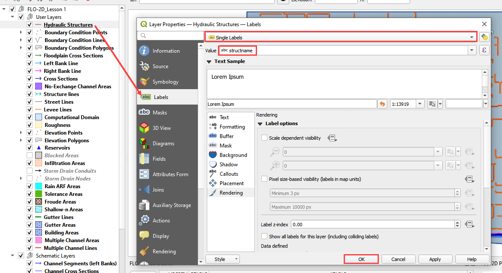

Lesson 6 – Hydraulic Structures
===============================

**Overview**

Lesson 6 outlines the process of creating hydraulic structures with rating tables and generalized culvert equations.
This lesson needs a channel so please use the data from QGIS Lesson 2, 3, or 4 to run through this tutorial.

This video shows the full process of this tutorial.

.. youtube:: H02oR4bySw4

Required Data
_____________

The lesson makes use of QGIS Lesson 2, 3, or 4 and hydraulic structure shapefile and structure data files in QGIS Lesson 6.

.. list-table::
   :widths: 33 33 33
   :header-rows: 0

   * - **File**
     - **Content**
     - **Location**

   * - \*.shp
     - Hydraulic Structures
     - QGIS Lesson 6

   * - \*.txt
     - Culvert Tables
     - QGIS Lesson 6\\Culvert Tables

Project Location C:\\Users\\Public\\Documents\\FLO-2D Pro Documentation\\Example Projects\\QGIS Tutorials

Check these folders to ensure the data is available before starting the lesson.

Step-by-Step Procedure
_______________________

To build HYSTRUC.DAT following these steps.

1. Open Lesson 2, 3, or 4 qgz file;

2. Import the Hydraulic Structures shapefile;

3. Build the structures into the User Layers;

4. Assign the structure attributes;

5. Assign the rating tables;

6. Schematize the data;

7. Export and project;

8. Run the simulation.

Step 1: Setup the project
_________________________

.. image:: ../img/Workshop/Worksh002.png

1. Search the start menu and run the “QGIS Desktop” program.

2. Complete Lesson 2 prior to starting this lesson.

3. Save the project

Step 2: Import data
____________________

1. Start by cleaning up the map space so the next layer will be easy to see.

2. Uncheck the User Left Bank Lines, Right Bank Lines, and Cross Sections layers;

3. Uncheck the Blocked Areas;

4. Uncheck the Storm Drain User Layers;

5. Click the User Boundary Conditions Layer to activate this layer;

6. Drag the Hydraulic Structures onto the map space.

.. note:: If the image is blurry, use Firefox or open the image in a new tab.

.. image:: ../img/Workshop/Worksh139.png

Step 3: Format the data layers
______________________________

1. Open the Attributes Table on the Hydraulic Structures Layer.

.. image:: ../img/Advanced-Workshop/Module033.png

2. Select structure 130, and 131 and click Zoom map to selected rows button.
   This will zoom the map to these two structures.

.. image:: ../img/Advanced-Workshop/Module034.png

**Label the Hydraulic Structures layer.**

3. Double click the Hydraulic Structures layer

4. Set the Labels like the following image.

5. This shows which culvert is being reviewed.

**Change the layer Symbology**

6. Change the tab to Symbology

7. Set the Symbol Layer Type to Arrow

8. Uncheck Curved Arrows

9. This shows the flow direction of each structure.

.. image:: ../img/Advanced-Workshop/Module036.png

Step 4: Build the culverts into the User Layers Structure Lines
________________________________________________________________

1. Use the Structure Editor to add all of the new structures.

2. Digitize all of the structures.

3. Click the Save icon to confirm that close the digitizing tool and load the data.

.. image:: ../img/Advanced-Workshop/Module037.png

**Digitizing process:**

  - Left click the inlet node (upstream node)

  - Left click the outlet node (downstream node)

  - Right Click to finish the polyine.

  - Click OK to finish the feature.

.. image:: ../img/Workshop/Worksh145.png

4. Click Save in the Structures Widget to load the data into the dialog box.

.. image:: ../img/Advanced-Workshop/Module039.png

Step 5: Assign the structure attributes
_______________________________________

**Complete the Structure Fields**

1. Load the Hydraulic Structures Attribute table.
   The attributes will help fill out each structure table.

2. Check the center button.

3. Select the first structure.

4. Rename the Structure with the “A” button.

5. Fill the Type and Rating fields

6. Move to the next structure and repeat the process.

.. image:: ../img/Advanced-Workshop/Module040.png

7. Schematize the structure data.

.. image:: ../img/Advanced-Workshop/Module041.png

Step 6: Assign the rating tables
_________________________________

1. Click the Import Rating Tables button

.. image:: ../img/Workshop/Worksh147.png

2. Select the rating tables from the project folder.

3. Click open.

C:\\Users\\Public\\Documents\\FLO-2D PRO Documentation\\Example Projects\\QGIS Tutorials\\QGIS Lesson 6\\Culverts Tables

.. image:: ../img/Workshop/Worksh148.png

4. The data has been imported.  Switch to another structure in the list if the table and plot does not update.

.. image:: ../img/Workshop/Worksh149.png

Step 7: Schematize the data
___________________________

Schematize the structure data and click Yes to replace the data.

.. image:: ../img/Workshop/Worksh165.png

.. image:: ../img/Workshop/Worksh150.png

Step 8: Export the data
_______________________

.. image:: ../img/Workshop/Worksh083.png

1. This is a good point to save project.

.. image:: ../img/Workshop/Worksh021.png

2. Export the data files to the Project Folder in QGIS Lesson 6 Export.

C:\\Users\\Public\\Documents\\FLO-2D PRO Documentation\\Example Projects\\QGIS Tutorials\\QGIS Lesson 6\\Lesson 6 Export

3. All GDS data files will be created in the selected project folder.

.. image:: ../img/Workshop/Worksh167.png

.. image:: ../img/Workshop/Worksh168.png

4. The swmm.inp file was not exported.
   Copy it from Lesson 3 Export folder or export it again using the Storm Drain Editor.

.. image:: ../img/Workshop/Worksh151.png

Step 9: Run the simulation
___________________________

.. image:: ../img/Workshop/Worksh0052.png

1. Click the Run FLO-2D Icon.

2. Set the Project path and the FLO-2D Engine Path and click OK to start the simulation.

.. image:: ../img/Workshop/Worksh152.png

