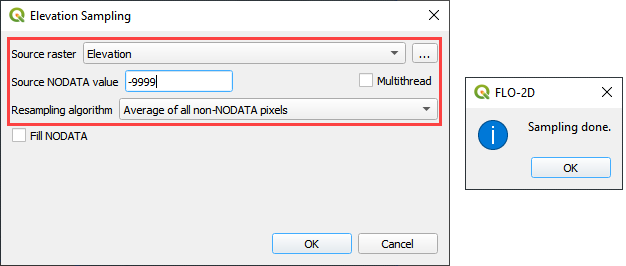
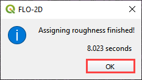
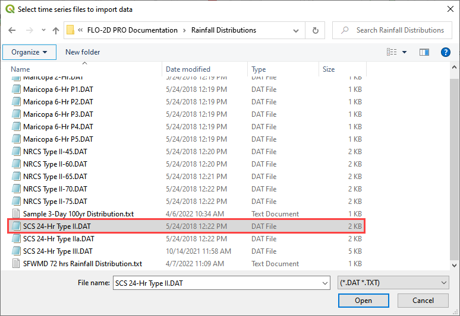
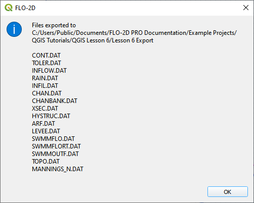

**FLO-2D\ ©**

**PRO VERSION**

**Two-Dimensional**

**Flood Routing Model**

**Workshop Lessons FLO-2D Plugin for QGIS 2021**

Table of Contents
=================

`Table of Contents i <#table-of-contents>`__

`Introduction 1 <#introduction>`__

`Lesson 1, Part 1 – QGIS FLO-2D Plugin Getting Started 3 <#lesson-1-part-1-qgis-flo-2d-plugin-getting-started>`__

`Overview 3 <#overview>`__

`Required Data 3 <#required-data>`__

`Step-by-Step Procedure 4 <#step-by-step-procedure>`__

`Step 1: Open QGIS 4 <#step-1-open-qgis>`__

`Step 2: Import the project domain 5 <#step-2-import-the-project-domain>`__

`Step 3: Set up the FLO-2D project 6 <#step-3-set-up-the-flo-2d-project>`__

`Step 4: Create the grid 7 <#step-4-create-the-grid>`__

`Step 5: Save the project 8 <#step-5-save-the-project>`__

`Step 6: Assign grid elevation 9 <#step-6-assign-grid-elevation>`__

`Step 7: Assign Manning’s data 10 <#step-7-assign-mannings-data>`__

`Step 8: Assign Control variables 12 <#_Toc71877122>`__

`Step 9: Save the project 14 <#step-9-save-the-project>`__

`Step 10: Export the project 14 <#step-10-export-the-project>`__

`Step 11: Run the simulation 14 <#step-11-run-the-simulation>`__

`Lesson 1, Part 2 – Project Recovery Methods 15 <#lesson-1-part-2-project-recovery-methods>`__

`Overview 15 <#overview-1>`__

`Required Data 15 <#required-data-1>`__

`Step-by-Step Procedure 16 <#step-by-step-procedure-1>`__

`Step 1: Create a recovery file 16 <#step-1-create-a-recovery-file>`__

`Step 2: Recover a project 17 <#step-2-recover-a-project>`__

`Step 3: Open the project 19 <#step-3-open-the-project>`__

`Lesson 1, Part 3 – Hydrology, Rainfall, and Infiltration 21 <#lesson-1-part-3-hydrology-rainfall-and-infiltration>`__

`Overview 21 <#overview-2>`__

`Required Data 21 <#required-data-2>`__

`Step-by-Step Procedure 22 <#step-by-step-procedure-2>`__

`Step 1: Open QGIS 22 <#step-1-open-qgis-1>`__

`Step 2: Load Lesson 1 22 <#step-2-load-lesson-1>`__

`Step 3: Import aerial images 23 <#step-3-import-aerial-images>`__

`Step 4: Add inflow node 24 <#step-4-add-inflow-node>`__

`Step 5: Assign rainfall 28 <#step-5-assign-rainfall>`__

`Step 6: Assign infiltration 32 <#step-6-assign-infiltration>`__

`Step 7: Check control variables 36 <#_Toc71877143>`__

`Step 8: Save the project 37 <#step-8-save-the-project>`__

`Step 9: Export the project 37 <#step-9-export-the-project>`__

`Step 10: Run the simulation 37 <#step-10-run-the-simulation>`__

`Lesson 2 – Channels 39 <#lesson-2-channels>`__

`Overview 39 <#overview-3>`__

`Required Data 39 <#required-data-3>`__

`Step-by-Step Procedure 40 <#step-by-step-procedure-3>`__

`Step 1: Open Lesson 1 in QGIS and load the FLO-2D Plugin data 40 <#step-1-open-lesson-1-in-qgis-and-load-the-flo-2d-plugin-data>`__

`Step 2: Import GeoRAS channel features 40 <#step-2-import-georas-channel-features>`__

`Step 3: Schematize channel 42 <#step-3-schematize-channel>`__

`Step 4: Channel in/out condtion 43 <#step-4-channel-inout-condtion>`__

`Step 5: Culverts 47 <#step-5-culverts>`__

`Step 6: Export the project 50 <#step-6-export-the-project>`__

`Step 7: Interpolate the channel 51 <#step-7-interpolate-the-channel>`__

`Step 8: Run the simulation 53 <#step-8-run-the-simulation>`__

`Summary 54 <#summary>`__

`Lesson 3 – CREATE A STORM DRAIN SYSTEM USING SHAPEFILES 55 <#lesson-3-create-a-storm-drain-system-using-shapefiles>`__

`Overview 55 <#overview-4>`__

`Required Data 55 <#required-data-4>`__

`Step-by-Step Procedure 56 <#step-by-step-procedure-4>`__

`Step 1: Open QGIS and load the FLO-2D Plugin data 56 <#step-1-open-qgis-and-load-the-flo-2d-plugin-data>`__

`Step 2: Import shapefiles for storm drain features 57 <#step-2-import-shapefiles-for-storm-drain-features>`__

`Step 3: Select components from shapefile layer 60 <#step-3-select-components-from-shapefile-layer>`__

`Step 4: Calculate the conduit node connections 64 <#step-4-calculate-the-conduit-node-connections>`__

`Step 5: Import Rating Tables 65 <#step-5-import-rating-tables>`__

`Step 6: Schematize storm drain components 66 <#step-6-schematize-storm-drain-components>`__

`Step 7: Export SWMM.INP file 68 <#step-7-export-swmm.inp-file>`__

`Step 8: Export the project 70 <#step-8-export-the-project>`__

`Step 9: Run the simulation 72 <#step-9-run-the-simulation>`__

`Summary 72 <#summary-1>`__

`Lesson 4 – QGIS FLO-2D Plugin Buildings, Walls and Wall Failure 73 <#lesson-4-qgis-flo-2d-plugin-buildings-walls-and-wall-failure>`__

`Overview 73 <#overview-5>`__

`Required Data 73 <#required-data-5>`__

`Step-by-Step Procedure 74 <#step-by-step-procedure-5>`__

`Step 1: Open project QGIS and load the FLO-2D Plugin data 74 <#step-1-open-project-qgis-and-load-the-flo-2d-plugin-data>`__

`Step 2: Assign buildings 75 <#step-2-assign-buildings>`__

`Step 3: Assign walls 77 <#step-3-assign-walls>`__

`Step 4: Export the project 80 <#step-4-export-the-project>`__

`Step 5: Run the simulation 83 <#step-5-run-the-simulation>`__

`Summary 83 <#summary-2>`__

`Lesson 5 – Realtime Rainfall Data 85 <#lesson-5-realtime-rainfall-data>`__

`Overview 85 <#overview-6>`__

`Required Data 85 <#required-data-6>`__

`Step-by-Step Procedure 86 <#step-by-step-procedure-6>`__

`Step 1: Setup the project 86 <#step-1-setup-the-project>`__

`Step 2: Rain editor 87 <#step-2-rain-editor>`__

`Step 3: Import rainfall data 87 <#step-3-import-rainfall-data>`__

`Step 4: Export the project 89 <#step-4-export-the-project-1>`__

`Step 5: Transfer the RAIN.DAT and RAINCELL.DAT files 90 <#step-5-transfer-the-rain.dat-and-raincell.dat-files>`__

`Step 6: Run the simulation 90 <#step-6-run-the-simulation>`__

`Lesson 6 – Hydraulic Structures 91 <#lesson-6-hydraulic-structures>`__

`Overview 91 <#overview-7>`__

`Required Data 91 <#required-data-7>`__

`Step-by-Step Procedure 92 <#step-by-step-procedure-7>`__

`Step 1: Setup the project 92 <#step-1-setup-the-project-1>`__

`Step 2: Import data 93 <#step-2-import-data>`__

`Step 3: Build the structures into the User Layers.
94 <#step-3-build-the-structures-into-the-user-layers.>`__

`Step 4: Assign the structure attributes 98 <#step-4-assign-the-structure-attributes>`__

`Step 5: Assign the rating tables 99 <#step-5-assign-the-rating-tables>`__

`Step 6: Schematize the data 101 <#step-6-schematize-the-data>`__

`Step 7: Export the data 102 <#step-7-export-the-data>`__

`Step 8: Run the simulation 103 <#step-8-run-the-simulation-1>`__

Introduction
============

This document is organized as step-by-step instructions to create and run a detailed FLO-2D flood routing simulation.
The lessons will guide the user through building a spatially variable model with infiltration, channel, levee, building, hydraulic structure, dam
breach and street components.
The objective is to apply the FLO-2D Plugin for QGIS to create a simple overland flow model that will be expanded with more channel and floodplain
details.

Training resources are also available in the FLO-2D Pro Documentation.
This folder is installed on the computer under the C:\Users\Public\Documents\FLO-2D PRO Documentation.
Training videos can also be downloaded from the FTP site.
Email contact@flo-2d.com for more information.

.. |Worksh154| image:: ../img/Workshop/Worksh154.png

.. |Worksh155| image:: ../img/Workshop/Worksh155.png

.. |Worksh002| image:: ../img/Workshop/Worksh002.png

.. |Worksh157| image:: ../img/Workshop/Worksh157.png

.. |Worksh158| image:: ../img/Workshop/Worksh158.png

.. |Worksh159| image:: ../img/Workshop/Worksh159.png

.. |Worksh162| image:: ../img/Workshop/Worksh162.png

.. |Worksh092| image:: ../img/Workshop/Worksh092.png

.. |Worksh163| image:: ../img/Workshop/Worksh163.png

.. |Worksh165| image:: ../img/Workshop/Worksh165.png

.. |Worksh165| image:: ../img/Workshop/Worksh165.png

.. |Worksh166| image:: ../img/Workshop/Worksh166.png

.. |Worksh168| image:: ../img/Workshop/Worksh168.png

.. |Worksh169| image:: ../img/Workshop/Worksh169.png

