**FLO-2D\ ©**

**PRO VERSION**

**Two-Dimensional**

**Flood Routing Model**

**Workshop Lessons FLO-2D Plugin for QGIS 2021**

Table of Contents
=================

`Table of Contents i <#table-of-contents>`__

`Introduction 1 <#introduction>`__

`Lesson 1, Part 1 – QGIS FLO-2D Plugin Getting Started 3 <#lesson-1-part-1-qgis-flo-2d-plugin-getting-started>`__

`Overview 3 <#overview>`__

`Required Data 3 <#required-data>`__

`Step-by-Step Procedure 4 <#step-by-step-procedure>`__

`Step 1: Open QGIS 4 <#step-1-open-qgis>`__

`Step 2: Import the project domain 5 <#step-2-import-the-project-domain>`__

`Step 3: Set up the FLO-2D project 6 <#step-3-set-up-the-flo-2d-project>`__

`Step 4: Create the grid 7 <#step-4-create-the-grid>`__

`Step 5: Save the project 8 <#step-5-save-the-project>`__

`Step 6: Assign grid elevation 9 <#step-6-assign-grid-elevation>`__

`Step 7: Assign Manning’s data 10 <#step-7-assign-mannings-data>`__

`Step 8: Assign Control variables 12 <#_Toc71877122>`__

`Step 9: Save the project 14 <#step-9-save-the-project>`__

`Step 10: Export the project 14 <#step-10-export-the-project>`__

`Step 11: Run the simulation 14 <#step-11-run-the-simulation>`__

`Lesson 1, Part 2 – Project Recovery Methods 15 <#lesson-1-part-2-project-recovery-methods>`__

`Overview 15 <#overview-1>`__

`Required Data 15 <#required-data-1>`__

`Step-by-Step Procedure 16 <#step-by-step-procedure-1>`__

`Step 1: Create a recovery file 16 <#step-1-create-a-recovery-file>`__

`Step 2: Recover a project 17 <#step-2-recover-a-project>`__

`Step 3: Open the project 19 <#step-3-open-the-project>`__

`Lesson 1, Part 3 – Hydrology, Rainfall, and Infiltration 21 <#lesson-1-part-3-hydrology-rainfall-and-infiltration>`__

`Overview 21 <#overview-2>`__

`Required Data 21 <#required-data-2>`__

`Step-by-Step Procedure 22 <#step-by-step-procedure-2>`__

`Step 1: Open QGIS 22 <#step-1-open-qgis-1>`__

`Step 2: Load Lesson 1 22 <#step-2-load-lesson-1>`__

`Step 3: Import aerial images 23 <#step-3-import-aerial-images>`__

`Step 4: Add inflow node 24 <#step-4-add-inflow-node>`__

`Step 5: Assign rainfall 28 <#step-5-assign-rainfall>`__

`Step 6: Assign infiltration 32 <#step-6-assign-infiltration>`__

`Step 7: Check control variables 36 <#_Toc71877143>`__

`Step 8: Save the project 37 <#step-8-save-the-project>`__

`Step 9: Export the project 37 <#step-9-export-the-project>`__

`Step 10: Run the simulation 37 <#step-10-run-the-simulation>`__

`Lesson 2 – Channels 39 <#lesson-2-channels>`__

`Overview 39 <#overview-3>`__

`Required Data 39 <#required-data-3>`__

`Step-by-Step Procedure 40 <#step-by-step-procedure-3>`__

`Step 1: Open Lesson 1 in QGIS and load the FLO-2D Plugin data 40 <#step-1-open-lesson-1-in-qgis-and-load-the-flo-2d-plugin-data>`__

`Step 2: Import GeoRAS channel features 40 <#step-2-import-georas-channel-features>`__

`Step 3: Schematize channel 42 <#step-3-schematize-channel>`__

`Step 4: Channel in/out condtion 43 <#step-4-channel-inout-condtion>`__

`Step 5: Culverts 47 <#step-5-culverts>`__

`Step 6: Export the project 50 <#step-6-export-the-project>`__

`Step 7: Interpolate the channel 51 <#step-7-interpolate-the-channel>`__

`Step 8: Run the simulation 53 <#step-8-run-the-simulation>`__

`Summary 54 <#summary>`__

`Lesson 3 – CREATE A STORM DRAIN SYSTEM USING SHAPEFILES 55 <#lesson-3-create-a-storm-drain-system-using-shapefiles>`__

`Overview 55 <#overview-4>`__

`Required Data 55 <#required-data-4>`__

`Step-by-Step Procedure 56 <#step-by-step-procedure-4>`__

`Step 1: Open QGIS and load the FLO-2D Plugin data 56 <#step-1-open-qgis-and-load-the-flo-2d-plugin-data>`__

`Step 2: Import shapefiles for storm drain features 57 <#step-2-import-shapefiles-for-storm-drain-features>`__

`Step 3: Select components from shapefile layer 60 <#step-3-select-components-from-shapefile-layer>`__

`Step 4: Calculate the conduit node connections 64 <#step-4-calculate-the-conduit-node-connections>`__

`Step 5: Import Rating Tables 65 <#step-5-import-rating-tables>`__

`Step 6: Schematize storm drain components 66 <#step-6-schematize-storm-drain-components>`__

`Step 7: Export SWMM.INP file 68 <#step-7-export-swmm.inp-file>`__

`Step 8: Export the project 70 <#step-8-export-the-project>`__

`Step 9: Run the simulation 72 <#step-9-run-the-simulation>`__

`Summary 72 <#summary-1>`__

`Lesson 4 – QGIS FLO-2D Plugin Buildings, Walls and Wall Failure 73 <#lesson-4-qgis-flo-2d-plugin-buildings-walls-and-wall-failure>`__

`Overview 73 <#overview-5>`__

`Required Data 73 <#required-data-5>`__

`Step-by-Step Procedure 74 <#step-by-step-procedure-5>`__

`Step 1: Open project QGIS and load the FLO-2D Plugin data 74 <#step-1-open-project-qgis-and-load-the-flo-2d-plugin-data>`__

`Step 2: Assign buildings 75 <#step-2-assign-buildings>`__

`Step 3: Assign walls 77 <#step-3-assign-walls>`__

`Step 4: Export the project 80 <#step-4-export-the-project>`__

`Step 5: Run the simulation 83 <#step-5-run-the-simulation>`__

`Summary 83 <#summary-2>`__

`Lesson 5 – Realtime Rainfall Data 85 <#lesson-5-realtime-rainfall-data>`__

`Overview 85 <#overview-6>`__

`Required Data 85 <#required-data-6>`__

`Step-by-Step Procedure 86 <#step-by-step-procedure-6>`__

`Step 1: Setup the project 86 <#step-1-setup-the-project>`__

`Step 2: Rain editor 87 <#step-2-rain-editor>`__

`Step 3: Import rainfall data 87 <#step-3-import-rainfall-data>`__

`Step 4: Export the project 89 <#step-4-export-the-project-1>`__

`Step 5: Transfer the RAIN.DAT and RAINCELL.DAT files 90 <#step-5-transfer-the-rain.dat-and-raincell.dat-files>`__

`Step 6: Run the simulation 90 <#step-6-run-the-simulation>`__

`Lesson 6 – Hydraulic Structures 91 <#lesson-6-hydraulic-structures>`__

`Overview 91 <#overview-7>`__

`Required Data 91 <#required-data-7>`__

`Step-by-Step Procedure 92 <#step-by-step-procedure-7>`__

`Step 1: Setup the project 92 <#step-1-setup-the-project-1>`__

`Step 2: Import data 93 <#step-2-import-data>`__

`Step 3: Build the structures into the User Layers.
94 <#step-3-build-the-structures-into-the-user-layers.>`__

`Step 4: Assign the structure attributes 98 <#step-4-assign-the-structure-attributes>`__

`Step 5: Assign the rating tables 99 <#step-5-assign-the-rating-tables>`__

`Step 6: Schematize the data 101 <#step-6-schematize-the-data>`__

`Step 7: Export the data 102 <#step-7-export-the-data>`__

`Step 8: Run the simulation 103 <#step-8-run-the-simulation-1>`__

Introduction
============

This document is organized as step-by-step instructions to create and run a detailed FLO-2D flood routing simulation.
The lessons will guide the user through building a spatially variable model with infiltration, channel, levee, building, hydraulic structure, dam
breach and street components.
The objective is to apply the FLO-2D Plugin for QGIS to create a simple overland flow model that will be expanded with more channel and floodplain
details.

Training resources are also available in the FLO-2D Pro Documentation.
This folder is installed on the computer under the C:\Users\Public\Documents\FLO-2D PRO Documentation.
Training videos can also be downloaded from the FTP site.
Email contact@flo-2d.com for more information.

Lesson 1, Part 1 – QGIS FLO-2D Plugin Getting Started
=====================================================

Overview
~~~~~~~~

This lesson will outline the process of setting up a FLO-2D project using the Plugin for QGIS.
Setting up the computational domain, creating a grid, interpolating elevation data and spatially variable roughness.

Required Data
~~~~~~~~~~~~~

The lesson makes use of terrain elevation data, project domain, roughness data, and an inflow hydrograph in the Lesson 1 folders.

.. list-table::
   :widths: 33 33 33
   :header-rows: 0

   * - **File**
     - **Content**
     - **Location\**

   * - Elevation.tif
     - Digital terrain raster
     - \\Example Projects\QGIS Tutorials\QGIS Lesson 1 PRO

   * - Project Domain.shp
     - Polygon for project domain
     -

   * - Mannings n.shp
     - Shapefile for spatially variable roughness
     -

   * - GroverBasinInflow24hr 100yr.txt
     - Inflow data file
     -

\*\ *Project Location C:\Users\Public\Documents\FLO-2D PRO Documentation*

Check these folders to ensure the data is available before starting the lesson.

Step-by-Step Procedure
~~~~~~~~~~~~~~~~~~~~~~

To setup a FLO-2D flood simulation use these steps.

1.  Open the QGIS program;

2.  Import the project domain;

3.  Set up the project;

4.  Create the grid;

5.  Save the project

6.  Assign the elevation to the grid;

7.  Assign Manning’s data to the grid;

8.  Assign Control variables;

9.  Save the project;

10.
Export the FLO-2D data files;

11.
Run the FLO-2D model.

Step 1: Open QGIS
~~~~~~~~~~~~~~~~~

.. image:: ../img/Workshop/Worksh002.png

Search the start menu and run the “QGIS Desktop” program.

Click the New Project icon to load a new map.

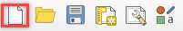

Step 2: Import the project domain
~~~~~~~~~~~~~~~~~~~~~~~~~~~~~~~~~

1. Open the project folder

2. Drag the file **Project Domain.shp** onto the map space.
   This will set the CRS to the correct EPSG code.

C:\Users\Public\Documents\FLO-2D PRO Documentation \\Example Projects\QGIS Tutorials\QGIS Lesson 1\Project domain.shp

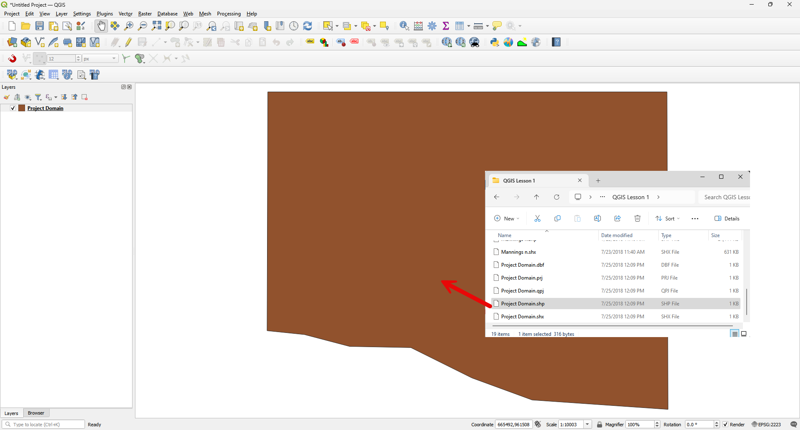

Step 3: Set up the FLO-2D project
~~~~~~~~~~~~~~~~~~~~~~~~~~~~~~~~~

.. image:: ../img/Workshop/Worksh005.png

1. Click the Set-up icon fill out the dialog box as shown below.
   Set the Grid cell size to 30 ft.

2. Click *Create*.

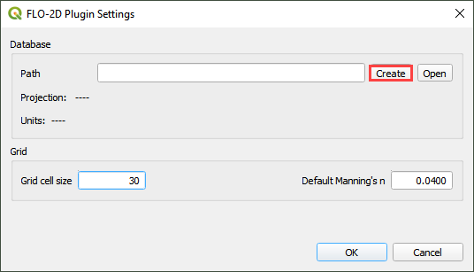

3. Save the geopackage file to the project folder.

4. Name the file Lesson 1.gpkg.

..

   **C:\Users\Public\Documents\FLO-2D PRO Documentation\Example Projects\QGIS Tutorials\QGIS Lesson 1**

5. Set the project CRS to Arizona Central (ft).
   Filter the list with an EPSG code: 2223.
   Select EPSG: 2223 and click *OK.*

6. Wait for the geopackage to write and check the accuracy of the project settings and click *OK*.

Step 4: Create the grid
~~~~~~~~~~~~~~~~~~~~~~~

1. From the Grid Tools widget, select *Create Grid*.

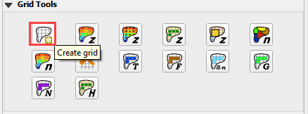

2. Select the Project Domain layer, and the Cell Size field and click OK

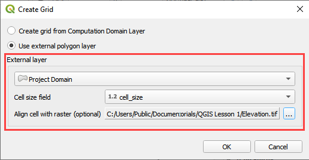

3. Click OK to close.
   The grid is complete.

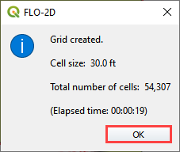

Step 5: Save the project
~~~~~~~~~~~~~~~~~~~~~~~~

1. Click the main Save icon on the QGIS toolbar.

.. image:: ../img/Workshop/Worksh011.png

2. Navigate to the Lesson folder, name the project Lesson 1.qgz and click Save.

**C:\Users\Public\Documents\FLO-2D PRO Documentation\Example Projects\QGIS Tutorials\QGIS Lesson 1\Lesson 1.qgz**

Step 6: Assign grid elevation
~~~~~~~~~~~~~~~~~~~~~~~~~~~~~

1. Import the elevation file.
   Open the project folder and drag the **Elevation.tif** file onto the map space.

2. To interpolate the elevation to a grid layer from a raster layer, use the *Sample Grid Elevation* icon.

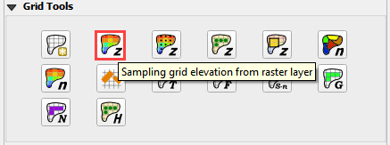

3. Click on the *Sample Grid Elevation* icon and enter the required data in the dialog fields and click *OK*.

4. As shown below, when the elevation sample is complete, the Select the *Fill NoDATA* option to set the elevation of empty grid elements from neighbors.

5. *Sampling Done* dialog box will appear.
   Close it.

|Worksh153|\ |Worksh154|

Step 7: Assign Manning’s data
~~~~~~~~~~~~~~~~~~~~~~~~~~~~~

1. Import the sample roughness file.
   Open the project folder and drag the Mannings n.shp file onto the map space.

2. Click the Sample Manning’s icon.

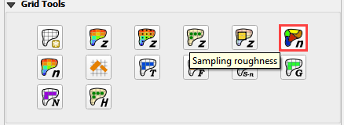

3. Fill the dialog box and click *OK*.
   Once the sample is complete, the following window will appear.
   Close the window.

|Worksh155| |Worksh156|

The roughness values and elevations are assigned to the grid layer in the Schematized Layers group.

Step 8: Assign Control variables
~~~~~~~~~~~~~~~~~~~~~~~~~~~~~~~~

1. Click the *Set Control Parameters* Icon.

.. image:: ../img/Workshop/Worksh017.png

2. Fill the dialog box using the two figures below.
   Save the data to the GeoPackage with the *Save* icon.
   The variable descriptions and instructions are presented in the Data Input Manual.

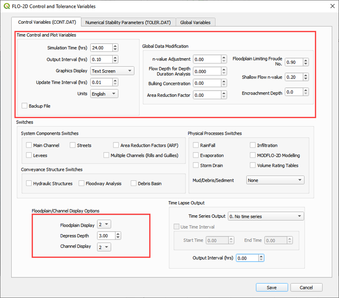

.. image:: ../img/Workshop/Worksh019.png

Step 9: Save the project
~~~~~~~~~~~~~~~~~~~~~~~~

1. Click the main *Save* icon on the QGIS toolbar.

.. image:: ../img/Workshop/Worksh020.png

Step 10: Export the project
~~~~~~~~~~~~~~~~~~~~~~~~~~~

1. Save project, then continue to export the project data into the FLO-2D format.

2. Click the *GDS Export* icon.

.. image:: ../img/Workshop/Worksh021.png

3. Navigate to the project folder and click *Select* Folder.

C:\Users\Public\Documents\FLO-2D PRO Documentation\Example Projects\QGIS Tutorials\QGIS Lesson 1\Project Export

Step 11: Run the simulation
~~~~~~~~~~~~~~~~~~~~~~~~~~~

1. Click on the *Run FLO-2D* icon.

2. Set the FLO-2D Pro folder.
   **C:\program files (x86)\flo-2d pro**

3. Set the Project folder.
   **C:\users\public\documents\flo-2d pro documentation\Example Projects\QGIS Tutorials\QGIS Lesson 1**

4. Click *OK* to Run the simulation.

.. image:: ../img/Workshop/Worksh023.png

Lesson 1, Part 2 – Project Recovery Methods
===========================================

.. _overview-1:

Overview
~~~~~~~~

Lesson 1, Part 2 is a practical study of managing a FLO-2D project that was constructed using QGIS and the FLO-2D Plugin.

.. _required-data-1:

Required Data
~~~~~~~~~~~~~

The lesson has a QGIS project file, Geopackage file, FLO-2D Data Export files and FLO-2D Project Run files.

.. list-table::
   :widths: 33 33 33
   :header-rows: 0

   * - **File**
     - **Content**
     - **Location\**

   * - Lesson 1.qgz
     - Digital terrain raster
     - \\Example Projects\QGIS Tutorials\QGIS Tutorials\QGIS Lesson 1 PRO

   * - Lesson 1.gpkg
     - Polygon for project domain
     -

   * - \*.DAT files
     - Shapefile for spatially variable roughness
     -

\*\ *Project Location C:\Users\Public\Documents\FLO-2D Documentation*

Check these folders to ensure the data is available before starting the lesson.
Lesson 1, Part 1 should be completed first.

.. _step-by-step-procedure-1:

Step-by-Step Procedure
~~~~~~~~~~~~~~~~~~~~~~

To create recovery backup system, follow these steps:

1. Create a recovery file;

2. Recover a project;

3. Open project;

4. Load a GeoPackage from previous FLO-2D Plugins build;

5. Recover data from a corrupt GeoPackage file;

Step 1: Create a recovery file
~~~~~~~~~~~~~~~~~~~~~~~~~~~~~~

1. Open QGIS Lesson 1 in a File Browser.
   Select the **Lesson 1.gpkg** and **Lesson 1.qgz** files and zip them.
   This will create a recovery file.

2. Name the zipped file.
   It is good to choose a name that identifies project progress.
   For Example: **Lesson 1 n-value OK.zip**.

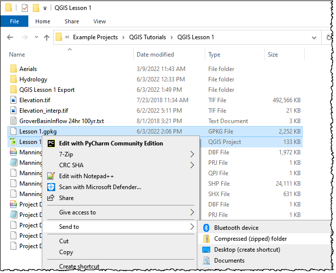

Step 2: Recover a project
~~~~~~~~~~~~~~~~~~~~~~~~~

This step is used when project data is corrupt.
If a project is not exporting data correctly or a mistake is made, use this method.

1. In the Lesson 1 Folder, select **Lesson 1.gpkg** and **Lesson 1.qgz** and delete them both.

.. image:: ../img/Workshop/Worksh025.png

2. Extract the recovery files.
   The example below uses **Lesson 1 Recovery Files.zip.** Either use this file or the file created in **Step 1**.

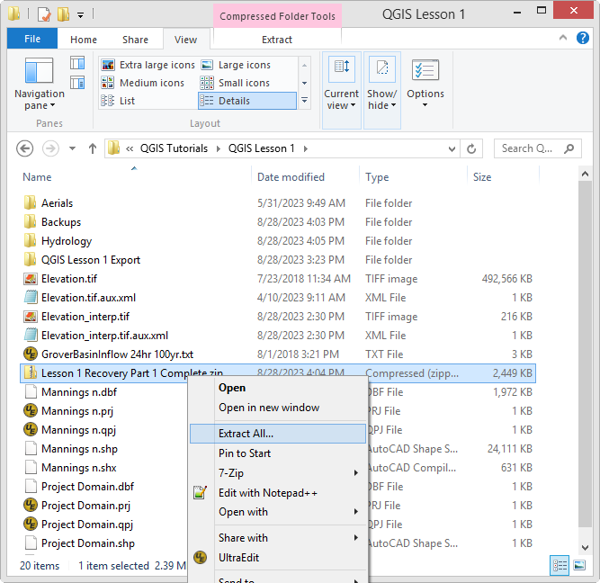

3. Change the name of the path so the file can be extracted directly to the Lesson 1 folder.

.. image:: ../img/Workshop/Worksh027.png

Step 3: Open the project
~~~~~~~~~~~~~~~~~~~~~~~~

1. Open QGIS and drag Lesson 1.qgz onto the canvas the file in QGIS and Load the Project into the FLO-2D Plugin.

.. image:: ../img/Workshop/Worksh028.png

2. Click Yes to load the plugin.

.. image:: ../img/Workshop/Worksh029.png

3. If the project folder changes, open the project but click No on the Load Model box and Yes to load the model from the current directory.

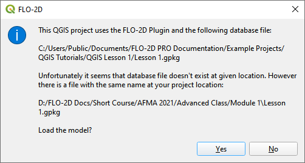

Lesson 1, Part 3 – Hydrology, Rainfall, and Infiltration
========================================================

Overview
~~~~~~~~

This lesson will outline the process for setting up a rainfall runoff model using a 24-hour 100yr storm and rainfall data and spatially variable
infiltration data.
This lesson is a continuation Lesson 1.
If Lesson 1 cannot be loaded, it can be recovered from the Lesson 1 Recovery Files.zip.

Required Data
~~~~~~~~~~~~~

The lesson makes use of rainfall distribution, rain arf, landuse and soil data.

.. list-table::
   :widths: 33 33 33
   :header-rows: 0

   * - **File**
     - **Content**
     - **Location\**

   * - SCS 24-Hr Type II
     - Rainfall Distribution Curve
     - \\Example Projects\QGIS Tutorials\QGIS Tutorials\QGIS Lesson 1 PRO\Hydrology

   * - NOAA Atlas 14
     - Rainfall depth reduction
     -

   * - Land use.shp
     - Shapefile for land use
     -

   * - Soil.shp
     - Shapefile for soil type
     -

\*\ *Project Location C:\Users\Public\Documents\FLO-2D PRO Documentation*

Check these folders to ensure the data is available before starting the lesson.

.. _step-by-step-procedure-2:

Step-by-Step Procedure
======================

To setup a FLO-2D flood simulation use these steps.

4.  Open the QGIS program;

5.  Load Lesson 1;

6.  Import aerial images;

7.  Assign inflow;

8.  Assign rainfall;

9.  Assign infiltration

10.
Check control variables;

11.
Save the project;

12.
Export the FLO-2D data files;

13.
Run the FLO-2D model.

.. _step-1-open-qgis-1:

|Worksh002|\ Step 1: Open QGIS
~~~~~~~~~~~~~~~~~~~~~~~~~~~

Search the start menu and run the “QGIS Desktop” program.

Step 2: Load Lesson 1
~~~~~~~~~~~~~~~~~~~~~

1. Open the project folder.

2. Drag the file **Lesson 1.qgz** onto the map space.
   If the file is missing.
   Extract it from the zipped recovery file.

**C:\Users\Public\Documents\FLO-2D PRO Documentation\Example Projects\QGIS Tutorials\QGIS Lesson 1\Lesson 1.qgz**

|Worksh157|\ |Worksh158|

3. Click *Yes* to load the model.

.. image:: ../img/Workshop/Worksh031.png

Step 3: Import aerial images
~~~~~~~~~~~~~~~~~~~~~~~~~~~~

Inflow nodes are set up using the Boundary Condition Editor widget.

1. Load an aerial image to help with placement.

2. Use *Quick Map Services Plugin* with the *Contributed Pack* to load aerial images into the layer.

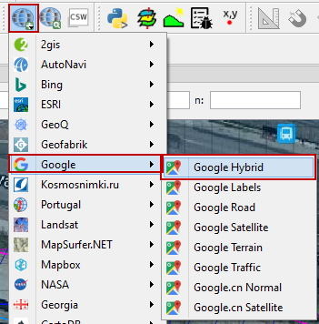

*Note: If this plugin is not available, aerial images are saved to QGIS Lesson 1/Aerials folder.*

*Note: If you do not see the Google maps, go toQuick Map Services/Settings/More Services/Get Contributed Pack.*

Step 4: Add inflow node
~~~~~~~~~~~~~~~~~~~~~~~

1. Zoom in on the top right corner of the project grid.
   Find the Basin Inlet feature.

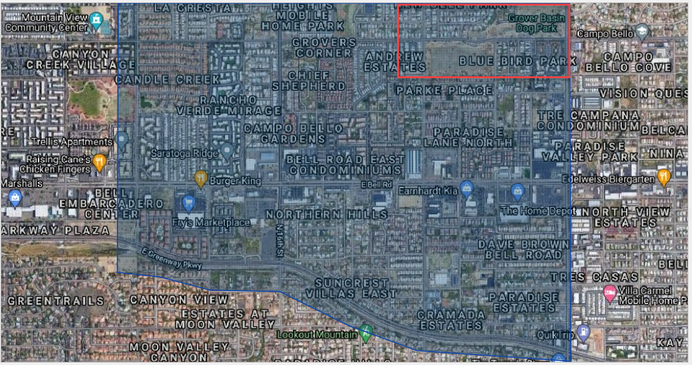

2. Click the *Add point BC* icon.

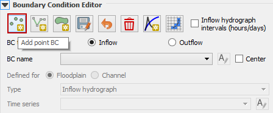

3. Click the cell indicated on the map in the following image and click *OK* to close the window.

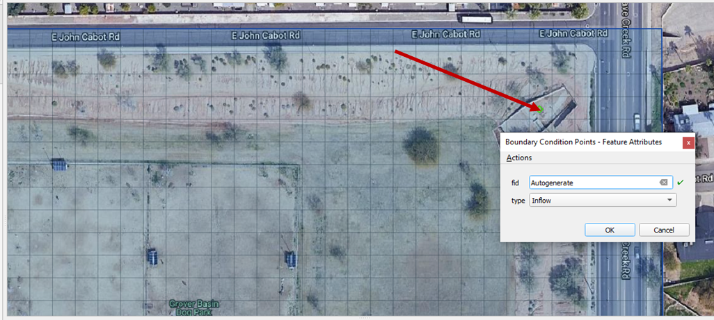

4. Click *Save* to load the data into the editor.

5. Updated the BC name and the Time series name.

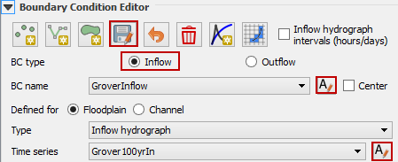

6. The inflow hydrograph is stored in a text file in the project folder.
   Open this file in Notepad.

**C:\Users\Public\Documents\FLO-2D PRO Documentation\Example Projects\QGIS Tutorials\QGIS Lesson 1\GroverBasinIfnlow 24hr 100yr.txt**

.. image:: ../img/Workshop/Worksh037.png

**CTRL – A** will select all data.

**CTRL – C** will copy the data.

**CTRL – W** will close the file.

.. image:: ../img/Workshop/Worksh038.png

7. *Select* the first cell of the FLO-2D Table Editor Table and click *Paste*.

8. Schematize the inflow data into the schema layers.

.. image:: ../img/Workshop/Worksh040.png

9. Click OK.

.. image:: ../img/Workshop/Worksh041.png

Step 5: Assign rainfall
~~~~~~~~~~~~~~~~~~~~~~~

1. Import the NOAA Atlas rainfall map.
   Open the project folder and drag the **NOAA Atlas 14 24hr 100yr.tif** file onto the map space.

2. Uniform rainfall requires the total rain in inches or millimeters and a rainfall distribution.
   **Set that to 3.74 Inches**.

3. The rainfall distribution is in a rainfall distribution data file.
   Click the *Import* icon and load the data file from QGIS Lesson 1.

**C:\Users\Public\Documents\FLO-2D PRO Documentation\Example Projects\QGIS Tutorials\QGIS Lesson 1\Hydrology\SCS 24-Hr Type II.DAT**

|Worksh159|\ |Worksh160|

4. |Worksh161|\ The rainfall data is imported into the FLO-2D Table Editor.

5. To perform the depth area reduction calculation, use the Area Reduction calculator.

.. image:: ../img/Workshop/Worksh044.png

1. |Worksh162|\ Click the *Area Reduction* icon.

2. Fill the form and click OK.

3. The raster pixels are typically 1000 by 1000 ft or larger.
   It is not necessary to average the data.
   Fill the dialog box as shown below and click OK to calucate and OK to confirm the data was written to file.

Step 6: Assign infiltration
~~~~~~~~~~~~~~~~~~~~~~~~~~~

1. Drag the file **Land Use.shp** onto the map space.

**C:\Users\Public\Documents\FLO-2D PRO Documentation\FLO-2D Pro Documentation\Example Projects\QGIS Tutorials\QGIS Lesson 1\Hydrology\Land Use.shp**

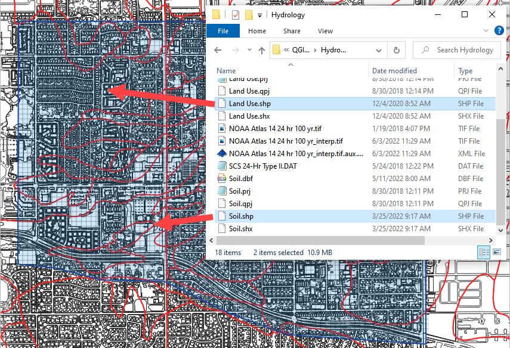

2. Drag the file **Soil.shp** onto the map space.

**C:\Users\Public\Documents\FLO-2D PRO Documentation\FLO-2D Pro Documentation\Example Projects\QGIS Tutorials\QGIS Lesson 1\Hydrology\Soil.shp**

3. From the Infiltration Editor click the Global Infiltration icon.

.. image:: ../img/Workshop/Worksh048.png

4. Check the **Global** **Green** **Ampt** switch and fill the global variables.
   The Global variables will be used for any cell that is not defined by the F lines in the spatially variable data assigned to INFIL.DAT.

5. Click **OK** to close.

.. image:: ../img/Workshop/Worksh049.png

6. On the Infiltration Editor click Calculate Green-Ampt.

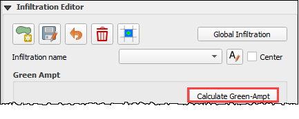

7. Specify the attributes as shown in the following image and click OK.
   The calculation process will take 1 to 5 min for this project.

.. image:: ../img/Workshop/Worksh051.png

.. image:: ../img/Workshop/Worksh052.png

Step 7: Check control variables
~~~~~~~~~~~~~~~~~~~~~~~~~~~~~~~

1. Click the **Control** **Parameters** **Icon**.
   Make sure the **Rain** and **Infiltration** switches are turned on.
   Click **Save** to **Close**.

.. image:: ../img/Workshop/Worksh017.png

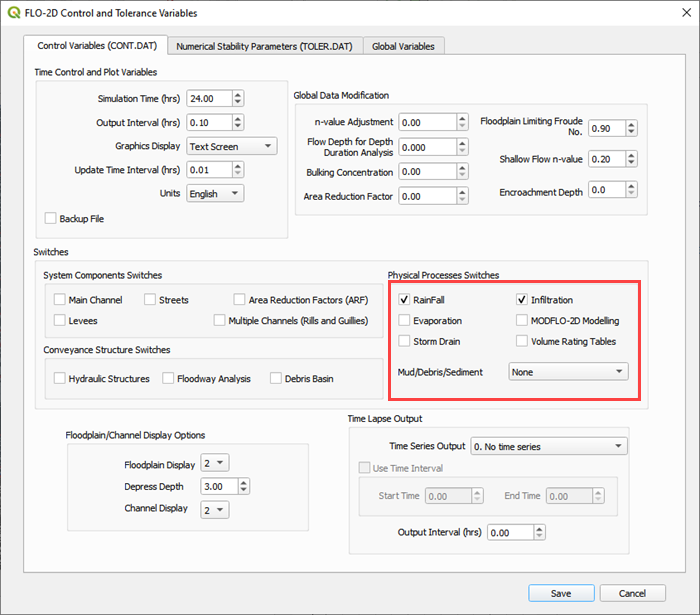

Step 8: Save the project
~~~~~~~~~~~~~~~~~~~~~~~~

1. Click the main Save icon on the QGIS toolbar.

.. image:: ../img/Workshop/Worksh020.png

Step 9: Export the project
~~~~~~~~~~~~~~~~~~~~~~~~~~

1. Save project, then continue to export the project data into the FLO-2D format.
   Click the GDS Export icon.
   Navigate to the project folder and click Select Folder.

.. image:: ../img/Workshop/Worksh021.png

**C:\Users\Public\Documents\FLO-2D PRO Documentation\Example Projects\QGIS Tutorials\QGIS Lesson 1\Project Export**

Step 10: Run the simulation
~~~~~~~~~~~~~~~~~~~~~~~~~~~

1. Click on the *Run FLO-2D* icon.

.. image:: ../img/Workshop/Worksh005.png

2. Set the FLO-2D Pro folder.
   C:\program files (x86)\flo-2d pro

3. Set the Project folder.

**C:\users\public\documents\flo-2d pro documentation\Example Projects\QGIS Tutorials\QGIS Lesson 1\Lesson 1 Export**

4. This project can be opened in the GDS and tested for accuracy.

Lesson 2 – Channels
===================

.. _overview-3:

Overview
~~~~~~~~

Complete QGIS Lesson 1 before starting this lesson.
Use Lesson 2 to build an urban drainage channel and add culverts to the channel.

.. _required-data-3:

Required Data
~~~~~~~~~~~~~

The lesson makes use of the original data from Lesson 1, left bank, right bank, and cross section data, and culvert rating tables.
Start from the end of Lesson 1.
All data is provided in the Lesson folders.

.. list-table::
   :widths: 33 33 33
   :header-rows: 0

   * - **File**
     - **Content**
     - **Location\**

   * - QGIS Lesson 1.gpkg
     -
     - \\Example Projects\QGIS Tutorials\QGIS Lesson 1

   * - QGIS Lesson 1.qgz
     -
     -

   * - Grnway Inflow 24 hr100yr.txt
     - Inflow hydrograph
     - \\Example Projects\QGIS Tutorials\QGIS Lesson 2

   * - Culvert ratingtables
     - Culvert rating tables
     - \\Example Projects\QGIS Tutorials\QGIS Lesson 2\Hydraulic Structures

   * - Greenway.g01
     - Channel GeoRAS file
     - \\Example Projects\QGIS Tutorials\QGIS Lesson 2

\*\ *Project Location C:\Users\Public\Documents\FLO-2D PRO Documentation*

Check these folders to ensure the data is available before starting the lesson.

.. _step-by-step-procedure-3:

Step-by-Step Procedure
======================

To setup a FLO-2D flood simulation use these steps.

1. Open Lesson 1;

2. Import GeoRAS Channel Features;

3. Schematize Channel;

4. Channel In/Out Condition;

5. Create Culverts;

6. Set up Control Parameters Export Project;

7. Interpolate the Channel;

8. Import the new data;

9. Run the FLO-2D model.

Step 1: Open Lesson 1 in QGIS and load the FLO-2D Plugin data
~~~~~~~~~~~~~~~~~~~~~~~~~~~~~~~~~~~~~~~~~~~~~~~~~~~~~~~~~~~~~

1. |Worksh092|\ Search the start menu and run the “QGIS Desktop” program.

2. Click *Open Project* and navigate to **QGIS Lesson 1**.
   Select **QGIS Lesson 1.qgz** and click

*Open*.

.. image:: ../img/Workshop/Worksh055.png

**C:\Users\Public\Documents\FLO-2D PRO Documentation\Example Projects\QGIS Tutorials\QGIS Lesson 1\QGIS Lesson 1.qgz**

3. Use *Quick Map Services* to load an aerial image onto the map.
   See **Lesson 1 - Part 2 - Step 3** for instructions.

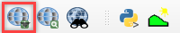

Step 2: Import GeoRAS channel features
~~~~~~~~~~~~~~~~~~~~~~~~~~~~~~~~~~~~~~

1. Click the *Import RAS* icon.
   Open the **Greenway.g01** file.

**C:\Users\Public\Documents\FLO-2D PRO Documentation\Example Projects\QGIS Tutorials\QGIS Lesson 2\Greenway.g01**

2. Check the *Bank Station* icon and click *OK*.

.. image:: ../img/Workshop/Worksh058.png

3. The channel left bank and cross sections are imported into the *User Layers*.
   The cross-section data is imported into the cross section data tables.

.. image:: ../img/Workshop/Worksh059.jpeg

Step 3: Schematize channel
~~~~~~~~~~~~~~~~~~~~~~~~~~

1. Click Schematize left banks and cross sections.

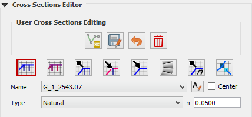

2. If the channel schematization process was successful, the following message will appear.
   Click *Close*.

.. image:: ../img/Workshop/Worksh061.png

Step 4: Channel in/out condtion
~~~~~~~~~~~~~~~~~~~~~~~~~~~~~~~

Inlet
^^^^^

1. *Zoom* to the first channel element on the southeast corner of the map.

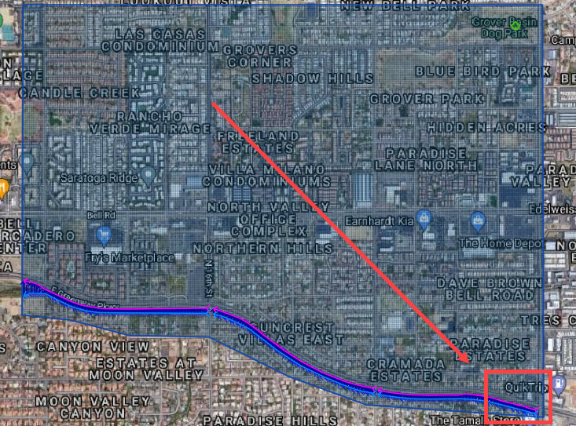

2. Go to the next page.

3. Use the Boundary Condition Editor to create the Inflow point.

.. image:: ../img/Workshop/Worksh063.png

4. Add a point to the first channel cell.

5. Click Save on the Widget

6. Change the name of the inflow to GrnwayIN

7. Set it to Channel

8. Go to the next page.

.. image:: ../img/Workshop/Worksh064.png

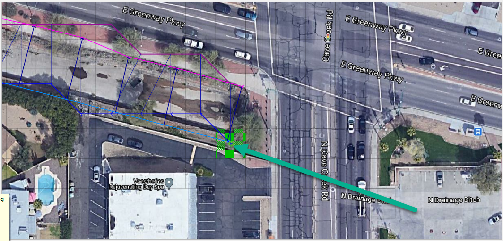

9. Add a time series the new BC node.
   Copy the inflow hydrograph data from the Grnwy inflow file to the table editor.

10.
Name the timeseries GrnwayIn 100yr 24hr.

**C:\Users\Public\Documents\FLO-2D PRO Documentation\Example Projects\QGIS Tutorials\QGIS Lesson 2\Greenway Inflow 100yr 24hr.txt**

Outlet
~~~~~~

1. Zoom to the end of the channel.
   Add a BC Point to the last element of the channel.

.. image:: ../img/Workshop/Worksh063.png

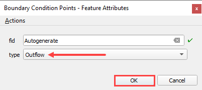

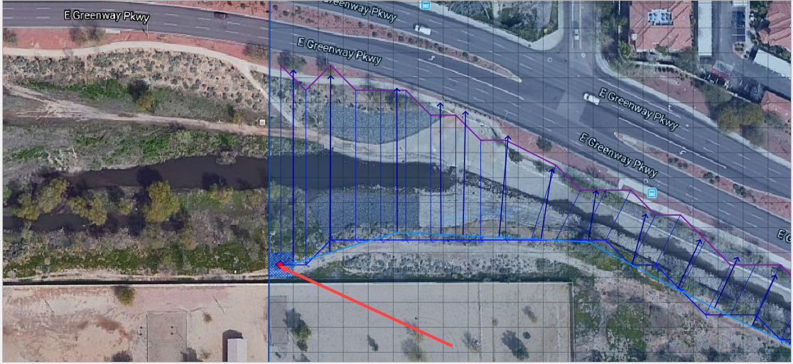

2. Save the form and set the BC type to Outflow

.. image:: ../img/Workshop/Worksh070.png

3. Name the BC to GrnwyOut

4. Set the type to 3.

.. image:: ../img/Workshop/Worksh071.png

5. *Shematize* the outflow conditions.

.. image:: ../img/Workshop/Worksh072.png

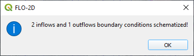

Step 5: Culverts
~~~~~~~~~~~~~~~~

This structure will calculate discharge through a box culvert.
This example has a box culvert that is longer than the grid element.
The channel segments are split up to allow for the width of the roadway.

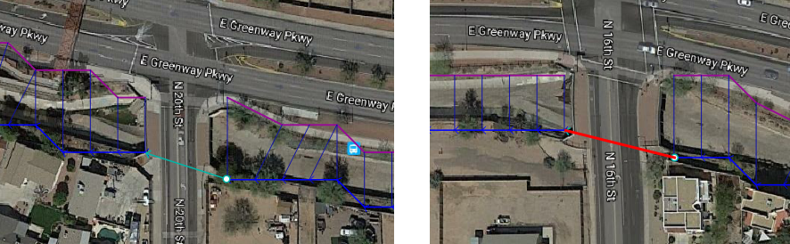

1. Open the *Stuctures Editor* drop down.
   Click the *Add Structure* icon.

2. Digitize two culverts by clicking on the blue left bank elements that represent the beginning and end of the hydraulic structure.
   Both structures are between the channel segments.

.. image:: ../img/Workshop/Worksh076.png

3. Click *Save*.

.. image:: ../img/Workshop/Worksh077.png

4. Fill in the data on the Structure Editor and the Table Editor.

-  Name the culverts Grnway1, Grnway2

-  Channel to Channel

-  Rating table

-  Tailwater condition is none.

-  Click the Import Rating Tables button

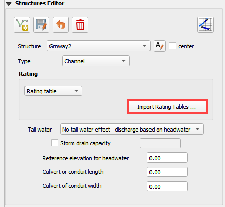

-  Navigate to the Rating Tables files , select both tables and click Open.

**C:\Users\Public\Documents\FLO-2D PRO Documentation\Example Projects\QGIS Tutorials\QGIS Lesson 2\Hydraulilc Structures\\**

.. image:: ../img/Workshop/Worksh079.png

5. Click *Schematize* to write the data to the schematic layers and *Save* the project.

.. image:: ../img/Workshop/Worksh080.png

6. The hydraululic structures are now ready.

7. If you do not see the data, refresh the tables by selecting the structure again in the widget.

.. image:: ../img/Workshop/Worksh081.png

*
*

Step 6: Export the project
~~~~~~~~~~~~~~~~~~~~~~~~~~

1. Click the *Setup Control Parameters* icon.

.. image:: ../img/Workshop/Worksh017.png

2. Select set control parameters.

3. Check the boxes for Main Channel and Hydraulic structures if needed.

4. Click *Save*.

.. image:: ../img/Workshop/Worksh082.png

5. This is a good point to save project.
   Refer to Steps 9 in Lesson 1.

.. image:: ../img/Workshop/Worksh083.png

6. Export the Project to the Project Folder in QGIS Lesson 2

.. image:: ../img/Workshop/Worksh021.png

**C:\Users\Public\Documents\FLO-2D PRO Documentation\Example Projects\QGIS Tutorials\QGIS Lesson 2\Lesson 2 Export**

Step 7: Interpolate the channel
~~~~~~~~~~~~~~~~~~~~~~~~~~~~~~~

1. To interpolate the channel segments, export the channel data and run the interpotator.
   In the *Cross Sections Editor* widget, click the *Create CHAN.DAT, XSEC.DAT, and CHANBANK.DAT* icon.

.. image:: ../img/Workshop/Worksh084.png

2. Select the folder where the \*.DAT files will be saved.

**C:\Users\Public\Documents\FLO-2D PRO Documentation\Example Projects\QGIS Tutorials\QGIS Lesson 2\Lesson 2 Export**

.. image:: ../img/Workshop/Worksh085.png

The first action saves the channel data.

.. image:: ../img/Workshop/Worksh086.png

The second action calls the Interpolate.exe program from the FLO-2D Pro folder.
If this process results in an Interpolate.exe error, it is possible to move that file to another location and make sure it is named correctly.

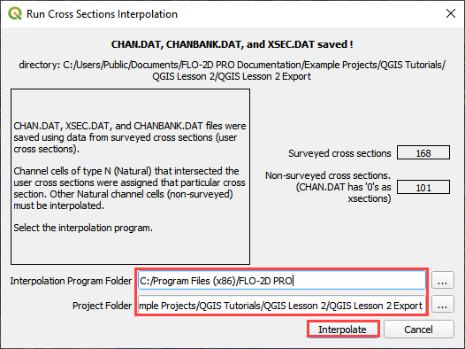

If the interpolation is performed correctly the following message will appear.

3. Click *Import CHAN.DAT and XSEC.DAT* to update the channel data in QGIS.

.. image:: ../img/Workshop/Worksh088.png

4. Click the OK icon when the process is finished.

.. image:: ../img/Workshop/Worksh089.png

Step 8: Run the simulation
~~~~~~~~~~~~~~~~~~~~~~~~~~

1. Click the *Run FLO-2D* Icon.

.. image:: ../img/Workshop/Worksh005.png

2. Set the *FLO-2D Folder*.
   C:\program files (x86)\flo-2d pro

3. Set the *Project Folder*.

**C:\users\public\public documents\flo-2d pro documentation\Example Projects\QGIS Tutorials\QGIS Lesson 2\Lesson 2 Export**

4. Click *OK*.

.. image:: ../img/Workshop/Worksh090.png

5. If an error message appears, open the error.chk file from the project directory.

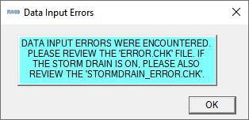

6. If you are in a live class, Open and read the Error.CHK file in Notepad or Notepad++ and wait for the instructor.
   We will fix this as a group.

7. If you are on your own, check out this video.
   Go in about halfway and find the part where we fix the left and right banks.

https://www.youtube.com/watch?v=Ov1oa2HEsXs

Summary
=======

This lesson was a simple channel import.
It used a Georeferenced HEC-RAS geometry file.
These files can be made with HEC-RAS version 5.0 or HEC GEORAS plugin for ArcGIS.
There are many ways to build channels with QGIS for FLO-2D and the other possibilities are outlined in the User’s Manual.

To add more detail and components to the project such as channels, hydraulic structures, buildings, levees and stormdrains, complete the following
lessons.

Lesson 3 – CREATE A STORM DRAIN SYSTEM USING SHAPEFILES
=======================================================

.. _overview-4:

Overview
~~~~~~~~

This lesson will outline the process of importing some shapefiles for a stormdrain system and create the INP file and associated storm drain data
files.

.. _required-data-4:

Required Data
~~~~~~~~~~~~~

Start this lesson from the end of Lesson 2.
It requires the channels and culverts from lesson 2.
All data is provided in the Lesson folders.

.. list-table::
   :widths: 33 33 33
   :header-rows: 0

   * - **File**
     - **Content**
     - **Location\**

   * - Shapefiles
     - Inlets-Junctions, Outfalls and Conduits
     - \\Example Projects\QGIS Tutorials\QGIS Lesson 3

   * - I4-37-32-26-1.txt
     - Rating Table
     - \\Example Projects\QGIS Tutorials\QGIS Lesson 3

   * -
     -
     -

\*\ *Project Location C:\Users\Public\Documents\FLO-2D Pro Documentation*

Check these folders to ensure the data is available before starting the lesson.

.. _step-by-step-procedure-4:

Step-by-Step Procedure
~~~~~~~~~~~~~~~~~~~~~~

To setup a FLO-2D flood simulation use these steps.

1. Open the finished gpkg and qgz file from Lesson 1;

2. Import shapefiles for storm drain;

3. Select components from storm drain shapefiles;

4. Calculate the conduit node connections;

5. Import rating tables

6. Schematize storm drain data;

7. Export swmm.inp file;

8. Export project data;

9. Run the simulation.

Step 1: Open QGIS and load the FLO-2D Plugin data
~~~~~~~~~~~~~~~~~~~~~~~~~~~~~~~~~~~~~~~~~~~~~~~~~

.. image:: ../img/Workshop/Worksh092.png

Search the start menu and run the “QGIS Desktop” program.

Click *Open Project* and navigate to the completed Lesson 2 files.
These may be in Lesson 1 or Lesson 2 depending on the starting point.
Select \*\ **.qgz** and click *Open*.

.. image:: ../img/Workshop/Worksh055.png

**C:\Users\Public\Documents\FLO-2D PRO Documentation\Example Projects\QGIS Tutorials\QGIS Lesson 1\QGIS Lesson 1.qgz**

Step 2: Import shapefiles for storm drain features
~~~~~~~~~~~~~~~~~~~~~~~~~~~~~~~~~~~~~~~~~~~~~~~~~~

1. Grab the \*.SHP files from QGIS Lesson 3 and drop the files in the map space.
   The shapefiles should be located inside the project layer in the layer panel.

2. Clean up your screen a little if you want.

   a. Uncheck Schema layers

   b. Uncheck the Google Image

**C:\Users\Public\Documents\FLO-2D PRO Documentation\Example Projects\QGIS Tutorials\QGIS Lesson 3\Storm Drain Shapefiles**

.. image:: ../img/Workshop/Worksh093.png

The shapefiles can be described as follow:

-  **Lesson3Outfalls.shp** is a point shapefile that contains the outfalls.

-  **Lesson3Conduits.shp** is a line shapefile that contains the pipes.

-  **Lesson3InletsJunctions.shp** is a point shapefile that contains the Inlets and Junctions.
  Inlets collect flow from the surface and their name should start with “I”, this is arequirement for all inlets from type 1 to 5, including manholes.

3. Check the Atribute Tables for the layers conduits, inlets/junctions and outfalls.
   To do this right click each layer and then Click Attributes Table.

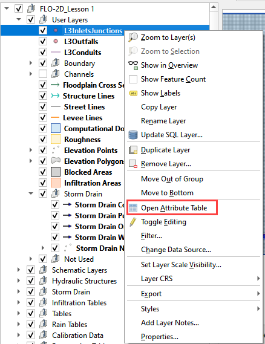

The following data must be available in the shapefile to create the **SWMM.INP** files and the associated storm drain data files: **SWMMFLO.DAT**,
**SWMMOUTF.DAT** and **SWMMFLORT.DAT**.

============ ==================================
**CONDUITS** Name
============ ==================================
\            Upstream Inlet/Junction
\            Downstream Inlet/Junction
\            Inlet/Outlet Offset (not required)
\            Shape
\            No of Barrels
\            Max Depth (Diameter for circular)
\            Geom 2 (Width for rectangle)
\            Geom 3
\            Geom 4
\            Length
\            Manning’s N
\            Initial Flow (Not required)
\            Maximum Flow (Not required)
\            Entry Loss Coef (Not required)
\            Exit Loss Coef (Not required)
\            Average Loss Coef (Not required)
\            Flap Gate
============ ==================================

==================== ================================
**INLETS/JUNCTIONS** Name
==================== ================================
\                    Invert Elevation
\                    Maximum Depth
\                    Initial Depth (Not required)
\                    Surcharge Depth (Not required)
\                    Length/Perimeter
\                    Width/Area
\                    Height/Sag/Surcharge Depth
\                    Weir Coefficient
\                    Feature (Not required)
\                    Curb Height (Not required)
\                    Clogging Factor (Not required)
\                    Time for Clogging (Not required)
==================== ================================

============ ==========================
**OUTFALLS** Name
============ ==========================
\            Invert Elevation
\            Flap Gate
\            Allow Discharge Switch
\            Outfall Type
\            Water Depth (Not required)
\            Tide Curve (Not required)
\            Time Series (Not required)
============ ==========================

Step 3: Select components from shapefile layer
~~~~~~~~~~~~~~~~~~~~~~~~~~~~~~~~~~~~~~~~~~~~~~

1. Display the Storm Drain Editor widget and click the Select components from shapefile layer button.

.. image:: ../img/Workshop/Worksh095.png

2. Use the Editor to assign the Inlets/Junctions parameters from the shapefile to the attribute table.

.. image:: ../img/Workshop/Worksh096.png

.. image:: ../img/Workshop/Worksh097.png

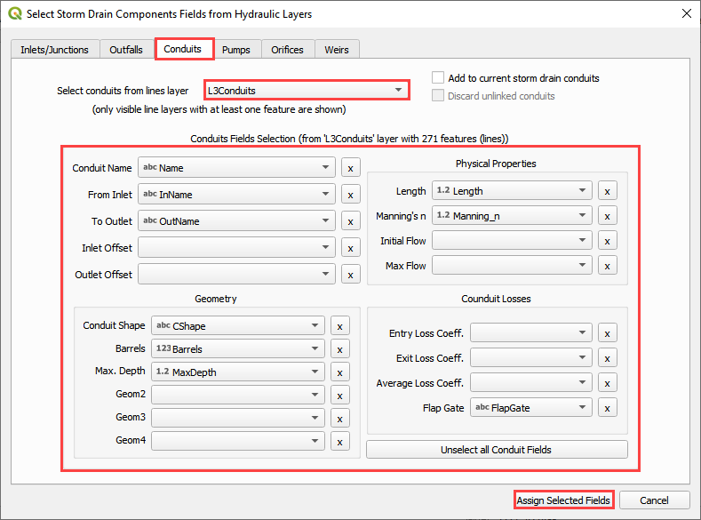

3. Once all features are assigned in the drop-down menu, then click on *Assign Selected Inlets/Junctions, Outfalls and Conduits* to create the data
   structures of the Storm Drain Components.
   The following message will be displayed.
   Click *OK*.

.. image:: ../img/Workshop/Worksh099.png

Step 4: Calculate the conduit node connections
~~~~~~~~~~~~~~~~~~~~~~~~~~~~~~~~~~~~~~~~~~~~~~

1. Display the Storm Drain Editor widget and click on *Inlets/Junctions.*

2. Click the Simulate storm drain checkbox.

3. Click the Auto-assign conduits nodes button.

.. image:: ../img/Workshop/Worksh100.png

Step 5: Import Rating Tables
~~~~~~~~~~~~~~~~~~~~~~~~~~~~

1. Click the Import Rating Table Button

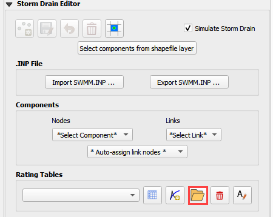

2. Navigate to the I4 table with this path.
   Select the file and click Open.

**C:\Users\Public\Documents\FLO-2D PRO Documentation\Example Projects\QGIS Tutorials\QGIS Lesson 3\Storm Drain Shapefiles\I4-37-32-26-1.txt**

.. image:: ../img/Workshop/Worksh102.png

3. The table was imported and assigned to the correct inlet node.

.. image:: ../img/Workshop/Worksh103.png

Step 6: Schematize storm drain components
~~~~~~~~~~~~~~~~~~~~~~~~~~~~~~~~~~~~~~~~~

1. Click on Schematize Storm Drain Components in the Storm Drain Editor widget.

.. image:: ../img/Workshop/Worksh104.png

2. Once the storm drain components are schematized, the following dialog will appear.
   Click *OK* to close.

.. image:: ../img/Workshop/Worksh105.png

The storm drain schematized data layers have been completed and the atribute tables can be reviewed in the *Storm Drain* layers: *Inlets* and
*Outfalls*.
The storm drain components are now part of the s\ *hematized layers* in the project.

.. image:: ../img/Workshop/Worksh106.png

Step 7: Export SWMM.INP file
~~~~~~~~~~~~~~~~~~~~~~~~~~~~

1. Make sure the switch *Simulate Storm Drain* is selected.
   Click on *Export SWMM.INP* button in the **Storm Drain Editor** widget.

.. image:: ../img/Workshop/Worksh107.png

2. Browse to the Project Folder and Save the **SWMM.INP** file.
   The \*.INP file should be named as ‘SWMM.INP’, no other names will be read by FLO-2D model.
   Click *Save*.

.. image:: ../img/Workshop/Worksh108.png

3. The *Storm Drain Control Dialog* is displayed.
   The control parameters must be entered.
   The time, date, flow units and other data are hardwired from the FLO-2D surface Control Dialog.
   All gray out data in the control dialog is hardwired.

4. The data is default for FLO-2D.
   the report_step can be set to any desired value.

.. image:: ../img/Workshop/Worksh109.png

5. A dialog displays presenting the features that were written to the \*.INP file.
   Click *OK*.

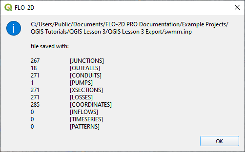

Step 8: Export the project
~~~~~~~~~~~~~~~~~~~~~~~~~~

The files that connect inlets and outfalls with the FLO-2D surface layer are created when the GDS Data Files are exported.

1. Click the *Set* *Control Variable* icon and enter the data in the FLO-2D Toolbar.
   The following dialog will be displayed, make sure the *Storm Drain* component switch is selected.

.. image:: ../img/Workshop/Worksh017.png

2. Click *Save*.

.. image:: ../img/Workshop/Worksh111.png

3. This is a good point to save project.
   Refer to Steps 9 in Lesson 1.

.. image:: ../img/Workshop/Worksh083.png

4. Export the data files to the Project Folder in QGIS Lesson 3

.. image:: ../img/Workshop/Worksh021.png

**C:\Users\Public\Documents\FLO-2D PRO Documentation\Example Projects\QGIS Tutorials\QGIS Lesson 3\Lesson 3 Export**

5. All GDS Data files will be created in the selected project folder, including **SWMMFLO.DAT** and **SWMMOUTF.DAT** files.

6. The following dialog will be displayed, associated storm drain data files are created when the storm drain switch has been turned ON.

.. image:: ../img/Workshop/Worksh112.png

Step 9: Run the simulation
~~~~~~~~~~~~~~~~~~~~~~~~~~

1. Click the *Run FLO-2D* Icon.

.. image:: ../img/Workshop/Worksh005.png

2. Set the Project path and the FLO-2D Engine Path and click OK to start the simulation.

3. Set the *FLO-2D Folder*.

..

   **C:\program files (x86)\flo-2d pro**

4. Set the *Project Folder*.

..

   **C:\users\public\public documents\flo-2d pro documentation\Example Projects\QGIS Tutorials\QGIS Lesson 3\Lesson 3 Export**

.. image:: ../img/Workshop/Worksh113.png

5. After the storm drain model is complete, review FLO-2D Storm Drain Manual Chapter 6 for more details about reviewing results.

.. _summary-1:

Summary
~~~~~~~

This is the completion of a full storm drain model using the FLO-2D model along with digital terrain elevation data and an inflow hydrograph, rain,
and boundary conditions from Lesson 1 and 2.
This lesson has demonstrated how to create the storm drain system by using shapefiles for conduits, inlets/junctions and outfalls.

Lesson 4 – QGIS FLO-2D Plugin Buildings, Walls and Wall Failure
===============================================================

.. _overview-5:

Overview
~~~~~~~~

Lesson 4 will outline the process of setting up buildings and walls and defining wall failure parameters in a FLO-2D project using the Plugin for QGIS.
This lesson can be completed after Lesson 1 is finished.
Apply these instructions after Lesson 1, 2 or 3 are completed.

.. _required-data-5:

Required Data
~~~~~~~~~~~~~

The lesson makes use of buildings and walls shapefiles.

.. list-table::
   :widths: 33 33 33
   :header-rows: 0

   * - **File**
     - **Content**
     - **Location\**

   * - Buildings.shp
     - Building shapefile
     - \\Example Projects\QGIS Tutorials\QGIS Lesson 4 PRO

   * - Walls.shp
     - Walls shapefile
     -

\*\ *Project Location C:\Users\Public\Documents\FLO-2D Pro Documentation*

Check these folders to ensure the data is available before starting the lesson.

.. _step-by-step-procedure-5:

Step-by-Step Procedure
~~~~~~~~~~~~~~~~~~~~~~

To setup a FLO-2D flood simulation use these steps.

1. Open Lesson 1, 2 or 3 completed project;

2. Assign buildings;

3. Assign walls;

4. Save and export;

5. Run the simulation.

Step 1: Open project QGIS and load the FLO-2D Plugin data
~~~~~~~~~~~~~~~~~~~~~~~~~~~~~~~~~~~~~~~~~~~~~~~~~~~~~~~~~

.. image:: ../img/Workshop/Worksh092.png

Search the start menu and run the “QGIS Desktop” program.

QGIS Lesson 1, 2 or 3 can be used to for this project.
Click Open Project and navigate to Example Projects.
If QGIS Lesson 1, 2 or 3 are complete, choose any of these files to continue with Lesson 4.
This tutorial will continue from Lesson 3.

.. image:: ../img/Workshop/Worksh055.png

**C:\Users\Public\Documents\FLO-2D PRO Documentation\Example Projects\QGIS Tutorials\QGIS Lesson 1\QGIS Lesson 1.gpkg**

1. *Click Yes* in the FLO-2D window to Load the model.

.. image:: ../img/Workshop/Worksh114.png

The model will look as follows:

.. image:: ../img/Workshop/Worksh115.png

Step 2: Assign buildings
~~~~~~~~~~~~~~~~~~~~~~~~

1. Drag the **Buildings.shp** shapefile onto the map space.

.. image:: ../img/Workshop/Worksh116.png

The **Buildings.shp** shapefile needs 3 Attributes.

-  Collapse Field

-  ARF Field

-  WRF Field

-  These fields represent switches to set the calculation control for each building.

-  Collapse = 0 will ignore building collapse settings.

-  Collapse = 1 will apply the control for building collapse.
  If building collapse is needed, look in the Data Input manual for an extra data file.

-  ARF = 0 will ignore the ARF calculation

-  ARF = 1 will calculate the ARF calculation

-  WRF = 0 will ignore the spatially variable WRF but apply a T line to any totally blocked cell.

-  WRF = 1 will calculate the spatially variable WRF and apply a T line to any totally blocked cell.

2. Click the Evaluate Reduction Factors (ARF and WRF) icon.

.. image:: ../img/Workshop/Worksh117.png

3. Set up the parameters and click OK

.. image:: ../img/Workshop/Worksh118.png

4. Close *OK* the window.

.. image:: ../img/Workshop/Worksh119.png

Step 3: Assign walls
~~~~~~~~~~~~~~~~~~~~

1. *Drag* the file **Walls.shp** into the map space.

.. image:: ../img/Workshop/Worksh120.png

2. Click the *Levee Elevation Tool* from the *FLO-2D Toolbar* and click the Add Walls to User Levee Lines button.

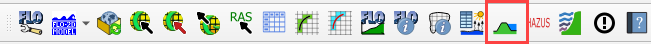

.. image:: ../img/Workshop/Worksh122.png

3. Set the wall elevation and failure fields and click Add Walls to User Levee Lines.

4. Uncheck Levee Failure

.. image:: ../img/Workshop/Worksh123.png

5. The levees were added to the user layer.
   Click OK.

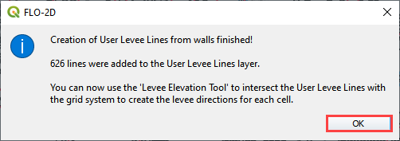

*Note: If an error message was displayed, Move the Walls Layer to the User Layer Group.*

6. Click the *Levee Elevation Tool* from the *FLO-2D Toolbar* and click the Create Schematic Layers from User Levees button.

.. image:: ../img/Workshop/Worksh125.png

7. In this case, only levee lines are used.
   Uncheck elevation polygons if it is checked.

.. image:: ../img/Workshop/Worksh126.png

8. Duplicate levees were identified.
   Remove them by clicking Yes.

.. image:: ../img/Workshop/Worksh127.png

9. Once the process is complete, the following image will appear.
   Click OK to close it.

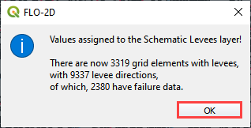

Step 4: Export the project
~~~~~~~~~~~~~~~~~~~~~~~~~~

The files that connect inlets and outfalls with the FLO-2D surface layer are created when the GDS Data Files are exported.

1. Click the *Set Control Parameters* icon and enter the data in the FLO-2D Toolbar.
   The following dialog will be displayed, make sure the **Area Reduction Factors** and **Levees** component switches are selected.

.. image:: ../img/Workshop/Worksh017.png

2. Click *Save*.

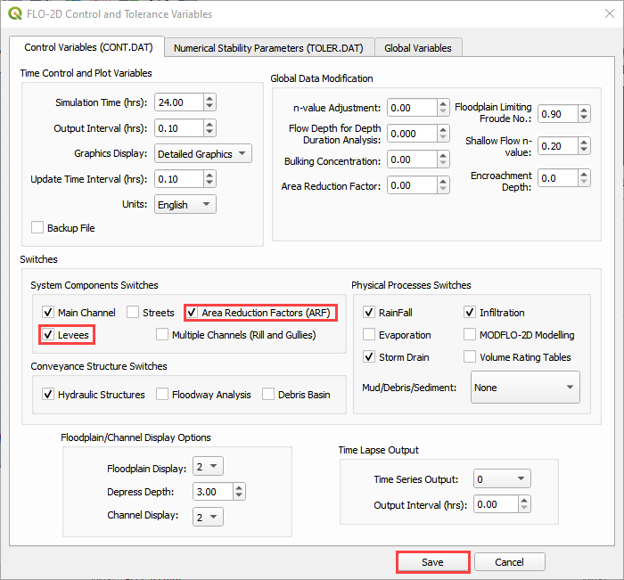

3. This is a good point to save the project.
   Refer to Steps 9 in Lesson
   1.

.. image:: ../img/Workshop/Worksh083.png

4. Export the data files to the project folder in QGIS Lesson 4.

.. image:: ../img/Workshop/Worksh021.png

**C:\Users\Public\Documents\FLO-2D PRO Documentation\Example Projects\QGIS Tutorials\QGIS Lesson 4\QGIS Lesson 4 Export**

|Worksh163|\ All GDS Data files will be created in the selected project
folder, including **ARF.DAT** and **LEVEE.DAT** files.

The swmm.inp file was not exported.
Copy it from Lesson 3 Export folder or export it again using the Storm Drain Editor.

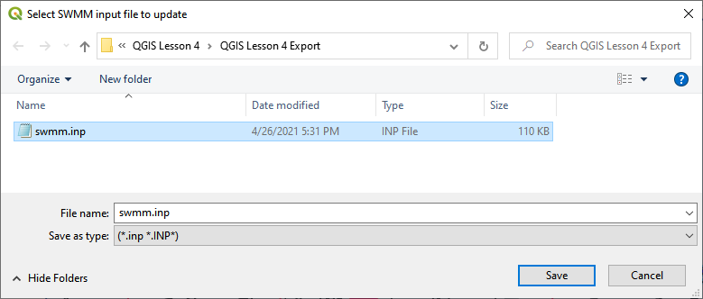

Step 5: Run the simulation
~~~~~~~~~~~~~~~~~~~~~~~~~~

1. Click the *Run FLO-2D* Icon.

.. image:: ../img/Workshop/Worksh005.png

2. Set the Project path and the FLO-2D Engine Path and click *OK* to start the simulation.

.. image:: ../img/Workshop/Worksh131.png

.. _summary-2:

Summary
=======

This is the completion of a tutorial for adding buildings and walls to a model that is ready to run.
This tutorial can be applied to any project once the grid and elevation is assigned.

Lesson 5 – Realtime Rainfall Data
=================================

.. _overview-6:

Overview
~~~~~~~~

Lesson 5 outlines the process of setting up realtime rainfall data in the raincell.dat file.
It is important to perform this tutorial on a Lesson 1 skeleton project.
Finish Lesson 1 through Step 5 before performing the following steps.

.. _required-data-6:

Required Data
~~~~~~~~~~~~~

The lesson makes use of QGIS Lesson 1 and rainfall data \*.ASC files in QGIS Lesson 5.

.. list-table::
   :widths: 33 33 33
   :header-rows: 0

   * - **File**
     - **Content**
     - **Location\**

   * - \*.asc
     - ASCII Grid File
     - \\Example Projects\QGIS Tutorials\QGIS Lesson 5 PRO

   * - \*.rfc
     - Rainfall Catalog File
     -

\*\ *Project Location C:\Users\Public\Documents\FLO-2D Pro Documentation*

Check these folders to ensure the data is available before starting the lesson.

.. _step-by-step-procedure-6:

Step-by-Step Procedure
~~~~~~~~~~~~~~~~~~~~~~

To build **RAIN.DAT** and **RAINCELL.DAT** following these steps.

1. Complete QGIS Lesson 1 to Step 5;

2. Set up the rain editor;

3. Import the rainfall data;

4. Export the project;

5. Transfer RAIN.DAT and RAINCELL.DAT files;

6. Run the simulation.

Step 1: Setup the project
~~~~~~~~~~~~~~~~~~~~~~~~~

1. Set up a “Skeleton Project”.
   **RAINCELL.DAT** is a large file and it is not necessary to keep it in the regular project GeoPackage.
   It will slow the model down and the **RAINCELL.DAT** is not a file that needs to be regenerated.

2. Follow the QGIS Lesson 1 steps up to Step 5.

Step 2: Rain editor
~~~~~~~~~~~~~~~~~~~

1. Set up the Rain Editor widget by checking the Simulate Rainfall, Building Rain and Realtime Rainfall check boxes.

.. image:: ../img/Workshop/Worksh132.png

Step 3: Import rainfall data
~~~~~~~~~~~~~~~~~~~~~~~~~~~~

1. Click the Import Realtime Rainfall ASCII files button.

.. image:: ../img/Workshop/Worksh133.png

2. Select the folder to import the data.

**C:\Users\Public\Documents\FLO-2D PRO Documentation\Example Projects\QGIS Tutorials\QGIS Lesson 5**

1. The plugin will read the catalog file and the ASCII grid files and interpolate the realtime rainfall data to the grid.

2. The data processing takes time.
   Track the the progress by the processor by how many auxillary files exist.

3. Once the processing is complete, click *OK* to close the dialog box.

.. _step-4-export-the-project-1:

Step 4: Export the project
~~~~~~~~~~~~~~~~~~~~~~~~~~

1. This is a good point to save project.
   Refer to Step 9 in Lesson 1.

.. image:: ../img/Workshop/Worksh083.png

2. Export the data files to the Project Folder in QGIS Lesson 5.

.. image:: ../img/Workshop/Worksh021.png

**C:\Users\Public\Documents\FLO-2D PRO Documentation\Example Projects\QGIS Tutorials\QGIS Lesson 5\Lesson 5 Export\\**

3. All GDS data files will be created in the selected project folder, including RAIN.DAT and RAINCELL.DAT files.

Step 5: Transfer the RAIN.DAT and RAINCELL.DAT files
~~~~~~~~~~~~~~~~~~~~~~~~~~~~~~~~~~~~~~~~~~~~~~~~~~~~

1. To use the new Rainfall data it needs to be transferred to a project folder.
   This project can be started by adding the **FLOPRO.EXE** Engine to the folder or by calling it from the Plugin.

2. Copy the **RAIN.DAT** and **RAINCELL.DAT** files to the Lesson 4 Export folder.

3. Replace the original **RAIN.DAT** file.

**C:\Users\Public\Documents\FLO-2D PRO Documentation\Example Projects\QGIS Tutorials\QGIS Lesson 4\QGIS Lesson 4 Export**

Step 6: Run the simulation
~~~~~~~~~~~~~~~~~~~~~~~~~~

1. Click the *Run FLO-2D* Icon.

.. image:: ../img/Workshop/Worksh005.png

2. Set the Project path and the FLO-2D Engine Path and click *OK* to start the simulation.

.. image:: ../img/Workshop/Worksh138.png

Lesson 6 – Hydraulic Structures
===============================

.. _overview-7:

Overview
~~~~~~~~

Lesson 6 outlines the process of creating hydraulic structures with rating tables and generalized culvert equations.
This lesson needs a channel so please use the data from Lesson 2, 3, or 4 to run through this tutorial.
Finish Lesson 2 through before performing the following steps.

.. _required-data-7:

Required Data
~~~~~~~~~~~~~

The lesson makes use of QGIS Lesson 2, 3 or 4 and hydraulic structure shapefile and structure data files in QGIS Lesson 6.

.. list-table::
   :widths: 33 33 33
   :header-rows: 0

   * - **File**
     - **Content**
     - **Location\**

   * - \*.shp
     - Hydraulic Structures
     - \\Example Projects\QGIS Tutorials\QGIS Lesson 6 PRO

   * - \*.txt
     - Culvert Tables
     -

\*\ *Project Location C:\Users\Public\Documents\FLO-2D Pro Documentation*

Check these folders to ensure the data is available before starting the lesson.

.. _step-by-step-procedure-7:

Step-by-Step Procedure
~~~~~~~~~~~~~~~~~~~~~~

To build **HYSTRUC.DAT** following these steps.

1. Open Lesson 2, 3, or 4 qgz file;

2. Import the Hydraulic Structures shapefile;

3. Build the structures into the User Layers;

4. Assign the structure attributes;

5. Assign the rating tables;

6. Schematize the data;

7. Export and

8. Run the simulation.

.. _step-1-setup-the-project-1:

Step 1: Setup the project
~~~~~~~~~~~~~~~~~~~~~~~~~

.. image:: ../img/Workshop/Worksh092.png

1. Search the start menu and run the “QGIS Desktop” program.

2. Complete Lesson 2 prior to starting this lesson.

3. Save the project

Step 2: Import data
~~~~~~~~~~~~~~~~~~~

Start by cleaning up the map space so the next layer will be easy to see.

1. Uncheck the User Leftbank, Right Bank Cross section layers;

2. Uncheck the Blocked Areas;

3. Uncheck the Storm Drain User Layers;

4. Click the User Boundary Conditions Layer;

5. Drag the Hydraulic Structures onto the map space.

.. image:: ../img/Workshop/Worksh139.png

Step 3: Build the structures into the User Layers.
~~~~~~~~~~~~~~~~~~~~~~~~~~~~~~~~~~~~~~~~~~~~~~~~~~

1. Open the Attributes Table on the Hydraulic Structures Layer.

.. image:: ../img/Workshop/Worksh140.png

2. Select structure 130, and 131 and click Zoom map to selected rows button.
   This will zoom your map to these two structures.

.. image:: ../img/Workshop/Worksh141.png

3. Label the Hydraulic Structures Layer.

4. Double click the Hydraulic Structures layer

5. Set the Labels like the following image.

6. This allows you to see which culvert you are working on.

.. image:: ../img/Workshop/Worksh142.png

7.  Change the layer Symbology

8.  Change the selector to Symbology

9.  Set the Symbol Layer Type to Arrow

10.
Uncheck Curved Arrows

11.
This will show you the flow direction of each structure.

.. image:: ../img/Workshop/Worksh143.png

Use the Structure Editor to add all of the new structures.

Digitize all of the structures.

Click the Save icon to confirm that you are finished with the digitizing tool.

   ..
   image:: ../img/Workshop/Worksh144.09211in

**Digitizing process:**

Left click the inlet node (upstream node)

Left click the outlet node (downstream node)

Right Click to finish the polyine.
Click OK to finish the feature.

.. image:: ../img/Workshop/Worksh145.png

Step 4: Assign the structure attributes
---------------------------------------

|Worksh164|\ Click Save in the Structures Widget to load the data into the
dialog box.

**Complete the Structure Fields**

Load the Hydraulic Structures Attribute table.
The attributes will help fill out each structure table.

Check the center button.

Select the first structure.

Rename the Structure with the “A” button.

Fill the Type and Rating fields

Move to the next structure and repeat the process.

.. image:: ../img/Workshop/Worksh146.png

Schematize the structure data.
|Worksh165|

Step 5: Assign the rating tables
--------------------------------

Click the Import Rating Tables button

.. image:: ../img/Workshop/Worksh147.png

Select the rating tables from the project folder.

Click open.

**C:\Users\Public\Documents\FLO-2D PRO Documentation\Example Projects\QGIS Tutorials\QGIS Lesson 6\Culverts Tables**

.. image:: ../img/Workshop/Worksh148.png

The data has been imported.
If you can’t see it, switch to a different structure.

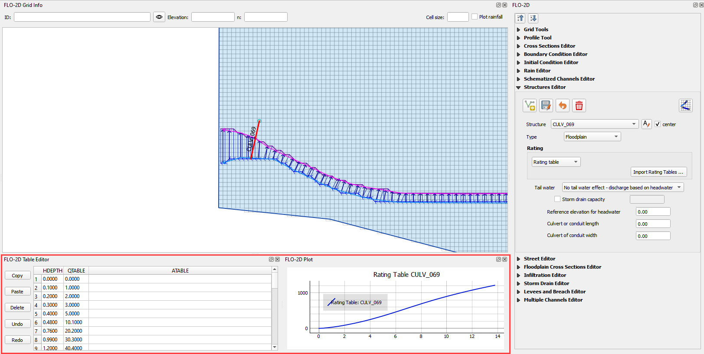

Step 6: Schematize the data
---------------------------

Schematize the structure data\ |Worksh165| and click **Yes** to replace the data.

.. image:: ../img/Workshop/Worksh150.png

Step 7: Export the data
-----------------------

.. image:: ../img/Workshop/Worksh083.png

This is a good point to save project.
Refer to Step 9 in Lesson 1.

|Worksh166|\ Export the data files to the Project Folder in QGIS Lesson 6
Export.

   **C:\Users\Public\Documents\FLO-2D PRO Documentation\Example Projects\QGIS Tutorials\QGIS Lesson 6\Lesson 6 Export\\**

All GDS data files will be created in the selected project folder.

|Worksh167|\ |Worksh168|

The swmm.inp file was not exported.
Copy it from Lesson 3 Export folder or export it again using the Storm Drain Editor.

.. image:: ../img/Workshop/Worksh151.png

.. _step-8-run-the-simulation-1:

Step 8: Run the simulation
--------------------------

|Worksh169|\ Click the *Run FLO-2D* Icon.

Set the Project path and the FLO-2D Engine Path and click *OK* to start the simulation.

.. image:: ../img/Workshop/Worksh152.png

.. |Worksh153| image:: ../img/Workshop/Worksh153.png

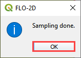

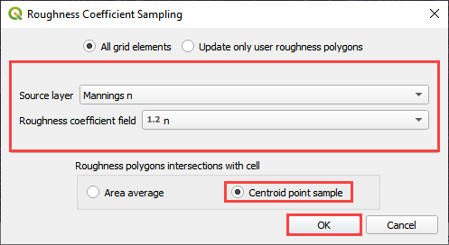

.. |Worksh156| image:: ../img/Workshop/Worksh156.png

.. |Worksh002| image:: ../img/Workshop/Worksh002.png

.. |Worksh157| image:: ../img/Workshop/Worksh157.png

.. |Worksh158| image:: ../img/Workshop/Worksh158.png

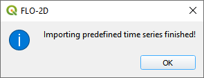

.. |Worksh160| image:: ../img/Workshop/Worksh160.png

.. |Worksh161| image:: ../img/Workshop/Worksh161.png

.. |Worksh162| image:: ../img/Workshop/Worksh162.png

.. |Worksh092| image:: ../img/Workshop/Worksh092.png

.. |Worksh163| image:: ../img/Workshop/Worksh163.png

.. |Worksh164| image:: ../img/Workshop/Worksh164.png

.. |Worksh165| image:: ../img/Workshop/Worksh165.png

.. |Worksh165| image:: ../img/Workshop/Worksh165.png

.. |Worksh166| image:: ../img/Workshop/Worksh166.png

.. |Worksh167| image:: ../img/Workshop/Worksh167.png

.. |Worksh168| image:: ../img/Workshop/Worksh168.png

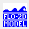

