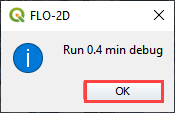
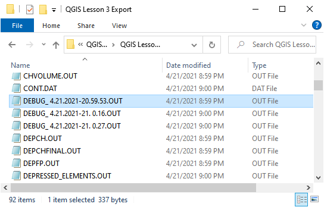
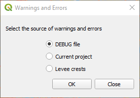
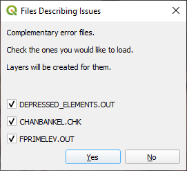
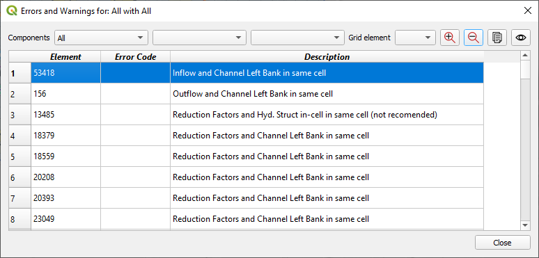
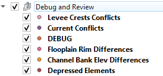

Data Warnings and Errors – DEBUG Tool
=====================================

The Data Warnings and Error button opens a system that helps the user
debug data files and search for data conflicts.

1. Perform a debug run

2. `Export the \*.DAT Files <#_Export_FLO-2D_*.DAT_1>`__.

3. Click the Run FLO-2D button.

4. This will automatically trigger the FLO-2D check system performed by
   the engine FLOPRO.EXE.

5. The model will execute, perform the data checks and then
   automatically shut down. Every time the debug is executed, a new
   debug file with a timestamp is saved to the project folder.

6. Click the Error and Warning button to open the import dialog box.

Debug
-----

7. To import the Debug files, click the Import DEBUG File button. The
   DEBUG file will have a date and timestamp to track progress.

8. The import process will include several files that can be used to
   help users review surface features such as rim elevations, depressed
   elements and channel – floodplain interface. Click Yes to load the
   Errors and Warning Dialog box and import the review files.

Conflicts
---------

The Current Project option will create a list of data conflicts. These
conflicts are not necessarily errors, they are generated based on the
conflict matrix. The conflict matrix is located Here:
c:\users\public\documents\FLO-2D Pro Documentation\Handouts\Conflict
Matrix.pdf

Levee Crests
------------

The final option is Levee Crest validation tool. It is used to review
the levees and grid element elevations.

Dialog Boxes
------------

The Errors and Warnings Dialog box shows all Errors, Conflicts, and
Warnings created by the file checking program. All of these boxes can be
used to sort and view and pan to cells with potential issues.

Debug Layers
------------

The layers show points where there are differences between channel bank
and floodplain bank elevations, rim and floodplain inlet elevations, and
depressed elements and levee crest elevations. In this example, the
layers are grouped using a QGIS standard layer grouping procedure.

Each layer has an attribute table that can be sorted and used to find
grid elements that may need elevation edits.

