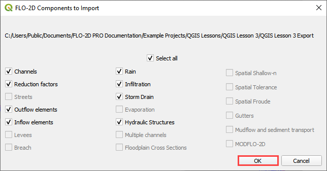
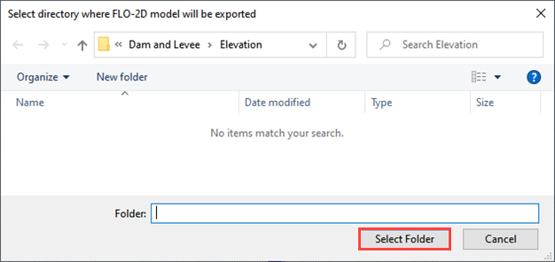

Export Project
===============

Export FLO-2D \*.DAT Files
---------------------------

Export the project files with this button.

.. image:: ../img/exportproject1.png

1. \**\* Set the Control Data switches before running the Export tool.
   See `Setup the FLO-2D Control Data <#_Setup_the_FLO-2D>`__ step.
   \**\*

2. Click the *GDS* *Export* icon.

3. Select the components that require an export.

**Important Note: It is not necessary to export all files every time.
Export large files like INFIL.DAT or TOPO.DAT only when needed.**

4. Navigate to the project folder and click Select Folder.

5. Check or uncheck the files to be exported and click OK.
