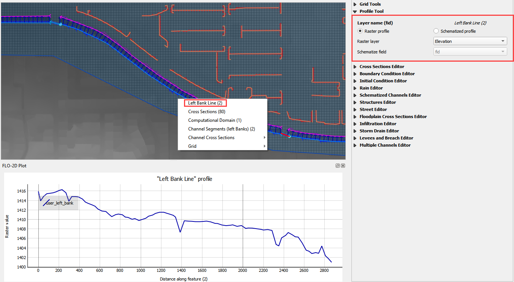
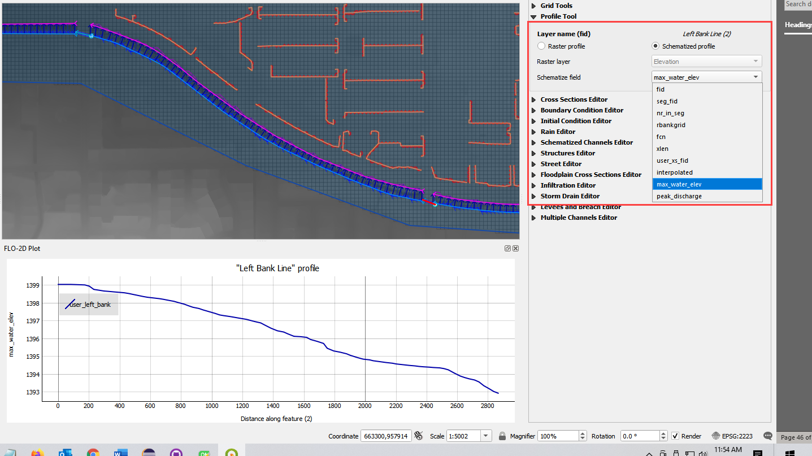

FLO-2D Info Tool
================

Use the *Info Tool* to identify data in the *User Layers* and *Schematic Layers*.
The layers must be active and checked on in the *Layers* Panel.
This tool also activates the Profile Tool Widget.
Layers that work with this tool:

-  Channel layers

-  Left bank

-  Cross sections

-  Structure layers

-  Levee layers

-  Storm drain layers

.. image:: ../img/Flo-2D-Info-Tool/flo2dinfotool002.png

Channel Layers
--------------

1. Click the FLO-2D Info Tool.

2. Click any left bank line.

3. The data will load into the editor widget, *FLO-2D Plot*, and *FLO-2D Table Editor*.

4. Use the Profile tool to select the data plot source.

5. In this example, the elevation raster is the y axis and the left bank length is the x axis.

6. In this example, the water surface elevation is the y axis.

7. To choose water surface elevation, load the data first from the HYCHAN.OUT file.

.. image:: ../img/Flo-2D-Info-Tool/flo2dinfotool005.png

.. image:: ../img/Flo-2D-Info-Tool/flo2dinfotool006.png

