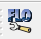
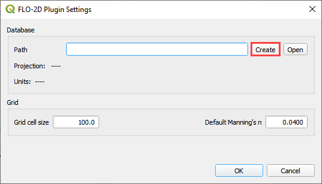
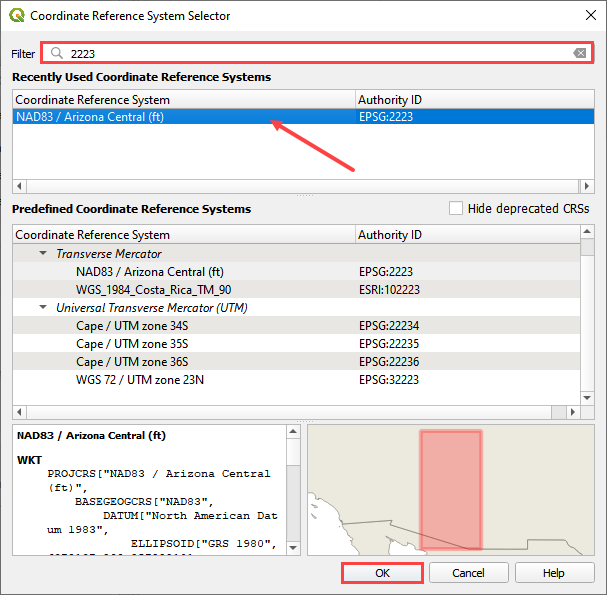
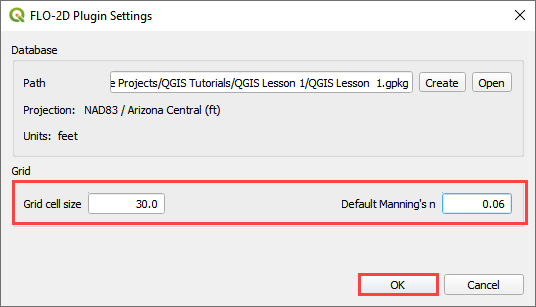

FLO-2D Plugin Settings
======================

The *FLO-2D Plugin Settings* tool is used to set up the FLO-2D layers,
set the coordinate system and create the GeoPackage file.

Click on the *FLO-2D Plugin Settings* tool icon.

Assign the desired grid element size and baseline n-value.

Click the *Create* button to set up the GeoPackage location.

Navigate to the project location: Project name is the user’s choice.
Name the file \*.gpkg and click *Save*.

.. image:: ../img/flo-2dsettingsupdateimages3.png

Set the coordinate reference system (CRS) for the project and click
*OK*.

Once the coordinate system is set, choose a grid element size and a
default n and click OK

