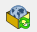
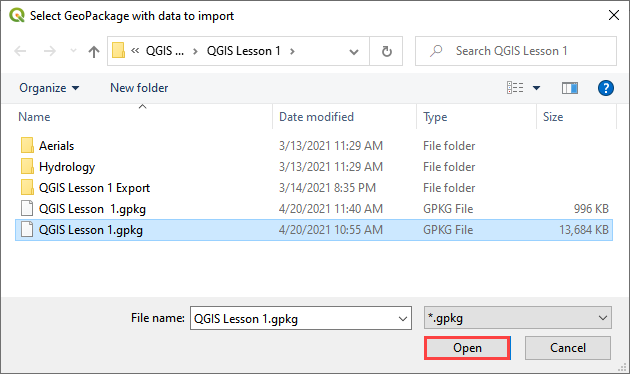
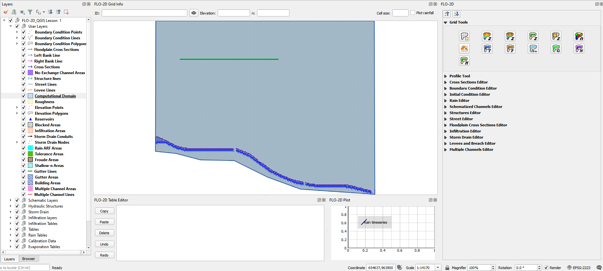

Import a GeoPackage from a Previous Build
=========================================

When the FLO-2D Plugin is updated, the GeoPackage structure changes. The
project can no longer be opened in the standard method described in the
previous section.

To update a GeoPackage:
-----------------------

1. Set up a new project (see FLO-2D Plugin Settings). This will build
   the new Geo Database.

2. Select the Import from Geo Package icon from the FLO-2D Toolbar.

3. Navigate to the location of the Geo Package and click Open. This will
   import the old data into the new format.

4. When the import is complete, the project will be loaded with no error
   messages.

