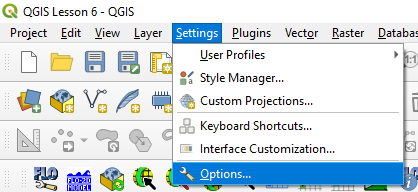
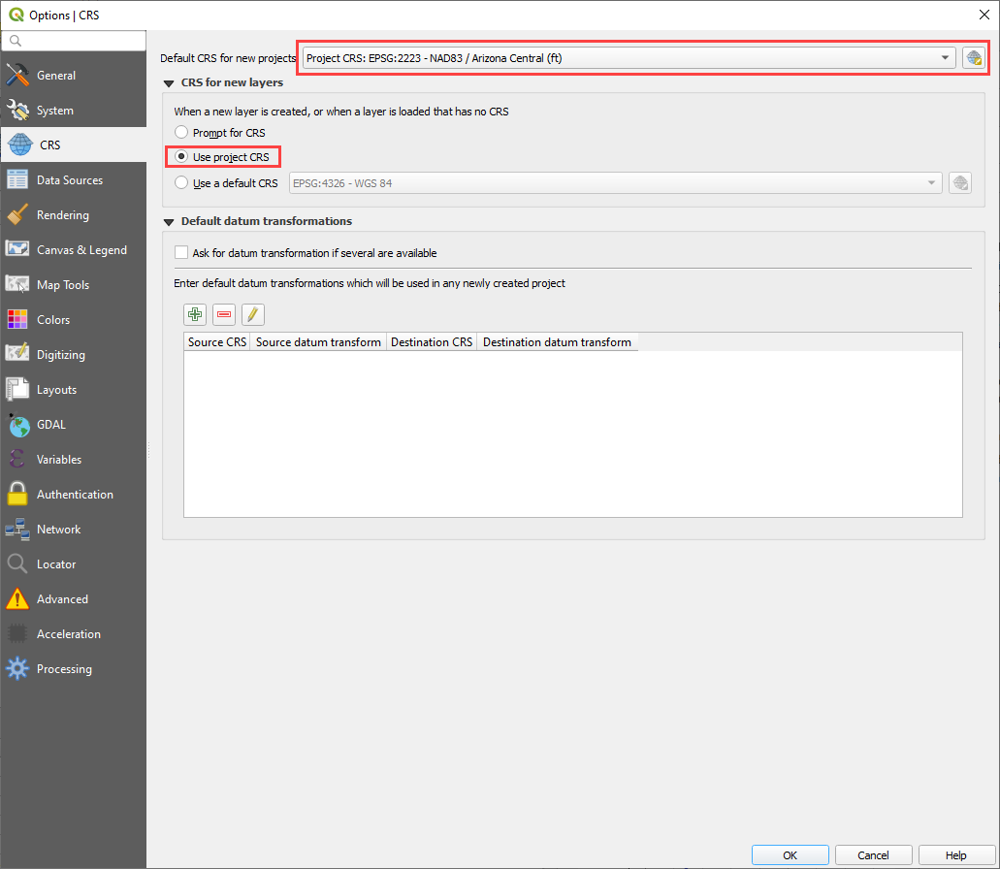
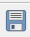
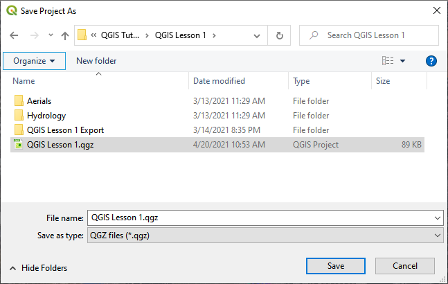
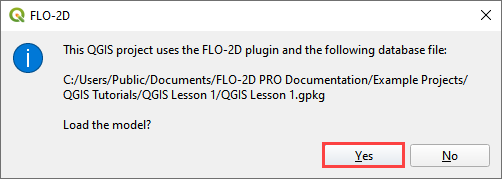
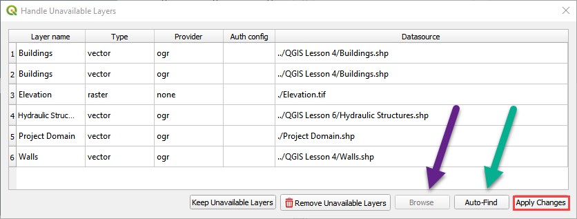
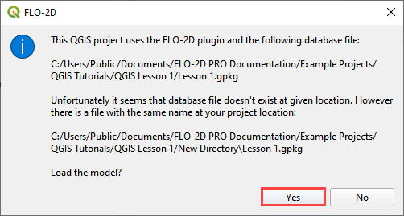

QGIS Tools
==========

QGIS Settings
-------------

Setting up QGIS before starting a project. One startup setting makes
adding layers and importing files easier. Set up the CRS of imported
layers. Click Settings/Options

Set the Default CRS to the coordinate system that is most commonly used.
Select the Use project CRS radio button. See the following image for an
example.

Save Project
============

Click the *Save* Icon on the QGIS toolbar. Save the file to the project
directory.

Open a Project
--------------

1. Click the open icon on the QGIS toolbar. Navigate to the project
   folder, select the \*.qgs file and click *Open*.

2. Click *Yes* to load the GeoPackage in the FLO-2D Plugin.

What if moved your project?

3. Fix the links with QGIS and the FLO-2D plugin with this process.

4. Fix the external data links with the Handle Unavailable Layers
   window. Autofind works well. Apply Changes to close the window.

\****Jasmine replace this image with the gif by replacing the one in the
../img folder.**\*

5. The Load Model window finds the geopackage and fixes the path. Click
   yes to load the model from the new path.

