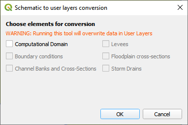

Convert Schematic Layers to User Layers
=======================================

This tool will convert imported \*.dat files to editable user layers.
Use it after performing an Import FLO-2D \*.DAT files.

1. This tool will convert imported project data into user layers so they
   can be edited.

2. Click the *Convert Schematic Layers to User Layers* icon.

3. This tool will convert the *Schematic Layers* to *User Layers* so
   they can be edited.

4. Select the layers that need to be edited.

5. Always select Computational Domain

6. The most helpful layers to convert are:

   a. Computational Domain

   b. Floodplain Cross-Sections

   c. Storm Drains

