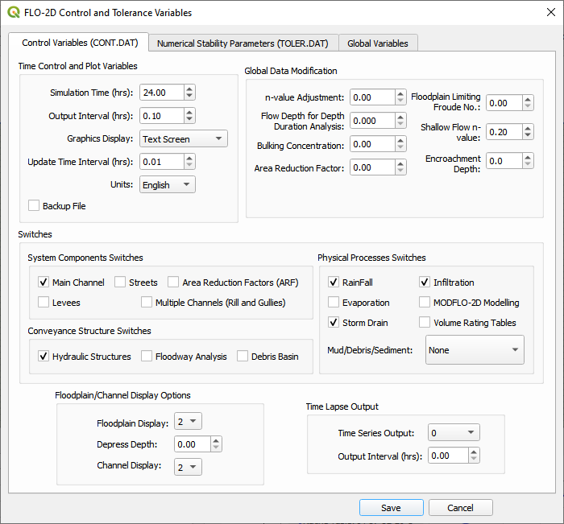

Setup the FLO-2D Control Data
=============================

This button allows the user to set up the control variables.

1. Click the *Set Control Parameters* Icon.

2. The dialog box is used to set the control data for the CONT.DAT and
   TOLER.DAT files.

3. Save the data to the GeoPackage with the *Save* button.

4. The variable descriptions and instructions are available in the `Data
   Input
   Manual <file:///C:\Users\Public\Documents\FLO-2D%20PRO%20Documentation\flo_help\Manuals\Data%20Input%20Manual%20PRO.pdf>`__.

**Important – If the user unselects a Component Switch, that data file
will not be written when the data is exported. The original data will be
preserved.**

5. Numerical stability parameters are defined on the second tab.

6. Global variables are defined on the 3\ :sup:`rd` tab.

