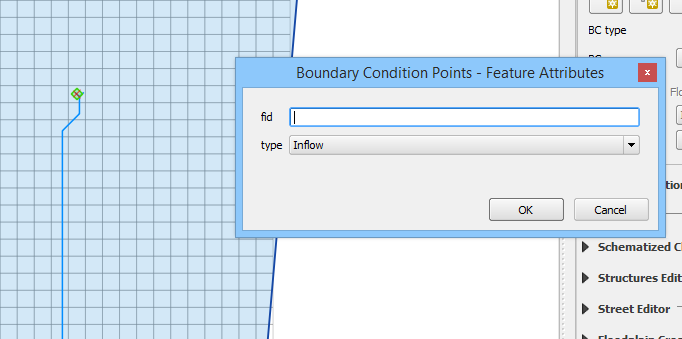
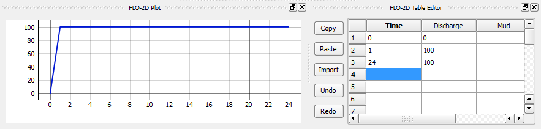
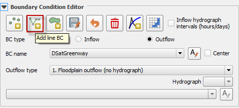
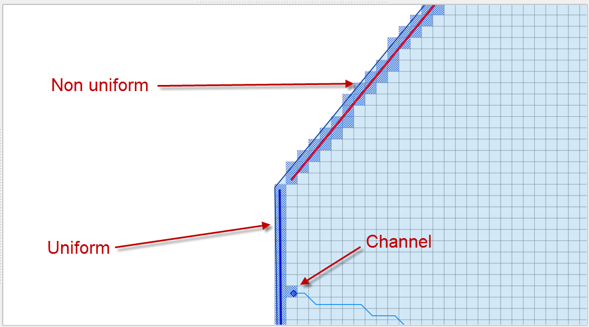
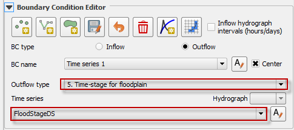
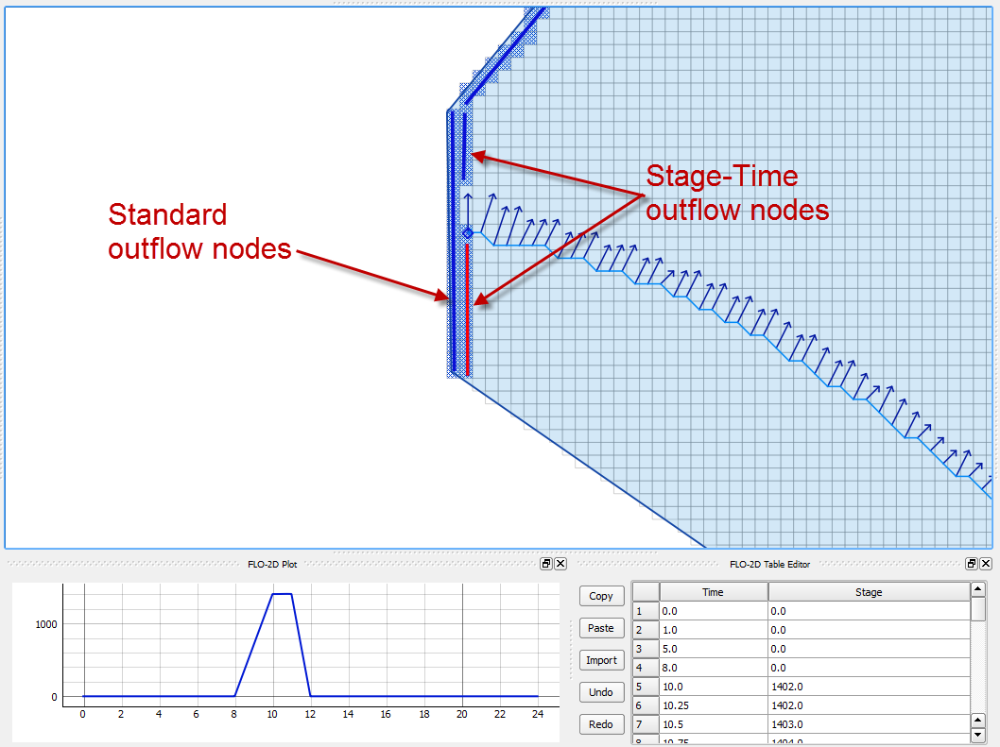
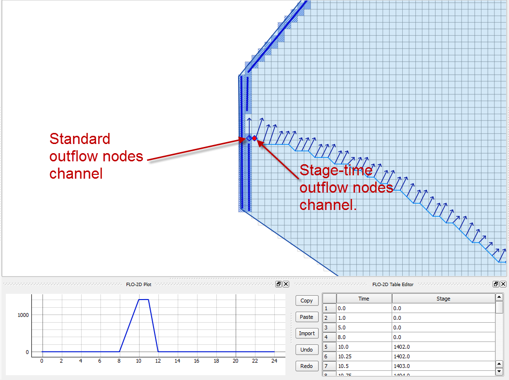
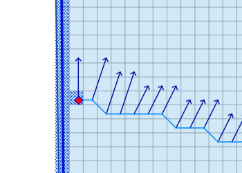

Boundary Condition Editor
=========================

The boundary condition editor is used to define the inflow and outflow boundaries.
The data is written to the INFLOW.DAT and OUTFLOW.DAT files.

Inflow Boundary Condition Editor
--------------------------------

Any number of inflow hydrographs to the FLO-2D model can be assigned to channel, floodplain or even the 1-D street component.
This represents a flood inflow to the flow domain from an off-site source.

Inflow Node
~~~~~~~~~~~

To create a point of inflow, click the Add Point BC button on the Boundary Condition Editor widget.

.. image:: ../../img/Boundary-Condition-Editor/bounda002.png

Identify the inflow node by left clicking the location of the inflow node on the map.
In this example, the inflow node is a channel inflow node.
It is not necessary to enter the fid.
Click *OK* to create the feature.

1. Click the Save Button to load the data into the editor.

2. Assign the defining detail conditions to the inflow node in the following image.

3. This example inflow node will have a steady hydrograph with 100 cfs assigned to Cave Creek inflow node.

.. image:: ../../img/Boundary-Condition-Editor/bounda004.png

The time series inflow hydrograph is assigned in the table editor where time is in hours and discharge is cfs or cms.
This is a clear water inflow hydrograph and no sediment concentration is assigned.

Repeat the process to add additional inflow hydrographs.
Use the *Add* data series/table for current BC button to create a new hydrograph.
Use the Schematize icon (shown below) to save the data to the Schematic Layers and click *Yes* to overwrite the layers.

.. image:: ../../img/Boundary-Condition-Editor/bounda006.png

.. image:: ../../img/Boundary-Condition-Editor/bounda007.png

Outflow Boundary Conditions
---------------------------

Boundary outflow conditions include stage time relationships, stage discharge relationships or normal depth control.
These conditions define how the channel or floodplain discharge enters or leaves the FLO-2D model domain.

Outflow Floodplain
~~~~~~~~~~~~~~~~~~

For a FLO-2D model normal depth outflow condition where the flow leaves the flow domain without effecting the upstream water surface elevation, select
the outflow nodes along the downstream boundary or any location in the project domain.

1. |bounda017|\ Click the *Add line BC* button and draw a line to represent
   the outflow cells.

2. Click *Save* to load save the feature to the layer and activate the editor.

3. Name the boundary and set the boundary conditions (Outflow type).

For multiple outflow nodes in a line, the outflow nodes should be continuous with no gaps (across diagonals).
If the outflow nodes are stacked up (two or more elements wide), the model will generate an error message at runtime indicating that some outflow
nodes have no access to upstream flow.

Outflow Channel
'''''''''''''''

For channel outflow at a normal depth condition, select the channel outflow node on the downstream boundary or channel segment terminus.

1. |bounda017|\ Click add a point boundary and click the last channel node.

2. Click *Save*.

3. Name the feature.

4. Set the outflow condition for the channel.
   A combined floodplain and channel outflow condition (3) is the typical setting.

|bounda020| |bounda021|

Outflow with Hydrograph

Use this option with any floodplain downstream boundary that will capture the outflow hydrograph and report it to file as inflow to a second
downstream FLO-2D model.
This outflow option will write a line ID of O1 thru O9 lines in the outflow.dat file.
It requires the cadpts_ds1.dat thru cadpts_ds9.dat data files from the downstream models to calculate the inflow_ds1.dat thru inflow_ds9.dat files at
runtime (see the FLO-2D Data Input Manual).
Select the outflow nodes along the downstream boundary to assign the hydrograph boundary condition.

1. |bounda017|\ Click the *Add line BC* button and draw a line through the
   desired outflow nodes.

2. Click *Save* to load save the feature to the layer and activate the editor.

3. Name the boundary condition and set the boundary *Outflow type* conditions as *Outflow with Hydrograph*.

.. image:: ../../img/Boundary-Condition-Editor/bounda010.png

Outflow with Time – Stage Hydrograph for Floodplain
---------------------------------------------------

To represent variable time-stage boundary conditions such as tides, storm surge, tsunamis, or flooding from a large river, use this outflow option.
The time–stage relationship can be synchronized with rainfall and upstream watershed flooding.
Select the outflow nodes along the downstream boundary as a row of elements inside the boundary (by one or more rows of elements).

1. |bounda017|\ Click *Save* to load save the feature to the layer and
   activate the editor.

2. Name the boundary and set the boundary conditions.

3. Name and fill the Time Series table.

There are two types of outflow time-stage conditions, one where the inflow hydrograph moves upstream and there is no outflow downstream and a second
possible condition where after the storm surge recedes, the downstream flow resumes and flows off the grid system.
This second option requires a double row of outflow nodes.
The row along the boundary is a conventional outflow node operating at a normal depth.
The upstream row is a time-stage outflow node.
When the upstream water surface elevation is greater than the stage in the time-stage outflow node, the time-stage condition is turned off and the
downstream flows goes through the time-stage outflow elements to the standard outflow nodes for the normal depth flow condition.

Outflow with Time – Stage Hydrograph for Channel
------------------------------------------------

Like the time-stage condition for the floodplain select this option to represent ocean tide, storm surge, tsunamis, or flooding from a large river
control in a channel terminus.
The time – stage relationship can be synchronized to rainfall and watershed flooding.

1. |bounda017|\ Select the standard outflow node at the end of the channel.

2. Set the time-stage node one element upstream.

3. Click *Save* to load save the feature to the layer and activate the editor.

4. Name the boundary and set the boundary conditions.

5. Name and fill the Time Series table.

.. image:: ../../img/Boundary-Condition-Editor/bounda013.png

Time-Stage for Floodplain and Free Floodplain and Channel
---------------------------------------------------------

Use this option to set the stage of a downstream boundary.
This node will allow water to collect on the boundary until it can exceed the stage along the boundary.
It can be used for two purposes.

1. Anytime there is a control on the boundary that releases water at a known stage.

2. Set the elevation for matching the water surface elevation of an existing FEMA map.

.. image:: ../../img/Boundary-Condition-Editor/bounda015.png

Time-Stage for Channel and Free Floodplain and Channel
------------------------------------------------------

This option is the same as option 7 with the condition that the stage – time table is assigned to the channel instead of the floodplain.

.. image:: ../../img/Boundary-Condition-Editor/bounda016.png

Channel Stage-Discharge Parameters
----------------------------------

This outflow option defines the discharge from a channel based on the stage using rating curve.
Several rating curves can be assigned for multiple limiting depths.
This system is used when there is a control or a gage at the channel with a known stage-discharge relationship.

1. Select the stage-discharge node at the end of a channel segment.

2. Click *Save* to load save the feature to the layer and activate the editor.

3. Name the boundary and set the boundary conditions.

4. Name and fill the Q(h) parameters table.

.. image:: ../../img/Boundary-Condition-Editor/bounda018.png

Channel Stage-Discharge (Q(h) table)
------------------------------------

The final outflow option is used to define the downstream boundary with a stage-discharge table.

1. |bounda017|\ Select the stage-discharge node at the channel terminus.

2. Click *Save* to load save the feature to the layer and activate the editor.

3. Name the boundary and set the boundary conditions.

4. Name and fill the Q(h) table.

.. image:: ../../img/Boundary-Condition-Editor/bounda019.png

Troubleshooting
~~~~~~~~~~~~~~~

1. The most common problems with creating outflow.dat data is caused by creating conflicts by putting other components in the outflow grid elements.

2. The schematic layers and tables will reset each time the Schematize tool is used.
   This could cause overwriting of imported data.
   Convert the Boundary Conditions to User Layers for projects that are imported into QGIS before performing the schematization process.

3. If the data does not export correctly, check the tables.
   The tables can be edited directly or can be copied into an OUTFLOW.DAT file.

4. Saving and restarting might resolve some issues with the GeoPackage but check the layers attributes prior to restarting QGIS.

.. |bounda020| image:: ../../img/Boundary-Condition-Editor/bounda020.png

