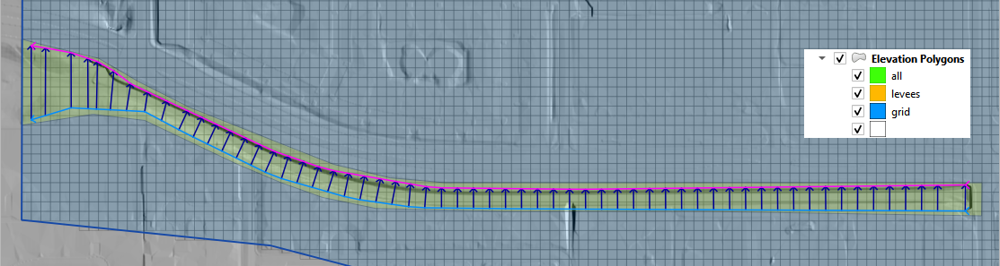

Elevation Correction from Polygons, Polylines and Points
========================================================

Overview
~~~~~~~~

This tool is used to correct elevation data for polygons, points or polylines.

.. image:: ../../img/Elevation-Correction-from-Polygons/elevationcorrectionfrompolygons002.png
 

The correction datasets are set up in the *User Layers* group.

Elevation Polygons

Elevation Points

Rasters

Users Layers Tab
----------------

There are multiple options in this tool.
The following sections will show how to use each option in the *Users Layers Mode* tab.

Tin from Points and Polygon
---------------------------

1. The first option is to edit the elevation on the grid using elevation points that are contained within a polygon boundary.

.. image:: ../../img/Elevation-Correction-from-Polygons/elevationcorrectionfrompolygons003.png

2. The tool creates a TIN that is confined to the elevation polygon layer.
   The TIN elevation is read from the *Elevation Points* layer.
   The elevation is assigned to the grid from the TIN as a correction to the grid elevation.
   Only grids with a centroid inside the polygon are adjusted.
   In this example, a section of the dam is removed from the grid element elevation so the dam can be breached.
   Most of the dam is left in place so the volume displacement is still occurring.

Note: The elevation image in this example is not the grid element.
It is a hillshade of the raw raster data.
The tool corrects the grid elevation only.

.. image:: ../../img/Elevation-Correction-from-Polygons/elevationcorrectionfrompolygons004.png

 

Here is a before and after image of the calculation.

.. image:: ../../img/Elevation-Correction-from-Polygons/elevationcorrectionfrompolygons005.png

Tin from Polygon Boundary
-------------------------

3. The second option is to build a TIN from the grid element elevation surrounding a polygon.
   This will assess the elevation where the polygon intersects the grid and interpolate that elevation to the TIN.

.. image:: ../../img/Elevation-Correction-from-Polygons/elevationcorrectionfrompolygons006.png

4. This option is used when a Cut or Fill correction is required.
   For example, to fill a channel with elevation data along the bank, cover the channel with an elevation polygon and apply the correction.

Elevation Polygon Attributes
----------------------------

5. This option is used when a single known elevation correction is required.

.. image:: ../../img/Elevation-Correction-from-Polygons/elevationcorrectionfrompolygons008.png

6. In this example, the invert elevation at the headwall inlet is incorrect.
   The polygon has a new elevation assigned that will be applied directly to the grid layer.
   In this case the correction is applied to centroid of the cell and the selected polygon only.

.. image:: ../../img/Elevation-Correction-from-Polygons/elevationcorrectionfrompolygons009.png

Grid Statistics within Blocked Areas
------------------------------------

7. In this case, the correction is applied by analyzing the statistics of the elevations within the **Blocked Areas Polygons**.
   The mean, max or min elevation of the combined cell centroids within the polygon are applied as a general condition to all of the cells centroids
   within the polygon.

.. image:: ../../img/Elevation-Correction-from-Polygons/elevationcorrectionfrompolygons010.png

.. image:: ../../img/Elevation-Correction-from-Polygons/elevationcorrectionfrompolygons011.png

External Layer Tab
------------------

This section will review each option in the *External* *Layers* *Mode* tab:

Correction Options
~~~~~~~~~~~~~~~~~~

There are several grid element correction options available in this tool.

-  Select any polygon layer.

-  Define the geometric predicate.
  Grid centroid or grid element.

-  Take the elevation from an attribute table.

-  Take the mean statistics from the elements within the polygons.

-  Use only selected features or all features.

.. image:: ../../img/Elevation-Correction-from-Polygons/elevationcorrectionfrompolygons012.png

Method 1 Elevation Correction
-----------------------------

This method will apply a elevation to each grid element within the polygon from the elevation field of the polygon.

1. Click the Elevation Correction Tool
