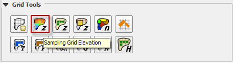
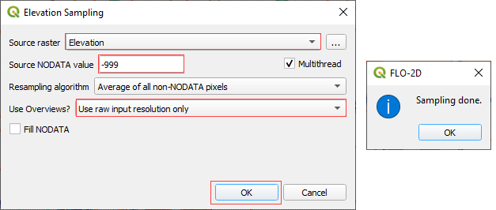
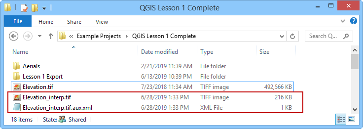
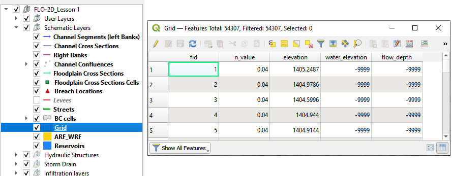
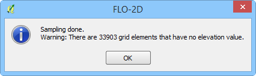
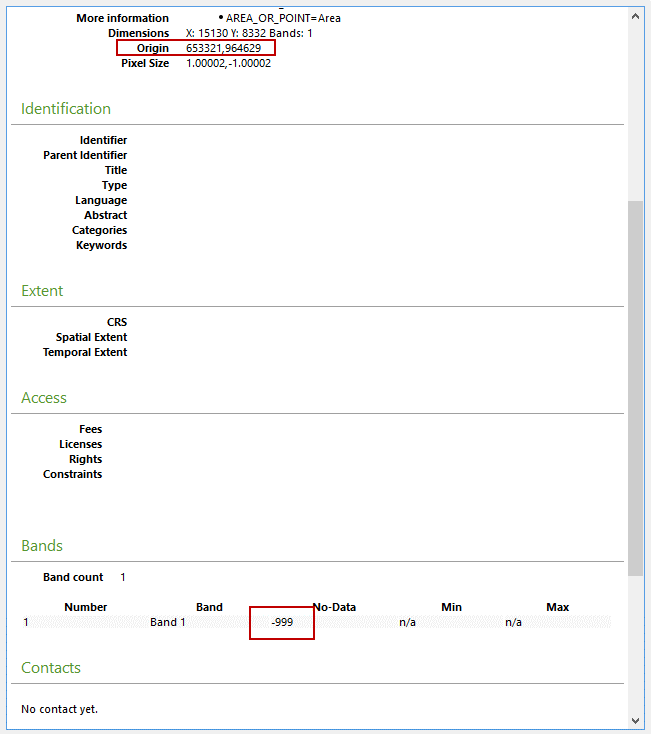

Sample Raster
=================================

To interpolate the elevation to a grid layer from a raster layer, use
the *Sampling Grid Elevation from Raster Layer* icon.

Overview
~~~~~~~~~~

A basic understanding of a raster file is necessary to use this routine.
A raster file is a georeferenced image file with band data assigned to
pixels aligned in column and row. In this case, the band is elevation.
Important properties:

1. The raster must have the same coordinate reference system (CRS) as
   the project. If the CRS is missing or is set by the user, save the
   raster with the correct CRS.

2. The best resolution of the grid element elevation is achieved when
   the elevation raster pixel size is smaller than the grid element
   size.

3. The raster warp method uses a weighted average to warp the original
   raster pixels to the cell size pixels.

Sample Elevation
----------------

1. Click the *Sampling Grid Elevation Button* and enter the required
   data in the dialog fields. As shown below.

2. Select the *Fill NODATA* option to set the elevation of empty grid
   elements from neighbors.

3. When the elevation sample is complete, the *Sampling Done* dialog box
   will appear.

4. When the interpolation process is complete, the filename_interp.tif
   raster will be created in the project directory.

5. This is the warped and realigned raster that was used to sample the
   elevation. It can be imported into the project at any time for review
   purposes.

6. The NODATA value in the previous dialog box is applied to the
   interp.tif raster.

7. The data is saved to the Schematize Layers/Grid layer.

Troubleshooting
~~~~~~~~~~~~~~~~

1. If the project or the data is on a server, this function may fail.
   Ensure all data is on the workstation.

2. If the raster has the wrong CRS or does not have complete coverage,
   the following message will be displayed. Save the raster with the
   correct CRS and make sure it has complete coverage.

 

3. If the “Sample Done” box is displayed but the grid table still has
   -9999 as the elevation, the raster CRS is not being read correctly.
   Save the raster as a new layer and assign the correct CRS.

4. If the grid layer elevation data does not seem accurate, review the
   origin vs layer extent. If the layer extent is offset from the
   origin, the raster realign will be inaccurate. Re-create the raster
   so that the origin and extent are not offset.

  
