Infiltration Editor
===================

Green-Ampt
----------

The Green-Ampt infiltration editor can add global or spatially variable infiltration data to the INFIL.DAT file.

Global
~~~~~~

Global data is set up using the Global Infiltration button.

1. Click the button to open the editor dialog box.

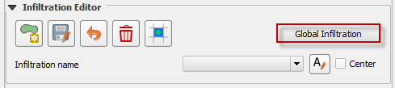

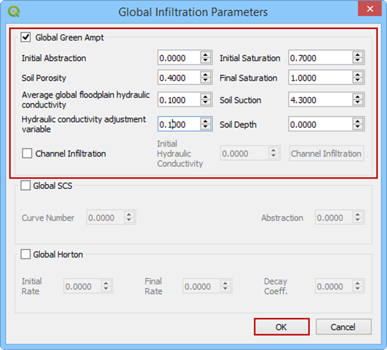

Channel Infiltration
--------------------

To assign channel infiltration, use the channel infiltration editor.
Set a global hydraulic conductivity for all channel elements and click the Channel Infiltration button.

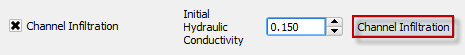
 

Local channel infiltration is set by segment in the dialog box.

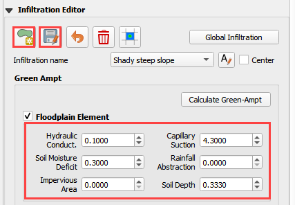

Green-Ampt from Infiltration Polygons
-------------------------------------

Spatially variable floodplain infiltration is set by digitizing infiltration polygons or importing infiltration polygons.
Use the polygon editor to digitize spatially variable infiltration.
Create a polygon to represent an area of infiltration.

1. Click the create a polygon tool and digitize a polygon.

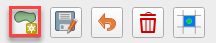
 

2. Name the infiltration polygon.

3. Fill the table for the infiltration data.

4. Click *Save*.

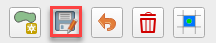
  

5. Click Schematize.

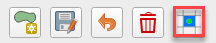

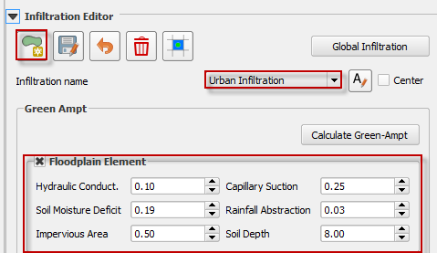

The infiltration polygons outline areas of cells that have similar infiltration characteristics.
In the following image, the infiltration areas are different for urban, desert and desert drainage.

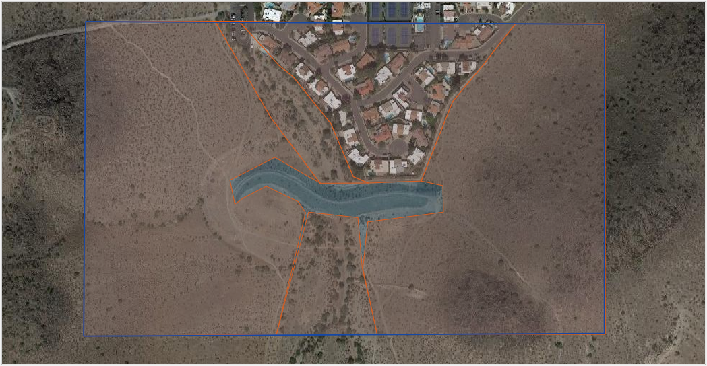
  

Green-Ampt from Infiltration Calculator
---------------------------------------

To use the Green-Ampt calculator, the user must prepare soil and land use shapefiles.
The soils data is acquired from the United States Department of Agriculture Web Soil Survey (USDA, 2017).
The data is organized by soil group.
The land use data can be acquired from various sources but is generally available from the United States Geological Survey Land Cover website (USGS,
2017).
The land use data can account for vegetative cover and impervious cover.

1. Prepare the data into shapefiles using QGIS or import them into QGIS.

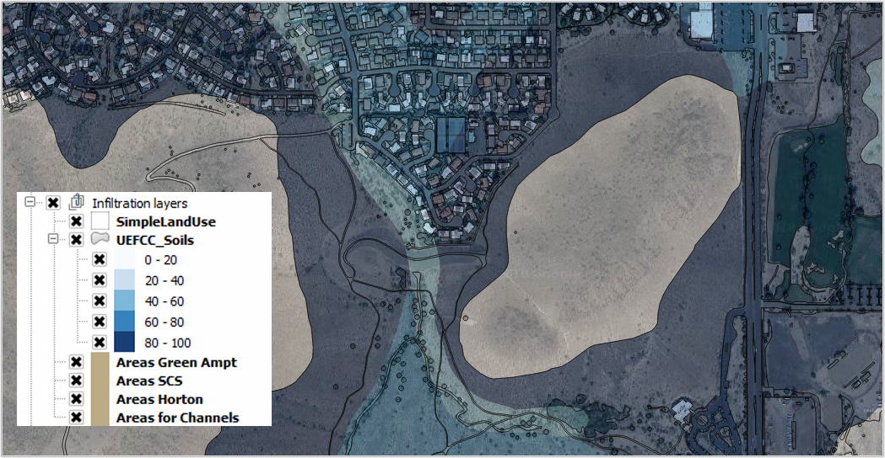

2. To run the calculator, click the Calculate Green-Ampt button.

.. image:: ../../img/Infiltration-Editor/Infilt012.png
 

3. Use the following dialog box to assign the required shapefiles and fields to the calculator.

4. Click OK to run the calculation.
   The plugin will assign spatially variable infiltration data to each cell.
   The data is exported to the INFIL.DAT file.

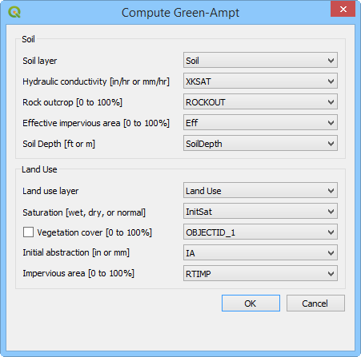

SCS
---

.. _global-1:

Global
~~~~~~

The SCS infiltration editor can add global or spatially variable infiltration data to the INFIL.DAT file for infiltration curve numbers.

1. Set up the Global Infiltration first.
   Click Global Infiltration.

.. image:: ../../img/Infiltration-Editor/Infilt014.png
  

2. Fill the Global Infiltration dialog box.

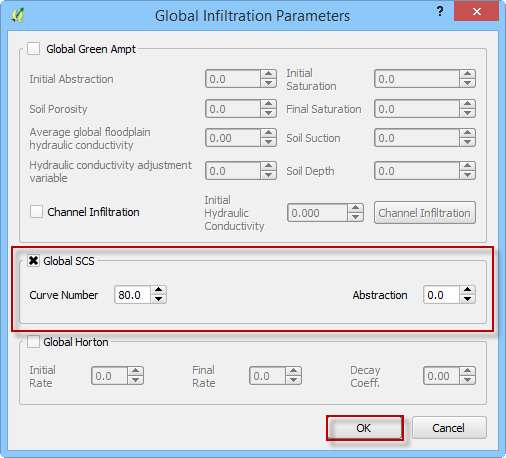
  

SCS Calculator Single Shapefile
-------------------------------

1. Click the Calculate SCS CN button.

.. image:: ../../img/Infiltration-Editor/Infilt016.png
  

2. Select the layer and field with the infiltration data and click OK to run the calculator.

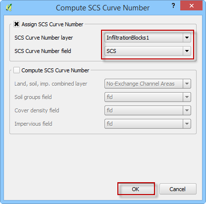
   

3. When the calculation is complete, the following box will appear.
   Click OK to close the box.

.. image:: ../../img/Infiltration-Editor/Infilt018.png
 

SCS Calculator Single Shapefile Multiple Fields
-----------------------------------------------

Use this option to calculate SCS curve number data from a single layer with multiple fields.
This is a vector layer with polygon features and field to define the soil group, vegetation coverage and impervious space.
This option was developed specifically for Pima County.

1. Click the Calculate SCS CN button.

.. image:: ../../img/Infiltration-Editor/Infilt016.png
 

2. Select the layer and fields with the infiltration data and click OK to run the calculator.

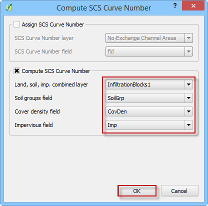
  

3. When the calculation is complete, the following box will appear.
   Click OK to close the box.

.. image:: ../../img/Infiltration-Editor/Infilt018.png

Horton
------

.. _global-2:

Global
~~~~~~

The SCS infiltration editor can add global or spatially variable infiltration data to the INFIL.DAT file for infiltration curve numbers.

1. Set up the Global Infiltration first.
   Click Global Infiltration.

.. image:: ../../img/Infiltration-Editor/Infilt014.png

2. Fill the Global Infiltration dialog box.

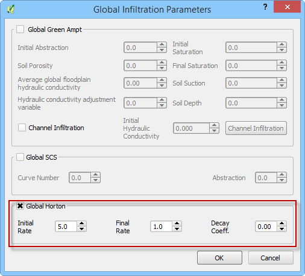

Horton Spatially Variable Method
--------------------------------

Spatially variable Horton infiltration is created by digitizing infiltration polygons.
Use the polygon editor to digitize spatially variable infiltration.
Create a polygon to represent an area of infiltration.

1. Click the create a polygon tool and digitize a polygon.

2. Click *Save*.

 

3. Right Click the Infiltration Areas layer (User Layers) and open the Attributes Table.
   Click the Editor Pencil button.

4. Name the infiltration polygons and fill out the data for fhorti, fhori, and deca.

5. Click the Save button and Editor Pencil button.

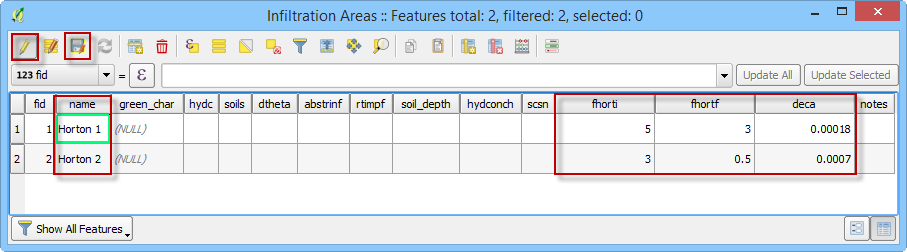

6. Click Schematize.

Troubleshooting
~~~~~~~~~~~~~~~

1. Infiltration calculators all use intersection tools.
   This can cause problems if the shapefiles are not set up correctly.
   Specifically, land use and soils shapefiles that may have been converted from raster data.
   If errors persist, use “fix geometry”, “simplify”, and “dissolve” on the source shapefiles.
   These tools are part of the QGIS Processing Toolbox.
   They can also be corrected in ArcGIS if the datasets are very large.

2. Make sure the shapefiles completely cover the grid.
   If a grid element is outside the coverage of the infiltration, QGIS will show an error.

3. Make sure the shapefile fields have a correctly defined number type.
   The shapefiles that are supplied with the QGIS Lessons will help define the Field Variable Format such as string, whole number or decimal number.
